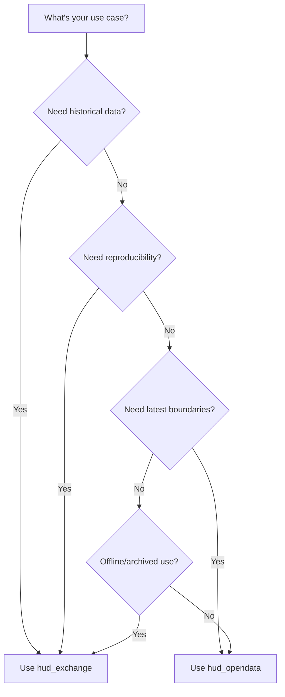

# Overview

CoC Lab is a Python-based data and geospatial infrastructure for working with **Continuum of Care (CoC) boundary data** and related housing metrics. It provides tools to:

- **Ingest** CoC boundaries from HUD data sources
- **Ingest** Census geometries and PIT counts
- **Validate** geometry and data quality
- **Version** boundary snapshots over time
- **Visualize** boundaries as interactive maps
- **Build crosswalks** linking CoCs to census tracts and counties
- **Compute measures** aggregating ACS demographic data to CoC level
- **Aggregate population estimates** (PEP) from counties to CoC geography
- **Aggregate rents** (ZORI) from counties to CoC geography
- **Assemble panels** combining PIT, ACS, and optional rent measures
- **Export bundles** with provenance and diagnostics

## Hub-and-Spoke Design (Current)

CoC Lab is intentionally organized around a **CoC-centric hub**. The stable unit of analysis is the CoC boundary vintage (`B{year}`), and most external sources are brought **into** that hub through crosswalks:

- **Hub:** CoC boundaries (target geography for analysis) and **PIT counts** (already CoC-keyed).
- **Spokes:** Tract- and county-native datasets (ACS, ZORI, PEP) aggregated to CoC via tract/county crosswalks.
- **Crosswalk direction:** County/tract → CoC (area- or population-weighted). This supports consistent CoC × year panels.

If you need a county-level hub (e.g., to estimate CoC/PIT values by county), that is a **different modeling choice** and would require additional allocation logic and crosswalk fields. The current implementation favors reproducible CoC-level analysis.

## What is a Continuum of Care?

A Continuum of Care (CoC) is a regional or local planning body that coordinates housing and services funding for homeless families and individuals. HUD assigns each CoC a unique identifier (e.g., `CO-500` for Colorado Balance of State CoC).

## Data Sources

| Source | Description | Update Frequency |
|--------|-------------|------------------|
| **HUD Exchange GIS Tools** | Annual CoC boundary shapefiles | Yearly vintages |
| **HUD Open Data (ArcGIS)** | Current CoC Grantee Areas | Live snapshots |
| **Census TIGER/Line** | Tract and county geometries | Annual vintages |
| **Census ACS 5-Year** | Demographic estimates used for measures | Annual releases |
| **Census PEP** | County population estimates | Annual releases |
| **NHGIS (IPUMS)** | National tract/county shapefiles | Decennial vintages |
| **HUD PIT Counts** | Point-in-Time counts by CoC | Annual releases |
| **Zillow ZORI** | County-level observed rent index | Monthly series |

## Choosing a CoC Boundary Source

CoC Lab supports two sources for CoC boundary geometries, each serving different purposes. Choose based on your use case:

### HUD Exchange (`hud_exchange`)

**Best for:** Historical analysis, reproducible research, compliance documentation

| Aspect | Details |
|--------|---------|
| **Update cadence** | Annual releases tied to HUD fiscal year |
| **Data stability** | Immutable once published—boundaries for a given vintage never change |
| **Historical access** | Multiple years available (e.g., 2020, 2021, 2022, 2023, 2024, 2025) |
| **Format** | Geodatabase or Shapefile downloads |

**Advantages:**
- **Reproducibility** — Running the same vintage always yields identical results
- **Historical comparison** — Compare how CoC boundaries evolved year-over-year
- **Audit trails** — Document which vintage was used for a specific analysis
- **Offline availability** — Downloaded files can be archived and reused

**Disadvantages:**
- **Lag time** — New vintages are published months after fiscal year ends
- **May miss recent changes** — Boundary updates between releases aren't reflected
- **Larger downloads** — Full national dataset for each vintage

### HUD Open Data (`hud_opendata`)

**Best for:** Current boundary lookups, real-time applications, quick exploration

| Aspect | Details |
|--------|---------|
| **Update cadence** | Live—reflects HUD's current authoritative boundaries |
| **Data stability** | May change at any time as HUD updates boundaries |
| **Historical access** | Current snapshot only (no historical data) |
| **Format** | ArcGIS Feature Service (paginated API) |

**Advantages:**
- **Always current** — Reflects the latest boundary definitions from HUD
- **No manual downloads** — Data fetched directly via API
- **Lightweight** — Only retrieves the data you need

**Disadvantages:**
- **Not reproducible** — Same query on different days may yield different results
- **No history** — Cannot access how boundaries looked in the past
- **API dependency** — Requires network access and relies on HUD service availability

### Decision Guide

| Use Case | Recommended Source |
|----------|-------------------|
| Year-over-year boundary change analysis | `hud_exchange` |
| Point-in-time count reporting (e.g., FY2024 PIT) | `hud_exchange` (matching vintage) |
| "What CoC is this address in today?" | `hud_opendata` |
| Building a dashboard with current boundaries | `hud_opendata` |
| Research paper requiring reproducible methods | `hud_exchange` |
| Archiving boundaries for compliance records | `hud_exchange` |

---

**Next:** [[02-Installation]]
