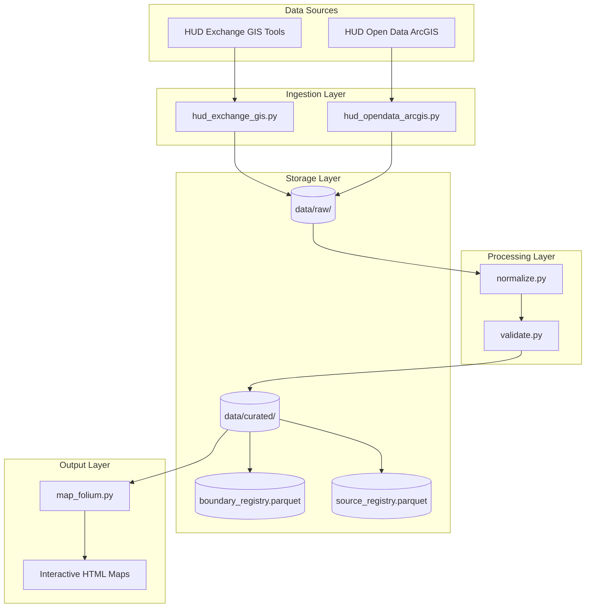
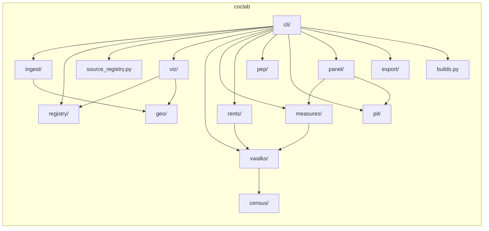

# Architecture

## System Overview



## Module Structure



## Directory Layout

```
coclab/
  cli/          # CLI commands (Typer)
  geo/          # Geometry normalization and validation
  ingest/       # Data source ingesters
  registry/     # Vintage tracking and version selection
  source_registry.py  # Source hash tracking and change detection
  viz/          # Map rendering (Folium)
  census/       # Census geometry ingestion (TIGER/Line)
    ingest/     # Tract and county downloaders
  xwalks/       # CoC-to-census crosswalk builders
  measures/     # ACS measure aggregation and diagnostics
  acs/          # ACS population ingest, rollup, and cross-check
    ingest/     # Tract population fetcher
  rents/        # ZORI rent data ingestion and aggregation
  pep/          # PEP ingest and aggregation
  pit/          # PIT count ingestion and QA (Phase 3)
    ingest/     # HUD Exchange PIT downloaders and parsers
  panel/        # CoC × year panel assembly (Phase 3)
  export/       # Bundle export and MANIFEST generation
  builds.py     # Named build scaffolds and manifests
  naming.py     # Filename conventions and temporal shorthand
  provenance.py # Parquet provenance helpers
data/
  raw/          # Downloaded source files
  curated/      # Processed GeoParquet files
    census/     # TIGER tract/county geometries
    xwalks/     # CoC-tract and CoC-county crosswalks
    measures/   # CoC-level demographic measures
    acs/        # ACS tract population, rollups, and county weights
    zori/       # ZORI rent data (county and CoC-level)
    pep/        # PEP county and CoC-level data
    pit/        # Canonical PIT count files
    panel/      # CoC × year analysis panels
    source_registry.parquet  # Source ingestion registry
builds/         # Named build scaffolds (each with base/ and data/)
exports/        # Export bundles (export-1, export-2, ...)
tests/          # Test suite including smoke tests
```

---

**Previous:** [[02-Installation]] | **Next:** [[04-CLI-Reference]]
