# CLI Reference

The `coclab` command provides access to all core functionality.

## Commands Overview

```mermaid
flowchart LR
    coclab --> agents
    coclab --> ingest
    coclab --> list
    coclab --> validate
    coclab --> diagnostics
    coclab --> build
    coclab --> aggregate
    coclab --> show
    coclab --> registry
    ingest --> boundaries
    ingest --> census
    ingest --> nhgis
    ingest --> pit
    ingest --> pit-vintage
    ingest --> acs-population
    ingest --> tract-relationship
    ingest --> zori
    ingest --> pep
    registry --> registry-delete-entry[delete-entry]
    registry --> registry-rebuild[rebuild]

    boundaries --> |"--source hud_exchange"| HUD_EX[Download annual vintage]
    boundaries --> |"--source hud_opendata"| HUD_OD[Fetch current snapshot]
    census --> TIGER[Download TIGER geometries]
    nhgis --> NHGIS[Download NHGIS tract shapefiles]
    pit --> PIT[Download & parse PIT counts]
    pit-vintage --> PITVINT[Parse all years from vintage]
    acs-population --> ACSPOP[Fetch tract population]
    tract-relationship --> TRACTREL[Download 2010↔2020 tract relationship]
    list --> list-boundaries[boundaries]
    list --> list-census[census]
    list --> list-measures[measures]
    list --> list-xwalks[xwalks]
    list-boundaries --> LIST[List boundary vintages]
    validate --> validate-boundaries
    validate --> validate-pit-vintages
    validate --> validate-population
    diagnostics --> diagnostics-panel
    diagnostics --> diagnostics-xwalk
    diagnostics --> diagnostics-zori
    build --> build-create[create]
    build --> build-list[list]
    build --> build-measures[measures]
    build --> build-zori[zori]
    build --> build-panel[panel]
    build --> build-xwalks[xwalks]
    build --> build-export[export]
    build --> build-pep[pep]
    aggregate --> aggregate-acs[acs]
    aggregate --> aggregate-zori[zori]
    aggregate --> aggregate-pep[pep]
    aggregate --> aggregate-pit[pit]
    show --> show-vintage-diffs[vintage-diffs]
    show --> show-map[map]
    show --> show-measures[measures]
    show --> show-sources[sources]
    validate-boundaries --> BOUNDCHK[Validate boundary registry health]
    registry-delete-entry --> BOUNDDEL[Remove boundary registry entry]
    show-map --> MAP[Render interactive map]
    build-xwalks --> XWALK[Create tract/county crosswalks]
    build-measures --> MEAS[Aggregate demographic measures from ACS]
    build-panel --> PANEL[Assemble CoC × year panels]
    validate-pit-vintages --> PITXCHECK[Validate PIT across vintages]
    validate-population --> POPCHECK[Validate CoC pop vs national]
    build-create --> CREATE[Create build scaffold with pinned assets]
    build-list --> BLIST[List available builds]
    build-zori --> ZORI_AGG[Aggregate ZORI to CoC level]
    aggregate-acs --> ACS_AGG[Aggregate ACS measures to CoC]
    aggregate-zori --> ZORI_AGG2[Aggregate ZORI to CoC]
    aggregate-pep --> PEP_AGG[Aggregate PEP population to CoC]
    aggregate-pit --> PIT_AGG[Filter/align PIT counts for build]
    diagnostics-panel --> PDIAG[Panel quality & sensitivity]
    diagnostics-xwalk --> DIAG[Crosswalk quality checks]
    diagnostics-zori --> ZORI_DIAG[ZORI coverage diagnostics]
    list-census --> LCENSUS[List census geometry files]
    list-xwalks --> LXWALK[List crosswalk files]
    list-measures --> LMEAS[List measure files]
    show-measures --> SMEAS[Display CoC measures]
    show-vintage-diffs --> COMP[Diff boundary vintages]
    show-sources --> SRCSTAT[Display source registry status]
    build-export --> EXPORT[Create analysis-ready bundle]
    registry-rebuild --> REGREBUILD[Rebuild source registry from local files]
```



**Ingest grouping:** The canonical form is `coclab ingest <subcommand>` (e.g., `coclab ingest boundaries`).
Legacy `ingest-*` commands remain as deprecated passthroughs for backward compatibility.

**List grouping:** The canonical form is `coclab list <subcommand>` (e.g., `coclab list boundaries`).
Legacy `list-*` commands remain as deprecated passthroughs for backward compatibility.

**Validate grouping:** The canonical form is `coclab validate <subcommand>` (e.g., `coclab validate boundaries`).
Legacy `validate-*` commands remain as deprecated passthroughs for backward compatibility.

**Diagnostics grouping:** The canonical form is `coclab diagnostics <subcommand>` (e.g., `coclab diagnostics panel`).
Legacy `diagnostics-*` commands remain as deprecated passthroughs for backward compatibility.

**Build grouping:** The canonical form is `coclab build <subcommand>` (e.g., `coclab build panel`).
Legacy build/aggregate/export commands remain as deprecated passthroughs for backward compatibility.

**Aggregate grouping:** The canonical form is `coclab aggregate <subcommand>` (e.g., `coclab aggregate acs`).
Aggregate commands operate on named builds and write outputs into build-local `data/curated/` folders.

**Show grouping:** The canonical form is `coclab show <subcommand>` (e.g., `coclab show map`).
Legacy commands (`show`, `show-measures`, `compare-vintages`, `source-status`) remain as deprecated passthroughs for backward compatibility.

**Registry grouping:** The canonical form is `coclab registry <subcommand>` (e.g., `coclab registry rebuild`).
Legacy commands (`delete-boundaries`, `registry-rebuild`) remain as deprecated passthroughs for backward compatibility.

## `coclab agents`

Display crosswalk alignment rules and dataset-to-vintage matching guidance.

```bash
coclab agents
```

**Output:**
- Printed rules for aligning PIT, ACS, PEP, and ZORI data with boundary vintages

## `coclab build create`

Create a named build scaffold with pinned boundary assets.

```bash
# Create a build for 2018-2024
coclab build create --name demo --years 2018-2024

# Use a custom builds root
coclab build create --name demo --years 2018-2024 --builds-dir /path/to/builds
```

| Option | Description | Default |
|--------|-------------|---------|
| `--name`, `-n` | Build name | Required |
| `--years` | Year spec (range or list) | Required |
| `--builds-dir` | Root builds directory | `builds` |
| `--data-dir` | Root data directory to resolve base assets | `data` |

**Output:**
- Build directory at `builds/{name}/`
- `manifest.json` with pinned boundary assets and hashes

## `coclab build list`

List available named builds.

```bash
coclab build list
```

| Option | Description | Default |
|--------|-------------|---------|
| `--builds-dir` | Root builds directory | `builds` |

**Output:**
- List of build names found under `builds/`

## `coclab build measures`

Aggregate CoC-level demographic measures from ACS 5-year estimates. Fetches tract-level data from the Census API and aggregates to CoC level using tract crosswalks.

**Measures produced:**

| Column | ACS Table | Description |
|--------|-----------|-------------|
| `total_population` | B01003 | Total population |
| `adult_population` | B01001 | Population 18+ (derived from age groups) |
| `median_household_income` | B19013 | Median household income ($) |
| `median_gross_rent` | B25064 | Median gross rent ($) |
| `population_below_poverty` | C17002 | Population below 100% poverty level |
| `poverty_universe` | C17002 | Population for whom poverty is determined |
| `coverage_ratio` | — | Fraction of CoC area with valid tract data |

```bash
# Aggregate measures with area weighting
coclab build measures --boundary 2025 --acs 2019-2023

# Use population weighting instead
coclab build measures --boundary 2025 --acs 2019-2023 --weighting population

# Write outputs inside a named build
coclab build measures --build demo --boundary 2025 --acs 2019-2023
```

| Option | Description | Default |
|--------|-------------|---------|
| `--boundary`, `-b` | CoC boundary vintage | Latest |
| `--acs`, `-a` | ACS 5-year estimate vintage (e.g., `2019-2023`) | `2018-2022` |
| `--tracts`, `-t` | Census tract vintage for crosswalk | Most recent decennial ≤ ACS end year |
| `--weighting`, `-w` | `area` or `population` | `area` |
| `--build` | Named build directory for build-local outputs | None |
| `--xwalk-dir` | Directory containing crosswalk files | `data/curated/xwalks` |
| `--output-dir`, `-o` | Output directory | `data/curated/measures` |

When `--build` is provided, default paths resolve under `builds/{name}/data/curated/`
for crosswalks and measures unless explicitly overridden.

**Output:**
- `measures__A{acs_end}@B{boundary}xT{tract}.parquet`
- Summary statistics printed to console

## `coclab build zori`

Aggregate ZORI data from county geography to CoC geography using area-weighted crosswalks and ACS-based demographic weights.

```bash
# Basic aggregation with renter household weighting
coclab build zori --boundary 2025 --counties 2023 --acs 2019-2023

# With yearly output
coclab build zori -b 2025 -c 2023 --acs 2019-2023 --to-yearly

# Custom weighting method
coclab build zori -b 2025 -c 2023 --acs 2019-2023 -w housing_units

# Write outputs inside a named build
coclab build zori --build demo --boundary 2025 --counties 2023 --acs 2019-2023
```

| Option | Description | Default |
|--------|-------------|---------|
| `--boundary`, `-b` | CoC boundary vintage (e.g., `2025`) | Required |
| `--counties`, `-c` | TIGER county vintage year | Required |
| `--acs` | ACS 5-year vintage for weights (e.g., `2019-2023`) | Required |
| `--geography`, `-g` | Base geography type | `county` |
| `--zori-path` | Explicit path to ZORI parquet file | Auto-detected |
| `--xwalk-path` | Explicit crosswalk path | Inferred |
| `--weighting`, `-w` | Weighting: `renter_households`, `housing_units`, `population`, `equal` | `renter_households` |
| `--build` | Named build directory for build-local outputs | None |
| `--output-dir`, `-o` | Output directory | `data/curated/zori` |
| `--to-yearly` | Also emit yearly collapsed file | False |
| `--yearly-method` | `pit_january`, `calendar_mean`, `calendar_median` | `pit_january` |
| `--force`, `-f` | Recompute even if output exists | False |

When `--build` is provided, outputs default to `builds/{name}/data/curated/zori`,
and crosswalks are resolved from the build-local `xwalks/` directory if present.

**Prerequisites:**
```bash
coclab ingest boundaries --source hud_exchange --vintage 2025
coclab ingest census --year 2023 --type counties
coclab build xwalks --boundary 2025 --counties 2023
coclab ingest zori --geography county
```

**Exit Codes:**
- `0` - Success
- `2` - Missing required inputs / mismatched vintages
- `3` - Failure to compute weights (ACS missing)

**Output:**
- `data/curated/zori/zori__A{acs_end}@B{boundary}xC{counties}__w{weight_abbrev}.parquet`
- Optional yearly: `data/curated/zori/zori_yearly__A{acs_end}@B{boundary}xC{counties}__w{weight_abbrev}__m{method}.parquet`

Note: Filenames use temporal shorthand (end year of ACS vintage) and abbreviated weighting
names; legacy `coc_zori__...` names may still exist in older runs.

## `coclab build panel`

Build analysis-ready CoC × year panels combining PIT counts with ACS measures. Optionally includes ZORI rent data for affordability analysis.

```bash
# Build panel for date range
coclab build panel --start 2018 --end 2024

# Specify weighting method
coclab build panel --start 2018 --end 2024 --weighting population

# Custom output path
coclab build panel --start 2020 --end 2024 --output custom_panel.parquet

# Include ZORI rent data for rent-to-income affordability
coclab build panel --start 2018 --end 2024 --include-zori

# Custom ZORI coverage threshold (default 0.90)
coclab build panel --start 2018 --end 2024 --include-zori --zori-min-coverage 0.80

# Explicit ZORI data path
coclab build panel --start 2018 --end 2024 --include-zori --zori-yearly-path data/curated/zori/zori_yearly__A2023@B2025xC2023__wrenter__mpit_january.parquet

# Write output inside a named build
coclab build panel --build demo --start 2018 --end 2024
```

| Option | Description | Default |
|--------|-------------|---------|
| `--start`, `-s` | Start year (inclusive) | Required |
| `--end`, `-e` | End year (inclusive) | Required |
| `--weighting`, `-w` | `area` or `population` | `population` |
| `--output`, `-o` | Output file path | Auto-generated |
| `--build` | Named build directory for build-local outputs | None |
| `--include-zori` | Include ZORI rent data and compute `rent_to_income` | `False` |
| `--no-include-zori` | Explicitly disable ZORI integration | - |
| `--zori-yearly-path` | Path to yearly ZORI Parquet file | Auto-discover |
| `--zori-min-coverage` | Minimum coverage ratio for ZORI eligibility | `0.90` |

**ZORI Integration:**

When `--include-zori` is enabled, the panel includes:

| Column | Description |
|--------|-------------|
| `zori_coc` | CoC-level ZORI rent value (yearly) |
| `zori_coverage_ratio` | Fraction of CoC covered by ZORI data |
| `zori_is_eligible` | Boolean: meets coverage threshold |
| `zori_excluded_reason` | Why excluded: `missing`, `zero_coverage`, `low_coverage` |
| `rent_to_income` | `zori_coc / (median_household_income / 12.0)` |
| `rent_metric` | Always `ZORI` (provenance) |
| `rent_alignment` | Temporal alignment method (provenance) |
| `zori_min_coverage` | Coverage threshold used (provenance) |

**Eligibility Rules:**
- CoC-year is eligible if `coverage_ratio >= zori_min_coverage`
- Ineligible rows have `zori_coc = null` and `rent_to_income = null`
- High dominance generates warnings but does NOT exclude
- Zero-coverage CoCs are excluded (never imputed)

### Analytic Universe for Rent-to-Income Measures

Analyses that use the `rent_to_income` variable **must be restricted** to CoC-year observations where `zori_is_eligible == True`.

CoC-years that fail ZORI eligibility criteria (e.g., insufficient coverage of underlying counties) have `rent_to_income` set to null and should not be included in rent-affordability inference. No imputation is performed for ineligible CoCs.

**Output:**
- Panel Parquet file with embedded provenance
- Summary statistics (years, CoC count, coverage)
- ZORI summary when enabled (eligible count, rent_to_income stats)

### Panel naming

By default, panels are written to `data/curated/panel/` using the boundary vintage:

Example:

```
data/curated/panel/panel__Y2018-2024@B2025.parquet
```

The filename does not change when `--include-zori` is enabled; the presence of ZORI
columns in the data indicates rent integration.

When `--build` is provided and `--output` is not set, panels are written to
`builds/{name}/data/curated/panel/`.

## `coclab validate boundaries`

Validate the boundary registry for missing files, invalid paths, or temporary-directory entries.

```bash
coclab validate boundaries
```

Returns a health report. Exits with code `1` if problems are detected.

## `coclab registry delete-entry`

Remove a boundary vintage entry from the registry (does not delete the data file).

```bash
coclab registry delete-entry 2024 hud_exchange

# Skip confirmation
coclab registry delete-entry 2024 hud_exchange --yes
```

| Option | Description | Default |
|--------|-------------|---------|
| `vintage` | Boundary vintage year | Required |
| `source` | Source name (`hud_exchange`, `hud_opendata`) | Required |
| `--yes`, `-y` | Skip confirmation | False |

## `coclab registry rebuild`

Rebuild the source registry by checking local files for missing entries or hash
mismatches. This is useful if files were moved or updated outside the normal
ingest commands.

```bash
coclab registry rebuild

# Preview changes without writing
coclab registry rebuild --dry-run
```

| Option | Description | Default |
|--------|-------------|---------|
| `--dry-run`, `-n` | Preview changes without modifying registry | False |
| `--registry`, `-r` | Path to source registry file | `data/curated/source_registry.parquet` |

## `coclab build xwalks`

Build area-weighted crosswalks linking CoC boundaries to census tracts and counties.

```bash
# Build crosswalks for a specific boundary and tract vintage
coclab build xwalks --boundary 2025 --tracts 2023

# Also build county crosswalk
coclab build xwalks --boundary 2025 --tracts 2023 --counties 2023
```

| Option | Description | Default |
|--------|-------------|---------|
| `--boundary`, `-b` | CoC boundary vintage | Latest |
| `--tracts`, `-t` | Census tract vintage year | 2023 |
| `--counties`, `-c` | Census county vintage year | Same as tracts |
| `--type` | `tracts`, `counties`, or `all` | `all` |
| `--build` | Named build directory for build-local outputs | None |
| `--output-dir`, `-o` | Output directory | `data/curated/xwalks` |
| `--force` | Overwrite existing crosswalks | False |
| `--population-weights`, `-p` | Add population-weighted `pop_share` to tract crosswalks | False |
| `--auto-fetch` | Auto-fetch ACS population data when adding pop weights | False |

When `--build` is provided, outputs default to `builds/{name}/data/curated/xwalks`.

**Output:**
- `xwalk__B{boundary}xT{tracts}.parquet`
- `xwalk__B{boundary}xC{counties}.parquet`
- Diagnostic summary printed to console

When `--population-weights` is enabled, tract crosswalks include `pop_share`
computed from ACS tract population. Use `--auto-fetch` to download missing
population data automatically.

## `coclab show vintage-diffs`

Compare CoC boundaries between two vintages.

```bash
# Basic comparison
coclab show vintage-diffs --vintage1 2024 --vintage2 2025

# Show unchanged CoCs too
coclab show vintage-diffs -v1 2024 -v2 2025 --show-unchanged

# Save diff to CSV
coclab show vintage-diffs -v1 2024 -v2 2025 -o diff_report.csv
```

| Option | Description | Default |
|--------|-------------|---------|
| `--vintage1`, `-v1` | First (older) vintage | Required |
| `--vintage2`, `-v2` | Second (newer) vintage | Required |
| `--show-unchanged` | Also list unchanged CoCs | False |
| `--output`, `-o` | Save diff to CSV | None |

**Output:**
- Summary counts of added, removed, changed, unchanged CoCs
- Lists of affected CoC IDs by category

## `coclab validate population`

Validate population totals from crosswalk aggregation against ACS national totals. Ensures that CoC-aggregated population approximately equals the national ACS total, helping identify crosswalk coverage issues, double-counting, or data quality problems.

```bash
# Basic validation (auto-detects latest vintages)
coclab validate population

# Specify vintages
coclab validate population --boundary 2025 --acs 2019-2023

# Show state-level breakdown
coclab validate population --by-state

# Adjust warning threshold
coclab validate population --warn-threshold 0.10
```

| Option | Description | Default |
|--------|-------------|---------|
| `--boundary`, `-b` | CoC boundary vintage | Latest |
| `--acs`, `-a` | ACS 5-year vintage | Latest |
| `--tracts`, `-t` | Census tract vintage | ACS end year |
| `--xwalk-dir` | Directory containing crosswalk files | `data/curated/xwalks` |
| `--acs-dir` | Directory containing ACS tract files | `data/curated/acs` |
| `--by-state`, `-s` | Show detailed state-level comparison | False |
| `--warn-threshold`, `-w` | Warning threshold for ratio deviation from 1.0 | 0.05 (5%) |

**Diagnostics Computed:**
1. **National total** - Sum of all tract populations from ACS
2. **Crosswalk statistics** - Tract counts, CoC counts, coverage gaps
3. **CoC-aggregated total** - `sum(tract_pop × area_share)` across all CoCs
4. **Ratio validation** - CoC/National ratio with pass/fail status
5. **Area_share validation** - Detects overlaps (>1.01) and partial coverage (<0.99)
6. **State-level comparison** (with `--by-state`) - Identifies states with coverage issues

**Exit Codes:**
- `0` - Ratio within threshold
- `1` - Ratio exceeds threshold (potential data issue)

**Example Output:**
```
POPULATION CROSSWALK VALIDATION
======================================================================
1. NATIONAL TOTAL (sum of all tracts): 335,559,225

2. CROSSWALK STATISTICS:
   Unique tracts in crosswalk:    85,275
   Unique CoCs:                   387

3. COC-AGGREGATED TOTAL: 330,903,210
   Ratio (CoC/National):     0.9861
   Status: OK (within 5% threshold)

4. AREA_SHARE VALIDATION:
   Tracts with sum > 1.01 (potential overlap): 0
   Tracts with sum < 0.99 (partial coverage):  4,696
```

## `coclab validate pit-vintages`

Compare PIT counts between two vintage releases to detect historical data revisions. This helps identify when HUD has revised historical PIT data between releases (e.g., due to CoC mergers or data corrections).

```bash
# Compare 2023 and 2024 vintages
coclab validate pit-vintages --vintage1 2023 --vintage2 2024

# Filter to a specific year
coclab validate pit-vintages -v1 2023 -v2 2024 --year 2020

# Save detailed comparison to CSV
coclab validate pit-vintages -v1 2023 -v2 2024 -o comparison.csv

# Show unchanged records too
coclab validate pit-vintages -v1 2023 -v2 2024 --show-unchanged
```

| Option | Description | Default |
|--------|-------------|---------|
| `--vintage1`, `-v1` | First (older) vintage to compare | Required |
| `--vintage2`, `-v2` | Second (newer) vintage to compare | Required |
| `--year`, `-y` | Filter to specific PIT year | All common years |
| `--output`, `-o` | Save detailed comparison to CSV | None |
| `--show-unchanged` | Include unchanged records in output | False |

**Output:**
- **Tab Totals**: Year-by-year comparison of all-CoC totals for total, sheltered, and unsheltered counts
- **Summary**: Counts of added, removed, changed, and unchanged CoC-year records
- **Changed**: CoCs with revised counts (shows delta values)
- **Added**: CoC-years present in v2 but not v1
- **Removed**: CoC-years present in v1 but not v2 (often due to mergers)

**Interpreting Results:**

If tab totals match but individual CoCs differ, the changes are likely due to CoC reorganizations (mergers) rather than data corrections. For example, if MA-519 was merged into MA-505:
- MA-505 will show as "changed" with increased counts
- MA-519 will show as "removed"
- Tab totals will remain identical

## `coclab diagnostics panel`

Run diagnostics and sensitivity checks on panel files.

```bash
# Run diagnostics on a panel
coclab diagnostics panel --panel data/curated/panel/panel__Y2018-2024@B2025.parquet

# Export diagnostics to CSV files
coclab diagnostics panel --panel panel.parquet --output-dir ./diagnostics/ --format csv

# Print text summary only
coclab diagnostics panel --panel panel.parquet --format text
```

| Option | Description | Default |
|--------|-------------|---------|
| `--panel`, `-p` | Path to panel Parquet file | Required |
| `--output-dir`, `-o` | Directory for CSV exports | None |
| `--format`, `-f` | `text` or `csv` | `text` |

**Diagnostics Included:**
- Coverage ratio distribution over time
- Boundary change flags by CoC/year
- Missingness summaries per column
- Panel structure validation

## `coclab diagnostics xwalk`

Run crosswalk quality diagnostics.

```bash
# Basic diagnostics
coclab diagnostics xwalk --crosswalk data/curated/xwalks/xwalk__B2025xT2023.parquet

# Show problem CoCs
coclab diagnostics xwalk -x crosswalk.parquet --show-problems

# Custom thresholds and CSV export
coclab diagnostics xwalk -x crosswalk.parquet --coverage-threshold 0.90 -o diagnostics.csv
```

| Option | Description | Default |
|--------|-------------|---------|
| `--crosswalk`, `-x` | Path to crosswalk parquet file | Required |
| `--coverage-threshold` | Coverage threshold for flagging | 0.95 |
| `--max-contribution` | Max tract contribution threshold | 0.8 |
| `--show-problems` | Show problem CoCs | False |
| `--output`, `-o` | Save diagnostics to CSV | None |

## `coclab diagnostics zori`

Summarize CoC ZORI coverage, missingness, and quality metrics.

```bash
# Run diagnostics on CoC ZORI file
coclab diagnostics zori --coc-zori data/curated/zori/coc_zori__county__b2025.parquet

# Save diagnostics to file
coclab diagnostics zori --coc-zori coc_zori.parquet --output diagnostics.csv

# Custom thresholds
coclab diagnostics zori --coc-zori coc_zori.parquet --coverage-threshold 0.85
```

| Option | Description | Default |
|--------|-------------|---------|
| `--coc-zori` | Path to CoC-level ZORI parquet file | Required |
| `--output`, `-o` | Save diagnostics to CSV or parquet | None |
| `--coverage-threshold` | Threshold for flagging low coverage | 0.90 |
| `--dominance-threshold` | Threshold for flagging high dominance | 0.80 |

**Output:**
- Console summary with coverage statistics
- Per-CoC diagnostic flags (low coverage, high dominance)
- Optional CSV/parquet export

## `coclab build pep`

Aggregate PEP (Population Estimates Program) county population estimates to CoC geography. Uses CoC-county crosswalks to weight and aggregate county-level annual population estimates.

```bash
# Basic aggregation
coclab build pep --boundary 2024 --counties 2024

# With equal weighting (instead of area-weighted)
coclab build pep --boundary 2024 --counties 2024 --weighting equal

# Specify year range
coclab build pep --boundary 2024 --counties 2024 --start-year 2015 --end-year 2024

# Write outputs inside a named build
coclab build pep --build demo --boundary 2024 --counties 2024
```

| Option | Description | Default |
|--------|-------------|---------|
| `--boundary`, `-b` | CoC boundary vintage year | Required |
| `--counties`, `-c` | TIGER county vintage year for crosswalk | Required |
| `--weighting`, `-w` | Weighting method: `area_share` or `equal` | `area_share` |
| `--build` | Named build directory for build-local outputs | None |
| `--pep-path` | Explicit path to PEP county parquet | Auto-detected |
| `--xwalk-path` | Explicit crosswalk path | Auto-detected |
| `--start-year` | First year to include | Earliest in data |
| `--end-year` | Last year to include | Latest in data |
| `--min-coverage` | Minimum coverage ratio for valid CoC-year | `0.95` |
| `--output-dir`, `-o` | Output directory for CoC-level data | `data/curated/pep` |
| `--force`, `-f` | Recompute even if output exists | `False` |

**Prerequisites:**
```bash
coclab ingest census --year 2024 --type counties
coclab build xwalks --boundary 2024 --counties 2024
coclab ingest pep --series auto
```

**Output:**
- `data/curated/pep/coc_pep__B{boundary}xC{counties}__w{weighting}.parquet`

**Columns:**
| Column | Description |
|--------|-------------|
| `coc_id` | CoC identifier |
| `year` | Estimate year |
| `population` | Aggregated population |
| `coverage_ratio` | Share of CoC weight covered by counties with data |
| `county_count` | Number of contributing counties |
| `boundary_vintage` | CoC boundary vintage used |
| `weighting_method` | Weighting method used |

## `coclab build export`

Export an analysis-ready bundle with MANIFEST.json for downstream analysis repositories.

```bash
# Basic export with default options
coclab build export --name my_analysis --panel data/curated/panel/panel__Y2011-2024@B2025.parquet

# Include inputs and use specific vintages
coclab build export --name replication --include panel,manifest,codebook,inputs \
  --boundary-vintage 2025 --years 2011-2024

# Export from a named build
coclab build export --name demo --build demo

# Create compressed archive
coclab build export --name archive --compress
```

| Option | Description | Default |
|--------|-------------|---------|
| `--name`, `-n` | Logical bundle name for metadata and documentation | Required |
| `--out-dir`, `-o` | Output directory where export-N folders are created | `exports` |
| `--panel`, `-p` | Explicit panel parquet path (inferred from curated if omitted) | Auto-infer |
| `--build` | Named build directory to source panels and artifacts from | None |
| `--include`, `-i` | Components to include (comma-separated) | `panel,manifest,codebook,diagnostics` |
| `--boundary-vintage` | Boundary vintage (e.g., 2025) | None |
| `--tract-vintage` | Census tract vintage (e.g., 2023) | None |
| `--county-vintage` | County vintage (e.g., 2023) | None |
| `--acs-vintage` | ACS vintage (e.g., 2019-2023) | None |
| `--years` | Year range (e.g., 2011-2024) | None |
| `--copy-mode` | File copy mode: `copy`, `hardlink`, or `symlink` | `copy` |
| `--compress` | Create .tar.gz archive of the bundle | `False` |
| `--force`, `-f` | Create bundle even if identical manifest exists | `False` |

When `--build` is provided, panel and artifact discovery is scoped to the
named build directory.

**Include Components:**

| Component | Description |
|-----------|-------------|
| `panel` | Primary panel parquet file(s) |
| `inputs` | Boundaries, crosswalks, raw curated sources required to regenerate |
| `derived` | Derived intermediate artifacts beyond the panel |
| `diagnostics` | Diagnostic outputs |
| `codebook` | Variable descriptions and schema documentation |
| `manifest` | Always created; this flag controls whether it is also copied to `provenance/` |

**Output:**
- New export folder created: `{out-dir}/export-{n}/`
- Each invocation creates a new numbered folder (export-1, export-2, ...) to preserve prior bundles
- Summary of files exported by role and total size

**Exit Codes:**

| Code | Meaning |
|------|---------|
| `0` | Success |
| `2` | Validation failure (missing panel, incompatible vintages, unreadable files) |
| `3` | Filesystem failure (cannot create export directory, copy failure) |
| `4` | Manifest failure (hashing/metadata extraction failure) |

## `coclab aggregate acs`

Aggregate ACS measures to CoC level for each boundary year in a named build.

```bash
# Aggregate using build years from the manifest
coclab aggregate acs --build demo

# Override years and use population weighting
coclab aggregate acs --build demo --years 2018-2024 --weighting population
```

| Option | Description | Default |
|--------|-------------|---------|
| `--build`, `-b` | Named build to aggregate against | Required |
| `--align` | `vintage_end_year` or `window_center_year` | `vintage_end_year` |
| `--years` | Year spec override (e.g., `2018-2024`) | Build years |
| `--weighting`, `-w` | `area` or `population` | `area` |
| `--tracts`, `-t` | Census tract vintage override | Auto (decennial) |

**Output:**
- Files written to `builds/{name}/data/curated/measures/`

## `coclab aggregate zori`

Aggregate ZORI data to CoC level for each boundary year in a named build.

```bash
# Monthly ZORI aggregation (native)
coclab aggregate zori --build demo

# Yearly collapse aligned to PIT January
coclab aggregate zori --build demo --align pit_january
```

| Option | Description | Default |
|--------|-------------|---------|
| `--build`, `-b` | Named build to aggregate against | Required |
| `--align` | `monthly_native`, `pit_january`, `calendar_year_average` | `monthly_native` |
| `--years` | Year spec override (e.g., `2018-2024`) | Build years |
| `--weighting`, `-w` | `renter_households`, `housing_units`, `population`, `equal` | `renter_households` |

**Output:**
- Files written to `builds/{name}/data/curated/zori/`

## `coclab aggregate pep`

Aggregate PEP county estimates to CoC level for each boundary year in a named build.

```bash
# Default July 1 alignment
coclab aggregate pep --build demo

# Align to PIT year with a lag
coclab aggregate pep --build demo --align lagged --lag-years 1
```

| Option | Description | Default |
|--------|-------------|---------|
| `--build`, `-b` | Named build to aggregate against | Required |
| `--align` | `as_of_july`, `to_calendar_year`, `to_pit_year`, `lagged` | `as_of_july` |
| `--years` | Year spec override (e.g., `2018-2024`) | Build years |
| `--lag-years` | Lag years (required for `lagged`) | None |
| `--weighting`, `-w` | `area_share` or `equal` | `area_share` |
| `--min-coverage` | Minimum coverage ratio for valid CoC-year | `0.95` |

**Output:**
- Files written to `builds/{name}/data/curated/pep/`

## `coclab aggregate pit`

Filter and align PIT data for each boundary year in a named build.

```bash
coclab aggregate pit --build demo

# Align PIT to calendar year
coclab aggregate pit --build demo --align to_calendar_year
```

| Option | Description | Default |
|--------|-------------|---------|
| `--build`, `-b` | Named build to aggregate against | Required |
| `--align` | `point_in_time_jan` or `to_calendar_year` | `point_in_time_jan` |
| `--years` | Year spec override (e.g., `2018-2024`) | Build years |

**Output:**
- Files written to `builds/{name}/data/curated/pit/`

## `coclab ingest acs-population`

Ingest tract-level population data from ACS 5-year estimates (Census API table B01003).

```bash
# Ingest tract population for ACS 2019-2023 using 2023 tract geometries
coclab ingest acs-population --acs 2019-2023 --tracts 2023

# Force re-fetch even if cached file exists
coclab ingest acs-population --acs 2019-2023 --tracts 2023 --force
```

| Option | Description | Default |
|--------|-------------|---------|
| `--acs`, `-a` | ACS 5-year vintage (e.g., `2019-2023` or `2023`) | Required |
| `--tracts`, `-t` | Census tract vintage year | Required |
| `--force` | Re-fetch even if cached file exists | False |
| `--translate/--no-translate` | Auto-translate 2010→2020 tract GEOIDs when needed | `--translate` |

If translation is required, ensure the tract relationship file is available
(`coclab ingest tract-relationship`).

**Output:**
- `data/curated/acs/acs_tracts__A{acs_end}xT{tracts}.parquet`
- Contains: tract_geoid, acs_vintage, tract_vintage, total_population, moe_total_population, data_source, source_ref, ingested_at

## `coclab ingest tract-relationship`

Download the Census Bureau tract-to-tract relationship file (2010↔2020). This
file is required to translate ACS data from 2010 tract geography to 2020 tract
geography.

```bash
coclab ingest tract-relationship

# Force a re-download even if cached
coclab ingest tract-relationship --force
```

| Option | Description | Default |
|--------|-------------|---------|
| `--force`, `-f` | Re-download even if file exists | False |

## `coclab ingest boundaries`

Ingest CoC boundary data from HUD sources.

**From HUD Exchange (annual vintages):**
```bash
coclab ingest boundaries --source hud_exchange --vintage 2025
```

**From HUD Open Data (current snapshot):**
```bash
coclab ingest boundaries --source hud_opendata --snapshot latest
```

| Option       | Description                                    | Default                     |
| ------------ | ---------------------------------------------- | --------------------------- |
| `--source`   | Data source (`hud_exchange` or `hud_opendata`) | Required                    |
| `--vintage`  | Year for HUD Exchange data                     | Required for `hud_exchange` |
| `--snapshot` | Snapshot tag for Open Data                     | `latest`                    |
| `--force`    | Re-ingest even if vintage already exists       | False                       |

## `coclab ingest census`

Download TIGER census geometries (tracts and/or counties).

```bash
# Download both tracts and counties for 2023
coclab ingest census --year 2023

# Download only tracts
coclab ingest census --year 2023 --type tracts

# Force re-download even if files exist
coclab ingest census --year 2023 --force
```

| Option | Description | Default |
|--------|-------------|---------|
| `--year`, `-y` | TIGER vintage year | 2023 |
| `--type`, `-t` | `tracts`, `counties`, or `all` | `all` |
| `--force` | Re-download even if file exists | False |

## `coclab ingest nhgis`

Download census tract and county shapefiles from NHGIS (National Historical Geographic Information System) via the IPUMS API. This is especially useful for 2010 tracts, which TIGER distributes as 3,000+ county-level files that must be downloaded individually.

**Environment Variable:**

| Variable        | Description                                                                 |
| --------------- | --------------------------------------------------------------------------- |
| `IPUMS_API_KEY` | Required. Your IPUMS API key. Get one at https://account.ipums.org/api_keys |

```bash
# Download 2010 and 2020 tracts (default)
coclab ingest nhgis --year 2010 --year 2020

# Download counties only
coclab ingest nhgis --year 2010 --type counties

# Custom poll interval (check every 5 minutes instead of 2)
coclab ingest nhgis --year 2010 --poll-interval 5

# Pass API key directly (not recommended for scripts)
coclab ingest nhgis --year 2020 --api-key your_key_here

# Force re-download even if file exists
coclab ingest nhgis --year 2010 --force
```

| Option | Description | Default |
|--------|-------------|---------|
| `--year`, `-y` | Census year(s) to download (2010, 2020). Can specify multiple. | Required |
| `--type`, `-t` | `tracts`, `counties`, or `all` | `all` |
| `--api-key` | IPUMS API key. Prefer using `IPUMS_API_KEY` env var. | From env |
| `--poll-interval` | Minutes between status checks while waiting | 2 |
| `--max-wait` | Maximum minutes to wait for extract completion | 60 |
| `--force` | Re-download even if file already exists | False |

**Supported Years:** 2010, 2020

**Workflow:**
1. Submits an extract request to NHGIS via the IPUMS API
2. Polls the API at the specified interval until the extract is ready
3. Downloads and extracts the shapefile
4. Normalizes to the standard tract schema (matching TIGER output)
5. Saves as GeoParquet and registers in source registry

**Output:**
- `data/curated/census/tracts__T{year}.parquet`
- `data/curated/census/counties__C{year}.parquet`
- Same schema as TIGER geometries: `geo_vintage`, `geoid`, `geometry`, `source`, `ingested_at`

**Why NHGIS over TIGER?**

For 2010 tracts, Census TIGER distributes data as county-level files (one per county, ~3,200 files). NHGIS provides pre-assembled national shapefiles, making ingestion much simpler. For 2020+ tracts, TIGER provides state-level files which are more manageable, but NHGIS remains a convenient single-file alternative.

## `coclab ingest pit`

Download and parse PIT (Point-in-Time) count data from HUD Exchange.

```bash
# Ingest PIT data for a specific year
coclab ingest pit --year 2024

# Force re-download even if file exists
coclab ingest pit --year 2024 --force

# Parse only (skip download if file exists)
coclab ingest pit --year 2024 --parse-only
```

| Option | Description | Default |
|--------|-------------|---------|
| `--year`, `-y` | PIT count year to ingest | Required |
| `--force` | Re-download even if file exists | False |
| `--parse-only` | Skip download, parse existing file | False |

**Workflow:**
1. Downloads PIT Excel file from HUD Exchange
2. Parses to canonical schema (coc_id, pit_total, pit_sheltered, pit_unsheltered)
3. Writes Parquet with embedded provenance
4. Registers in PIT registry
5. Runs QA validation checks

## `coclab ingest pit-vintage`

Ingest **all years** from a PIT vintage file. Unlike `ingest pit` which extracts only a single year, this command parses every year tab from the HUD Excel file (e.g., 2007-2024 from the 2024 release).

This is useful for detecting when HUD revises historical PIT data between releases.

```bash
# Ingest all years from the 2024 vintage
coclab ingest pit-vintage --vintage 2024

# Force re-download
coclab ingest pit-vintage --vintage 2024 --force

# Parse existing file only
coclab ingest pit-vintage --vintage 2024 --parse-only
```

| Option | Description | Default |
|--------|-------------|---------|
| `--vintage`, `-v` | Vintage/release year to ingest | Required |
| `--force` | Re-download even if file exists | False |
| `--parse-only` | Skip download, parse existing file | False |

**Output:**
- `data/curated/pit/pit_vintage__P{vintage}.parquet` containing all years
- Registered in PIT vintage registry

## `coclab ingest zori`

Download and normalize ZORI (Zillow Observed Rent Index) data from Zillow Economic Research.

```bash
# Ingest county-level ZORI data
coclab ingest zori --geography county

# Force re-download even if cached
coclab ingest zori --geography county --force

# Filter to specific date range
coclab ingest zori --geography county --start 2020-01-01 --end 2024-12-31
```

| Option | Description | Default |
|--------|-------------|---------|
| `--geography`, `-g` | Geography level: `county` or `zip` | `county` |
| `--url` | Override download URL | Auto-detected |
| `--force`, `-f` | Re-download and reprocess even if cached | False |
| `--output-dir`, `-o` | Output directory for curated parquet | `data/curated/zori` |
| `--raw-dir` | Directory for raw downloads | `data/raw/zori` |
| `--start` | Filter to dates >= start (YYYY-MM-DD) | None |
| `--end` | Filter to dates <= end (YYYY-MM-DD) | None |

**Exit Codes:**
- `0` - Success
- `2` - Validation/parse error
- `3` - Download error

**Output:**
- `data/curated/zori/zori__{geography}.parquet`

## `coclab ingest pep`

Download and normalize PEP (Population Estimates Program) county population estimates from the Census Bureau.

```bash
# Auto-detect best available series
coclab ingest pep --series auto

# Specific postcensal vintage
coclab ingest pep --series postcensal --vintage 2024

# Intercensal 2010-2020 estimates (when available)
coclab ingest pep --series intercensal-2010-2020

# Both series combined
coclab ingest pep --series all --vintage 2024

# Filter to specific years
coclab ingest pep --series postcensal --vintage 2024 --start 2015 --end 2020
```

| Option | Description | Default |
|--------|-------------|---------|
| `--series`, `-s` | Series to ingest: `auto`, `postcensal`, `intercensal-2010-2020`, or `all` | `auto` |
| `--vintage`, `-v` | Postcensal vintage year (required for postcensal or all) | Latest |
| `--url` | Override download URL (single vintage only) | Auto-detected |
| `--force`, `-f` | Re-download and reprocess even if cached | `False` |
| `--output-dir`, `-o` | Output directory for curated parquet | `data/curated/pep` |
| `--raw-dir` | Directory for raw downloads | `data/raw/pep` |
| `--prefer-postcensal-2020` | When combining series, use postcensal values for 2020 | `False` |
| `--start` | First year to include (YYYY) | Earliest in data |
| `--end` | Last year to include (YYYY) | Latest in data |

**Series Options:**
- `auto`: Best available (intercensal if available, else postcensal)
- `postcensal`: Current estimates (use `--vintage` for specific release)
- `intercensal-2010-2020`: Bridged intercensal series (not yet available)
- `all`: Combine intercensal + postcensal (falls back to postcensal if unavailable)

**Exit Codes:**
- `0` - Success
- `2` - Validation/parse error
- `3` - Download error

**Output:**
- `data/curated/pep/pep_county__v{vintage}.parquet` (postcensal)
- `data/curated/pep/pep_county__combined.parquet` (all series)

## `coclab list boundaries`

List all available boundary vintages in the registry.

```bash
coclab list boundaries
```

**Example Output:**
```
Available boundary vintages:

Vintage                        Source                    Features   Ingested At
-------------------------------------------------------------------------------------
2025                           hud_exchange_gis_tools    400        2025-01-15 14:30
HUDOpenData_2025-01-10         hud_opendata_arcgis       402        2025-01-10 09:15
```

## `coclab list census`

List available TIGER census geometry files (tracts and counties).

```bash
# List all census geometry files
coclab list census

# List only tract files
coclab list census --type tracts

# List only county files
coclab list census --type counties
```

| Option | Description | Default |
|--------|-------------|---------|
| `--type`, `-t` | Filter by type: `tracts` or `counties` | All |
| `--dir`, `-d` | Directory to scan | `data/curated/census` |

**Example Output:**
```
Available census geometry files:

Type         Year             Rows         Size Modified
-----------------------------------------------------------------
counties     2022            3,235     119.7 MB 2025-01-06 07:33
counties     2023            3,235     119.5 MB 2025-01-05 18:10
tracts       2022           85,529     619.9 MB 2025-01-06 07:33
tracts       2023           85,529     620.8 MB 2025-01-05 18:18

Total: 4 census file(s)
```

## `coclab list measures`

List available CoC measure files.

```bash
coclab list measures
```

| Option | Description | Default |
|--------|-------------|---------|
| `--dir`, `-d` | Directory to scan | `data/curated/measures` |

## `coclab list xwalks`

List available crosswalk files.

```bash
# List all crosswalks
coclab list xwalks

# List only tract crosswalks
coclab list xwalks --type tract
```

| Option | Description | Default |
|--------|-------------|---------|
| `--type`, `-t` | `tract`, `county`, or `all` | `all` |
| `--dir`, `-d` | Directory to scan | `data/curated/xwalks` |

## `coclab show map`

Render an interactive map for a specific CoC boundary.

```bash
# Show using latest vintage
coclab show map --coc CO-500

# Specify a vintage
coclab show map --coc CO-500 --vintage 2025

# Custom output path
coclab show map --coc NY-600 --output my_map.html
```

| Option | Description | Default |
|--------|-------------|---------|
| `--coc` | CoC identifier (e.g., `CO-500`) | Required |
| `--vintage` | Boundary vintage to use | Latest |
| `--output` | Output HTML file path | Auto-generated |

## `coclab show measures`

Display computed measures for a specific CoC.

```bash
# Show measures (auto-detect latest files)
coclab show measures --coc CO-500

# Specify vintages
coclab show measures --coc CO-500 --boundary 2025 --acs 2022

# Output as JSON
coclab show measures --coc NY-600 --format json
```

| Option | Description | Default |
|--------|-------------|---------|
| `--coc`, `-c` | CoC identifier | Required |
| `--boundary`, `-b` | Boundary vintage | Auto-detect |
| `--acs`, `-a` | ACS vintage year | Auto-detect |
| `--format`, `-f` | `table`, `json`, or `csv` | `table` |

## `coclab show sources`

Display status of tracked external data sources. The source registry tracks all ingested external data (ZORI, boundaries, census, etc.) with SHA-256 hashes to detect upstream changes.

```bash
# Show full registry summary
coclab show sources

# Check for upstream data changes
coclab show sources --check-changes

# Filter by source type
coclab show sources --type zori
```

| Option | Description | Default |
|--------|-------------|---------|
| `--type`, `-t` | Filter to source type (`zori`, `boundary`, `census_tract`, etc.) | All |
| `--check-changes`, `-c` | Highlight sources with multiple different hashes | `False` |

**Source Types Tracked:**
- `zori` - Zillow ZORI rent data
- `boundary` - HUD CoC boundaries
- `census_tract` - TIGER tract geometries
- `census_county` - TIGER county geometries
- `nhgis_tract` - NHGIS tract geometries
- `nhgis_county` - NHGIS county geometries
- `acs_tract` - ACS tract-level data
- `acs_county` - ACS county-level data
- `pep_county` - Census PEP county population estimates
- `pit` - HUD PIT counts
- `tract_relationship` - Census tract relationship file (2010↔2020)

**Change Detection:**

When `--check-changes` is used, the command identifies sources where the upstream data has changed between ingestions (different SHA-256 hashes). This helps detect silent updates to external data sources.

---

**Previous:** [[03-Architecture]] | **Next:** [[05-Python-API]]
