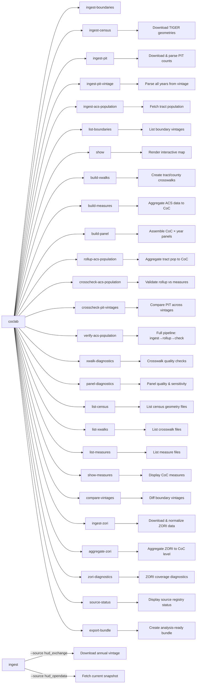

# CLI Reference

The `coclab` command provides access to all core functionality.

## Commands Overview



## `coclab aggregate-zori`

Aggregate ZORI data from county geography to CoC geography using area-weighted crosswalks and ACS-based demographic weights.

```bash
# Basic aggregation with renter household weighting
coclab aggregate-zori --boundary 2025 --counties 2023 --acs 2019-2023

# With yearly output
coclab aggregate-zori -b 2025 -c 2023 --acs 2019-2023 --to-yearly

# Custom weighting method
coclab aggregate-zori -b 2025 -c 2023 --acs 2019-2023 -w housing_units
```

| Option | Description | Default |
|--------|-------------|---------|
| `--boundary`, `-b` | CoC boundary vintage (e.g., `2025`) | Required |
| `--counties`, `-c` | TIGER county vintage year | Required |
| `--acs` | ACS 5-year vintage for weights (e.g., `2019-2023`) | Required |
| `--geography`, `-g` | Base geography type | `county` |
| `--zori-path` | Explicit path to ZORI parquet file | Auto-detected |
| `--xwalk-path` | Explicit crosswalk path | Inferred |
| `--weighting`, `-w` | Weighting: `renter_households`, `housing_units`, `population`, `equal` | `renter_households` |
| `--output-dir`, `-o` | Output directory | `data/curated/zori` |
| `--to-yearly` | Also emit yearly collapsed file | False |
| `--yearly-method` | `pit_january`, `calendar_mean`, `calendar_median` | `pit_january` |
| `--force`, `-f` | Recompute even if output exists | False |

**Prerequisites:**
```bash
coclab ingest-boundaries --source hud_exchange --vintage 2025
coclab ingest-census --year 2023 --type counties
coclab build-xwalks --boundary 2025 --counties 2023
coclab ingest-zori --geography county
```

**Exit Codes:**
- `0` - Success
- `2` - Missing required inputs / mismatched vintages
- `3` - Failure to compute weights (ACS missing)

**Output:**
- `data/curated/zori/coc_zori__{geography}__b{boundary}__c{counties}__acs{acs}__w{weighting}.parquet`
- Optional yearly: `data/curated/zori/coc_zori_yearly__...parquet`

## `coclab build-measures`

Aggregate ACS 5-year estimates to CoC level using tract crosswalks.

```bash
# Build measures with area weighting
coclab build-measures --boundary 2025 --acs 2019-2023

# Use population weighting instead
coclab build-measures --boundary 2025 --acs 2019-2023 --weighting population
```

| Option | Description | Default |
|--------|-------------|---------|
| `--boundary`, `-b` | CoC boundary vintage | Latest |
| `--acs`, `-a` | ACS 5-year estimate vintage (e.g., `2019-2023`) | `2018-2022` |
| `--tracts`, `-t` | Tract vintage for crosswalk | Same as ACS end year |
| `--weighting`, `-w` | `area` or `population` | `area` |
| `--xwalk-dir` | Directory containing crosswalk files | `data/curated/xwalks` |
| `--output-dir`, `-o` | Output directory | `data/curated/measures` |

**Output:**
- `measures__A{acs}@B{boundary}.parquet`
- Summary statistics printed to console

## `coclab build-panel`

Build analysis-ready CoC × year panels combining PIT counts with ACS measures. Optionally includes ZORI rent data for affordability analysis.

```bash
# Build panel for date range
coclab build-panel --start 2018 --end 2024

# Specify weighting method
coclab build-panel --start 2018 --end 2024 --weighting population

# Custom output path
coclab build-panel --start 2020 --end 2024 --output custom_panel.parquet

# Include ZORI rent data for rent-to-income affordability
coclab build-panel --start 2018 --end 2024 --include-zori

# Custom ZORI coverage threshold (default 0.90)
coclab build-panel --start 2018 --end 2024 --include-zori --zori-min-coverage 0.80

# Explicit ZORI data path
coclab build-panel --start 2018 --end 2024 --include-zori --zori-yearly-path data/curated/zori/coc_zori_yearly.parquet
```

| Option | Description | Default |
|--------|-------------|---------|
| `--start`, `-s` | Start year (inclusive) | Required |
| `--end`, `-e` | End year (inclusive) | Required |
| `--weighting`, `-w` | `area` or `population` | `population` |
| `--output`, `-o` | Output file path | Auto-generated |
| `--include-zori` | Include ZORI rent data and compute `rent_to_income` | `False` |
| `--no-include-zori` | Explicitly disable ZORI integration | - |
| `--zori-yearly-path` | Path to yearly ZORI Parquet file | Auto-discover |
| `--zori-min-coverage` | Minimum coverage ratio for ZORI eligibility | `0.90` |

**ZORI Integration:**

When `--include-zori` is enabled, the panel includes:

| Column | Description |
|--------|-------------|
| `zori_coc` | CoC-level ZORI rent value (yearly) |
| `zori_coverage_ratio` | Fraction of CoC covered by ZORI data |
| `zori_is_eligible` | Boolean: meets coverage threshold |
| `zori_excluded_reason` | Why excluded: `missing`, `zero_coverage`, `low_coverage` |
| `rent_to_income` | `zori_coc / (median_household_income / 12.0)` |
| `rent_metric` | Always `ZORI` (provenance) |
| `rent_alignment` | Temporal alignment method (provenance) |
| `zori_min_coverage` | Coverage threshold used (provenance) |

**Eligibility Rules:**
- CoC-year is eligible if `coverage_ratio >= zori_min_coverage`
- Ineligible rows have `zori_coc = null` and `rent_to_income = null`
- High dominance generates warnings but does NOT exclude
- Zero-coverage CoCs are excluded (never imputed)

### Analytic Universe for Rent-to-Income Measures

Analyses that use the `rent_to_income` variable **must be restricted** to CoC-year observations where `zori_is_eligible == True`.

CoC-years that fail ZORI eligibility criteria (e.g., insufficient coverage of underlying counties) have `rent_to_income` set to null and should not be included in rent-affordability inference. No imputation is performed for ineligible CoCs.

**Output:**
- Panel Parquet file with embedded provenance
- Summary statistics (years, CoC count, coverage)
- ZORI summary when enabled (eligible count, rent_to_income stats)

### Panel Naming with ZORI-Enhanced Outputs

When the `--include-zori` option is enabled in `coclab build-panel`, the resulting panel file includes a `__zori` suffix in its filename. This convention distinguishes panels that include rent-based affordability measures from panels built without rent data.

Example:

```
data/curated/panels/coc_panel__2018_2024__zori.parquet
```

This naming convention supports side-by-side comparison of panels built under different analytic assumptions.

## `coclab build-xwalks`

Build area-weighted crosswalks linking CoC boundaries to census tracts and counties.

```bash
# Build crosswalks for a specific boundary and tract vintage
coclab build-xwalks --boundary 2025 --tracts 2023

# Also build county crosswalk
coclab build-xwalks --boundary 2025 --tracts 2023 --counties 2023
```

| Option | Description | Default |
|--------|-------------|---------|
| `--boundary`, `-b` | CoC boundary vintage | Latest |
| `--tracts`, `-t` | Census tract vintage year | 2023 |
| `--counties`, `-c` | Census county vintage year | Same as tracts |
| `--output-dir`, `-o` | Output directory | `data/curated/xwalks` |

**Output:**
- `xwalk__B{boundary}xT{tracts}.parquet`
- `xwalk__B{boundary}xC{counties}.parquet`
- Diagnostic summary printed to console

## `coclab compare-vintages`

Compare CoC boundaries between two vintages.

```bash
# Basic comparison
coclab compare-vintages --vintage1 2024 --vintage2 2025

# Show unchanged CoCs too
coclab compare-vintages -v1 2024 -v2 2025 --show-unchanged

# Save diff to CSV
coclab compare-vintages -v1 2024 -v2 2025 -o diff_report.csv
```

| Option | Description | Default |
|--------|-------------|---------|
| `--vintage1`, `-v1` | First (older) vintage | Required |
| `--vintage2`, `-v2` | Second (newer) vintage | Required |
| `--show-unchanged` | Also list unchanged CoCs | False |
| `--output`, `-o` | Save diff to CSV | None |

**Output:**
- Summary counts of added, removed, changed, unchanged CoCs
- Lists of affected CoC IDs by category

## `coclab crosscheck-acs-population`

Cross-check population rollup against existing CoC measures (`total_population` from `coc_measures`).

```bash
# Basic crosscheck
coclab crosscheck-acs-population --boundary 2025 --acs 2019-2023 --tracts 2023 --weighting area

# With custom thresholds
coclab crosscheck-acs-population --boundary 2025 --acs 2019-2023 --tracts 2023 --weighting area \
    --warn-pct 0.02 --error-pct 0.10 --min-coverage 0.90
```

| Option | Description | Default |
|--------|-------------|---------|
| `--boundary`, `-b` | CoC boundary vintage | Required |
| `--acs`, `-a` | ACS 5-year vintage | Required |
| `--tracts`, `-t` | Census tract vintage year | Required |
| `--weighting`, `-w` | `area` or `population_mass` | `area` |
| `--warn-pct` | Warning threshold for percent delta | 0.01 (1%) |
| `--error-pct` | Error threshold for percent delta | 0.05 (5%) |
| `--min-coverage` | Minimum coverage ratio | 0.95 |

**Exit Codes:**
- `0` - No errors (warnings allowed)
- `2` - Errors found (threshold exceeded)

**Output:**
- Console report with top 25 worst deltas
- `data/curated/acs/acs_population_crosscheck__{boundary}__{acs}__{tracts}__{weighting}.parquet`

## `coclab crosscheck-pit-vintages`

Compare PIT counts between two vintage releases to detect historical data revisions. This helps identify when HUD has revised historical PIT data between releases (e.g., due to CoC mergers or data corrections).

```bash
# Compare 2023 and 2024 vintages
coclab crosscheck-pit-vintages --vintage1 2023 --vintage2 2024

# Filter to a specific year
coclab crosscheck-pit-vintages -v1 2023 -v2 2024 --year 2020

# Save detailed comparison to CSV
coclab crosscheck-pit-vintages -v1 2023 -v2 2024 -o comparison.csv

# Show unchanged records too
coclab crosscheck-pit-vintages -v1 2023 -v2 2024 --show-unchanged
```

| Option | Description | Default |
|--------|-------------|---------|
| `--vintage1`, `-v1` | First (older) vintage to compare | Required |
| `--vintage2`, `-v2` | Second (newer) vintage to compare | Required |
| `--year`, `-y` | Filter to specific PIT year | All common years |
| `--output`, `-o` | Save detailed comparison to CSV | None |
| `--show-unchanged` | Include unchanged records in output | False |

**Output:**
- **Tab Totals**: Year-by-year comparison of all-CoC totals for total, sheltered, and unsheltered counts
- **Summary**: Counts of added, removed, changed, and unchanged CoC-year records
- **Changed**: CoCs with revised counts (shows delta values)
- **Added**: CoC-years present in v2 but not v1
- **Removed**: CoC-years present in v1 but not v2 (often due to mergers)

**Interpreting Results:**

If tab totals match but individual CoCs differ, the changes are likely due to CoC reorganizations (mergers) rather than data corrections. For example, if MA-519 was merged into MA-505:
- MA-505 will show as "changed" with increased counts
- MA-519 will show as "removed"
- Tab totals will remain identical

## `coclab export-bundle`

Export an analysis-ready bundle with MANIFEST.json for downstream analysis repositories.

```bash
# Basic export with default options
coclab export-bundle --name my_analysis --panel data/curated/panels/coc_panel.parquet

# Include inputs and use specific vintages
coclab export-bundle --name replication --include panel,manifest,codebook,inputs \
  --boundary-vintage 2025 --years 2011-2024

# Create compressed archive
coclab export-bundle --name archive --compress
```

| Option | Description | Default |
|--------|-------------|---------|
| `--name`, `-n` | Logical bundle name for metadata and documentation | Required |
| `--out-dir`, `-o` | Output directory where export-N folders are created | `exports` |
| `--panel`, `-p` | Explicit panel parquet path (inferred from curated if omitted) | Auto-infer |
| `--include`, `-i` | Components to include (comma-separated) | `panel,manifest,codebook,diagnostics` |
| `--boundary-vintage` | Boundary vintage (e.g., 2025) | None |
| `--tracts-vintage` | Census tracts vintage (e.g., 2023) | None |
| `--counties-vintage` | Counties vintage (e.g., 2023) | None |
| `--acs-vintage` | ACS vintage (e.g., 2019-2023) | None |
| `--years` | Year range (e.g., 2011-2024) | None |
| `--copy-mode` | File copy mode: `copy`, `hardlink`, or `symlink` | `copy` |
| `--compress` | Create .tar.gz archive of the bundle | `False` |
| `--force`, `-f` | Create bundle even if identical manifest exists | `False` |

**Include Components:**

| Component | Description |
|-----------|-------------|
| `panel` | Primary panel parquet file(s) |
| `inputs` | Boundaries, crosswalks, raw curated sources required to regenerate |
| `derived` | Derived intermediate artifacts beyond the panel |
| `diagnostics` | Diagnostic outputs |
| `codebook` | Variable descriptions and schema documentation |
| `manifest` | Always created; this flag controls whether it is also copied to `provenance/` |

**Output:**
- New export folder created: `{out-dir}/export-{n}/`
- Each invocation creates a new numbered folder (export-1, export-2, ...) to preserve prior bundles
- Summary of files exported by role and total size

**Exit Codes:**

| Code | Meaning |
|------|---------|
| `0` | Success |
| `2` | Validation failure (missing panel, incompatible vintages, unreadable files) |
| `3` | Filesystem failure (cannot create export directory, copy failure) |
| `4` | Manifest failure (hashing/metadata extraction failure) |

## `coclab ingest-acs-population`

Ingest tract-level population data from ACS 5-year estimates (Census API table B01003).

```bash
# Ingest tract population for ACS 2019-2023 using 2023 tract geometries
coclab ingest-acs-population --acs 2019-2023 --tracts 2023

# Force re-fetch even if cached file exists
coclab ingest-acs-population --acs 2019-2023 --tracts 2023 --force
```

| Option | Description | Default |
|--------|-------------|---------|
| `--acs`, `-a` | ACS 5-year vintage (e.g., `2019-2023` or `2023`) | Required |
| `--tracts`, `-t` | Census tract vintage year | Required |
| `--force` | Re-fetch even if cached file exists | False |

**Output:**
- `data/curated/acs/tract_population__{acs}__{tracts}.parquet`
- Contains: tract_geoid, acs_vintage, tract_vintage, total_population, moe_total_population, data_source, source_ref, ingested_at

## `coclab ingest-boundaries`

Ingest CoC boundary data from HUD sources.

**From HUD Exchange (annual vintages):**
```bash
coclab ingest-boundaries --source hud_exchange --vintage 2025
```

**From HUD Open Data (current snapshot):**
```bash
coclab ingest-boundaries --source hud_opendata --snapshot latest
```

| Option       | Description                                    | Default                     |
| ------------ | ---------------------------------------------- | --------------------------- |
| `--source`   | Data source (`hud_exchange` or `hud_opendata`) | Required                    |
| `--vintage`  | Year for HUD Exchange data                     | Required for `hud_exchange` |
| `--snapshot` | Snapshot tag for Open Data                     | `latest`                    |
| `--force`    | Re-ingest even if vintage already exists       | False                       |

## `coclab ingest-census`

Download TIGER census geometries (tracts and/or counties).

```bash
# Download both tracts and counties for 2023
coclab ingest-census --year 2023

# Download only tracts
coclab ingest-census --year 2023 --type tracts

# Force re-download even if files exist
coclab ingest-census --year 2023 --force
```

| Option | Description | Default |
|--------|-------------|---------|
| `--year`, `-y` | TIGER vintage year | 2023 |
| `--type`, `-t` | `tracts`, `counties`, or `all` | `all` |
| `--force` | Re-download even if file exists | False |

## `coclab ingest-pit`

Download and parse PIT (Point-in-Time) count data from HUD Exchange.

```bash
# Ingest PIT data for a specific year
coclab ingest-pit --year 2024

# Force re-download even if file exists
coclab ingest-pit --year 2024 --force

# Parse only (skip download if file exists)
coclab ingest-pit --year 2024 --parse-only
```

| Option | Description | Default |
|--------|-------------|---------|
| `--year`, `-y` | PIT count year to ingest | Required |
| `--force` | Re-download even if file exists | False |
| `--parse-only` | Skip download, parse existing file | False |

**Workflow:**
1. Downloads PIT Excel file from HUD Exchange
2. Parses to canonical schema (coc_id, pit_total, pit_sheltered, pit_unsheltered)
3. Writes Parquet with embedded provenance
4. Registers in PIT registry
5. Runs QA validation checks

## `coclab ingest-pit-vintage`

Ingest **all years** from a PIT vintage file. Unlike `ingest-pit` which extracts only a single year, this command parses every year tab from the HUD Excel file (e.g., 2007-2024 from the 2024 release).

This is useful for detecting when HUD revises historical PIT data between releases.

```bash
# Ingest all years from the 2024 vintage
coclab ingest-pit-vintage --vintage 2024

# Force re-download
coclab ingest-pit-vintage --vintage 2024 --force

# Parse existing file only
coclab ingest-pit-vintage --vintage 2024 --parse-only
```

| Option | Description | Default |
|--------|-------------|---------|
| `--vintage`, `-v` | Vintage/release year to ingest | Required |
| `--force` | Re-download even if file exists | False |
| `--parse-only` | Skip download, parse existing file | False |

**Output:**
- `data/curated/pit/pit_vintage__{vintage}.parquet` containing all years
- Registered in PIT vintage registry

## `coclab ingest-zori`

Download and normalize ZORI (Zillow Observed Rent Index) data from Zillow Economic Research.

```bash
# Ingest county-level ZORI data
coclab ingest-zori --geography county

# Force re-download even if cached
coclab ingest-zori --geography county --force

# Filter to specific date range
coclab ingest-zori --geography county --start 2020-01-01 --end 2024-12-31
```

| Option | Description | Default |
|--------|-------------|---------|
| `--geography`, `-g` | Geography level: `county` or `zip` | `county` |
| `--url` | Override download URL | Auto-detected |
| `--force`, `-f` | Re-download and reprocess even if cached | False |
| `--output-dir`, `-o` | Output directory for curated parquet | `data/curated/zori` |
| `--raw-dir` | Directory for raw downloads | `data/raw/zori` |
| `--start` | Filter to dates >= start (YYYY-MM-DD) | None |
| `--end` | Filter to dates <= end (YYYY-MM-DD) | None |

**Exit Codes:**
- `0` - Success
- `2` - Validation/parse error
- `3` - Download error

**Output:**
- `data/curated/zori/zori__{geography}.parquet`

## `coclab list-boundaries`

List all available boundary vintages in the registry.

```bash
coclab list-boundaries
```

**Example Output:**
```
Available boundary vintages:

Vintage                        Source                    Features   Ingested At
-------------------------------------------------------------------------------------
2025                           hud_exchange_gis_tools    400        2025-01-15 14:30
HUDOpenData_2025-01-10         hud_opendata_arcgis       402        2025-01-10 09:15
```

## `coclab list-census`

List available TIGER census geometry files (tracts and counties).

```bash
# List all census geometry files
coclab list-census

# List only tract files
coclab list-census --type tracts

# List only county files
coclab list-census --type counties
```

| Option | Description | Default |
|--------|-------------|---------|
| `--type`, `-t` | Filter by type: `tracts` or `counties` | All |
| `--dir`, `-d` | Directory to scan | `data/curated/census` |

**Example Output:**
```
Available census geometry files:

Type         Year             Rows         Size Modified
-----------------------------------------------------------------
counties     2022            3,235     119.7 MB 2025-01-06 07:33
counties     2023            3,235     119.5 MB 2025-01-05 18:10
tracts       2022           85,529     619.9 MB 2025-01-06 07:33
tracts       2023           85,529     620.8 MB 2025-01-05 18:18

Total: 4 census file(s)
```

## `coclab list-measures`

List available CoC measure files.

```bash
coclab list-measures
```

| Option | Description | Default |
|--------|-------------|---------|
| `--dir`, `-d` | Directory to scan | `data/curated/measures` |

## `coclab list-xwalks`

List available crosswalk files.

```bash
# List all crosswalks
coclab list-xwalks

# List only tract crosswalks
coclab list-xwalks --type tract
```

| Option | Description | Default |
|--------|-------------|---------|
| `--type`, `-t` | `tract`, `county`, or `all` | `all` |
| `--dir`, `-d` | Directory to scan | `data/curated/xwalks` |

## `coclab panel-diagnostics`

Run diagnostics and sensitivity checks on panel files.

```bash
# Run diagnostics on a panel
coclab panel-diagnostics --panel data/curated/panels/coc_panel__2018_2024.parquet

# Export diagnostics to CSV files
coclab panel-diagnostics --panel panel.parquet --output-dir ./diagnostics/ --format csv

# Print text summary only
coclab panel-diagnostics --panel panel.parquet --format text
```

| Option | Description | Default |
|--------|-------------|---------|
| `--panel`, `-p` | Path to panel Parquet file | Required |
| `--output-dir`, `-o` | Directory for CSV exports | None |
| `--format`, `-f` | `text` or `csv` | `text` |

**Diagnostics Included:**
- Coverage ratio distribution over time
- Boundary change flags by CoC/year
- Missingness summaries per column
- Panel structure validation

## `coclab rollup-acs-population`

Build CoC population rollup by aggregating tract population to CoC using existing crosswalks.

```bash
# Build rollup with area weighting
coclab rollup-acs-population --boundary 2025 --acs 2019-2023 --tracts 2023 --weighting area

# Use population_mass weighting
coclab rollup-acs-population --boundary 2025 --acs 2019-2023 --tracts 2023 --weighting population_mass

# Force rebuild even if cached
coclab rollup-acs-population --boundary 2025 --acs 2019-2023 --tracts 2023 --weighting area --force
```

| Option | Description | Default |
|--------|-------------|---------|
| `--boundary`, `-b` | CoC boundary vintage | Required |
| `--acs`, `-a` | ACS 5-year vintage | Required |
| `--tracts`, `-t` | Census tract vintage year | Required |
| `--weighting`, `-w` | `area` or `population_mass` | `area` |
| `--force` | Rebuild even if cached file exists | False |

**Output:**
- `data/curated/acs/coc_population_rollup__{boundary}__{acs}__{tracts}__{weighting}.parquet`
- Contains: coc_id, boundary_vintage, acs_vintage, tract_vintage, weighting_method, coc_population, coverage_ratio, max_tract_contribution, tract_count

## `coclab show`

Render an interactive map for a specific CoC boundary.

```bash
# Show using latest vintage
coclab show --coc CO-500

# Specify a vintage
coclab show --coc CO-500 --vintage 2025

# Custom output path
coclab show --coc NY-600 --output my_map.html
```

| Option | Description | Default |
|--------|-------------|---------|
| `--coc` | CoC identifier (e.g., `CO-500`) | Required |
| `--vintage` | Boundary vintage to use | Latest |
| `--output` | Output HTML file path | Auto-generated |

## `coclab show-measures`

Display computed measures for a specific CoC.

```bash
# Show measures (auto-detect latest files)
coclab show-measures --coc CO-500

# Specify vintages
coclab show-measures --coc CO-500 --boundary 2025 --acs 2022

# Output as JSON
coclab show-measures --coc NY-600 --format json
```

| Option | Description | Default |
|--------|-------------|---------|
| `--coc`, `-c` | CoC identifier | Required |
| `--boundary`, `-b` | Boundary vintage | Auto-detect |
| `--acs`, `-a` | ACS vintage year | Auto-detect |
| `--format`, `-f` | `table`, `json`, or `csv` | `table` |

## `coclab source-status`

Display status of tracked external data sources. The source registry tracks all ingested external data (ZORI, boundaries, census, etc.) with SHA-256 hashes to detect upstream changes.

```bash
# Show full registry summary
coclab source-status

# Check for upstream data changes
coclab source-status --check-changes

# Filter by source type
coclab source-status --type zori
```

| Option | Description | Default |
|--------|-------------|---------|
| `--type`, `-t` | Filter to source type (`zori`, `boundary`, `census_tract`, etc.) | All |
| `--check-changes`, `-c` | Highlight sources with multiple different hashes | `False` |

**Source Types Tracked:**
- `zori` - Zillow ZORI rent data
- `boundary` - HUD CoC boundaries
- `census_tract` - TIGER tract geometries
- `census_county` - TIGER county geometries
- `acs_tract` - ACS tract-level data
- `acs_county` - ACS county-level data
- `pit` - HUD PIT counts

**Change Detection:**

When `--check-changes` is used, the command identifies sources where the upstream data has changed between ingestions (different SHA-256 hashes). This helps detect silent updates to external data sources.

## `coclab verify-acs-population`

One-shot command that runs: ingest → rollup → crosscheck.

```bash
# Full verification pipeline
coclab verify-acs-population --boundary 2025 --acs 2019-2023 --tracts 2023 --weighting area

# With custom thresholds and force rebuild
coclab verify-acs-population --boundary 2025 --acs 2019-2023 --tracts 2023 --weighting area \
    --force --warn-pct 0.02 --error-pct 0.10 --min-coverage 0.90
```

| Option | Description | Default |
|--------|-------------|---------|
| `--boundary`, `-b` | CoC boundary vintage | Required |
| `--acs`, `-a` | ACS 5-year vintage | Required |
| `--tracts`, `-t` | Census tract vintage year | Required |
| `--weighting`, `-w` | `area` or `population_mass` | `area` |
| `--force` | Force re-ingest and rebuild all artifacts | False |
| `--warn-pct` | Warning threshold for percent delta | 0.01 (1%) |
| `--error-pct` | Error threshold for percent delta | 0.05 (5%) |
| `--min-coverage` | Minimum coverage ratio | 0.95 |

**Exit Codes:**
- `0` - No errors (warnings allowed)
- `2` - Errors found (threshold exceeded)

## `coclab xwalk-diagnostics`

Run crosswalk quality diagnostics.

```bash
# Basic diagnostics
coclab xwalk-diagnostics --crosswalk data/curated/xwalks/xwalk__B2025xT2023.parquet

# Show problem CoCs
coclab xwalk-diagnostics -x crosswalk.parquet --show-problems

# Custom thresholds and CSV export
coclab xwalk-diagnostics -x crosswalk.parquet --coverage-threshold 0.90 -o diagnostics.csv
```

| Option | Description | Default |
|--------|-------------|---------|
| `--crosswalk`, `-x` | Path to crosswalk parquet file | Required |
| `--coverage-threshold` | Coverage threshold for flagging | 0.95 |
| `--max-contribution` | Max tract contribution threshold | 0.8 |
| `--show-problems` | Show problem CoCs | False |
| `--output`, `-o` | Save diagnostics to CSV | None |

## `coclab zori-diagnostics`

Summarize CoC ZORI coverage, missingness, and quality metrics.

```bash
# Run diagnostics on CoC ZORI file
coclab zori-diagnostics --coc-zori data/curated/zori/coc_zori__county__b2025.parquet

# Save diagnostics to file
coclab zori-diagnostics --coc-zori coc_zori.parquet --output diagnostics.csv

# Custom thresholds
coclab zori-diagnostics --coc-zori coc_zori.parquet --coverage-threshold 0.85
```

| Option | Description | Default |
|--------|-------------|---------|
| `--coc-zori` | Path to CoC-level ZORI parquet file | Required |
| `--output`, `-o` | Save diagnostics to CSV or parquet | None |
| `--coverage-threshold` | Threshold for flagging low coverage | 0.90 |
| `--dominance-threshold` | Threshold for flagging high dominance | 0.80 |

**Output:**
- Console summary with coverage statistics
- Per-CoC diagnostic flags (low coverage, high dominance)
- Optional CSV/parquet export

---

**Previous:** [[03-Architecture]] | **Next:** [[05-Python-API]]
