# Data Model

Unless stated otherwise, path examples in this chapter show the built-in
default layout. Replace `data/raw/...`, `data/curated/...`, and
`data/curated/panel/...` with the configured `asset_store_root` and
`output_root` when your environment uses custom storage roots.

## Analysis Geography Model

CoC Lab supports multiple analysis geographies—the unit of observation in derived outputs. The abstraction separates *analysis geography* (what you want to measure) from *source geometry* (how input data is natively organized).

| Property | CoC | Metro |
|----------|-----|-------|
| `geo_type` | `"coc"` | `"metro"` |
| `geo_id` | CoC code (e.g., `CO-500`) | Metro ID (e.g., `GF01`) |
| Version key | `boundary_vintage` (e.g., `"2025"`) | `definition_version` (e.g., `"glynn_fox_v1"`) |
| Identity source | HUD boundary polygons | Researcher membership rules |
| PIT aggregation | Native (identity) | Summed over member CoCs |
| ACS aggregation | Tract crosswalk | County-membership tract crosswalk |
| PEP aggregation | County crosswalk | County membership |
| ZORI aggregation | County crosswalk | County membership |

### Canonical Column Contract

Derived datasets use these canonical columns:

| Column | Type | Description |
|--------|------|-------------|
| `geo_type` | string | Geography family: `"coc"` or `"metro"` |
| `geo_id` | string | Canonical identifier within the family |
| `year` | int | Observation year |

CoC outputs retain `coc_id` for backward compatibility. Metro outputs use `metro_id` as the native identifier alongside `geo_type` and `geo_id`. Metro outputs never invent a fake `coc_id`.

## Canonical Boundary Schema

All boundary data is normalized to this schema before storage:

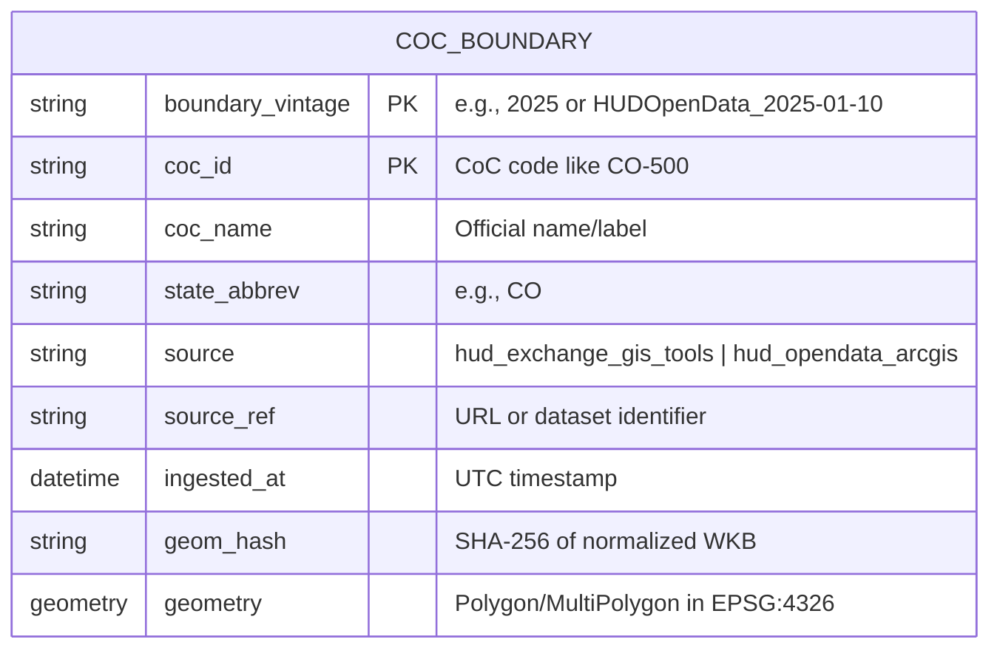

| Column | Type | Description |
|--------|------|-------------|
| `boundary_vintage` | string | Version identifier (e.g., `2025`) |
| `coc_id` | string | CoC identifier (e.g., `CO-500`) |
| `coc_name` | string | Official CoC name |
| `state_abbrev` | string | US state abbreviation |
| `source` | string | Data source identifier |
| `source_ref` | string | URL or reference to original data |
| `ingested_at` | datetime | UTC timestamp of ingestion |
| `geom_hash` | string | SHA-256 hash for change detection |
| `geometry` | Polygon/MultiPolygon | Boundary in EPSG:4326 |

## Registry Schema

The registry tracks all available boundary vintages:

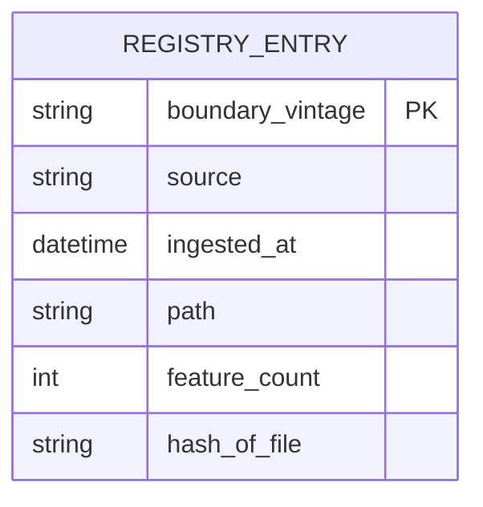

## Crosswalk Schema

Crosswalks link CoC boundaries to census geographies:

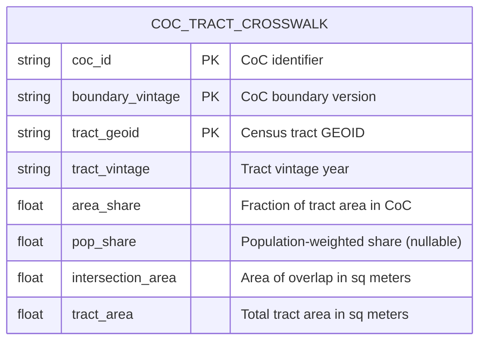

| Column | Type | Description |
|--------|------|-------------|
| `coc_id` | string | CoC identifier (e.g., `CO-500`) |
| `boundary_vintage` | string | CoC boundary version |
| `tract_geoid` | string | 11-digit census tract GEOID |
| `tract_vintage` | string | Census tract vintage year |
| `area_share` | float | `intersection_area / tract_area` |
| `pop_share` | float | Population-weighted share (nullable) |
| `intersection_area` | float | Overlap area in square meters |
| `tract_area` | float | Total tract area in square meters |

## County Crosswalk Schema

Crosswalks linking CoC boundaries to county geographies:

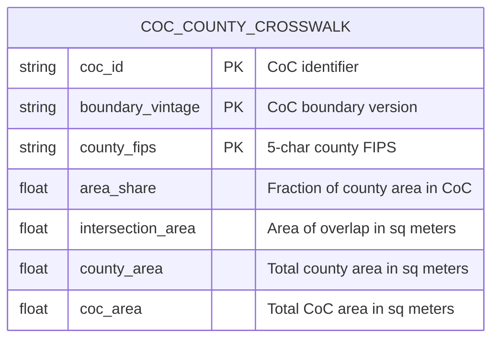

| Column | Type | Description |
|--------|------|-------------|
| `coc_id` | string | CoC identifier (e.g., `CO-500`) |
| `boundary_vintage` | string | CoC boundary version |
| `county_fips` | string | 5-character county FIPS code |
| `area_share` | float | `intersection_area / county_area` (for county→CoC aggregation) |
| `intersection_area` | float | Overlap area in square meters (ESRI:102003) |
| `county_area` | float | Total county area in square meters |
| `coc_area` | float | Total CoC area in square meters |

**Deriving Alternative Shares:**

- **County share (default):** `area_share = intersection_area / county_area`
  Used for aggregating county-level data to CoC level (e.g., PEP population, ZORI rents).

- **CoC share:** `coc_share = intersection_area / coc_area`
  Can be derived for disaggregating CoC-level data to counties.

## CoC Measures Schema

Aggregated demographic measures at CoC level:

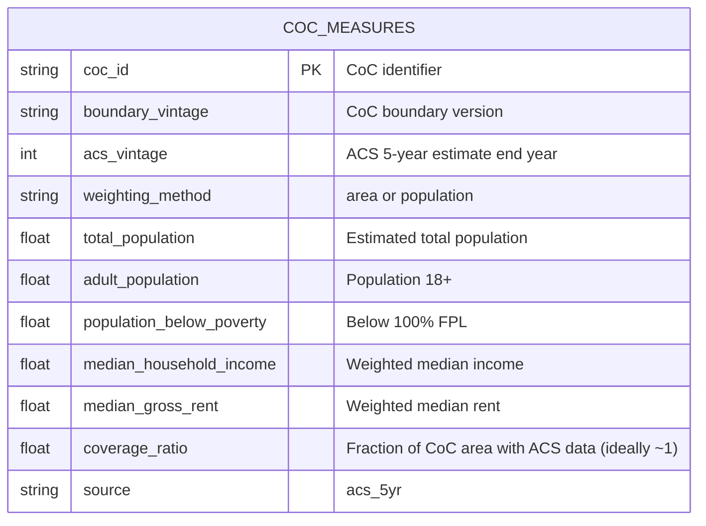

| Column | Type | Description |
|--------|------|-------------|
| `coc_id` | string | CoC identifier |
| `boundary_vintage` | string | CoC boundary version used |
| `acs_vintage` | int | ACS 5-year estimate end year |
| `weighting_method` | string | `area` or `population` |
| `total_population` | float | Weighted population estimate |
| `adult_population` | float | Population 18 and older |
| `population_below_poverty` | float | Below 100% federal poverty line |
| `median_household_income` | float | Population-weighted median |
| `median_gross_rent` | float | Population-weighted median |
| `coverage_ratio` | float | Fraction of CoC area covered by tracts with data |
| `source` | string | Always `acs_5yr` |

## PIT Counts Schema

Canonical PIT (Point-in-Time) count data:

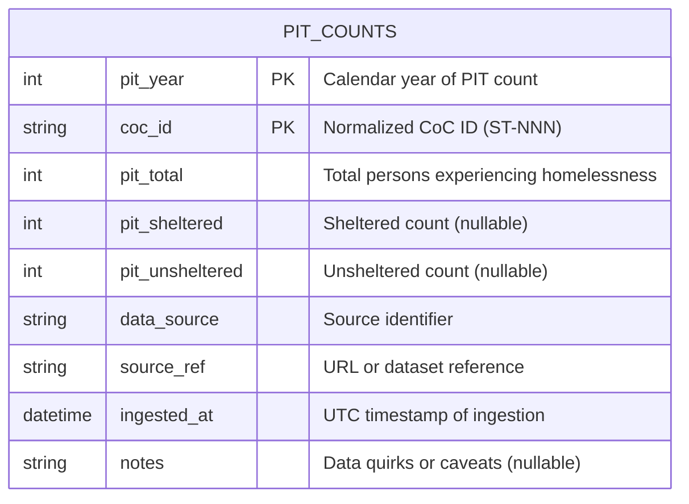

| Column | Type | Description |
|--------|------|-------------|
| `pit_year` | int | Calendar year of PIT count |
| `coc_id` | string | Normalized CoC ID (e.g., `CO-500`) |
| `pit_total` | int | Total persons experiencing homelessness |
| `pit_sheltered` | int | Sheltered count (nullable) |
| `pit_unsheltered` | int | Unsheltered count (nullable) |
| `data_source` | string | Source identifier (e.g., `hud_exchange`) |
| `source_ref` | string | URL or dataset reference |
| `ingested_at` | datetime | UTC timestamp of ingestion |
| `notes` | string | Data quirks or caveats (nullable) |

## Panel Schema

Analysis-ready CoC × year panels combining PIT counts with ACS measures:

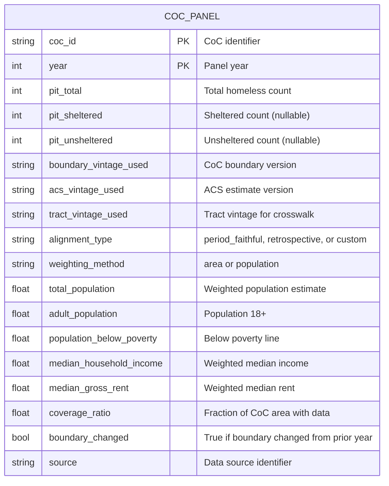

| Column | Type | Description |
|--------|------|-------------|
| `coc_id` | string | CoC identifier (e.g., `CO-500`) |
| `year` | int | Panel year |
| `pit_total` | int | Total homeless count from PIT |
| `pit_sheltered` | int | Sheltered count (nullable) |
| `pit_unsheltered` | int | Unsheltered count (nullable) |
| `boundary_vintage_used` | string | CoC boundary version applied |
| `acs_vintage_used` | string | ACS estimate version applied |
| `tract_vintage_used` | string | Tract vintage used for the crosswalk |
| `alignment_type` | string | Alignment policy label (`period_faithful`, `retrospective`, or `custom`) |
| `weighting_method` | string | `area` or `population` |
| `total_population` | float | Weighted population estimate |
| `adult_population` | float | Population 18 and older |
| `population_below_poverty` | float | Below 100% federal poverty line |
| `median_household_income` | float | Population-weighted median |
| `median_gross_rent` | float | Population-weighted median |
| `coverage_ratio` | float | Fraction of CoC area covered by tracts with data |
| `boundary_changed` | bool | True if CoC boundary changed from prior year |
| `source` | string | Data source identifier |

When ZORI is enabled, the panel appends:
- `zori_coc`
- `zori_coverage_ratio`
- `zori_is_eligible`
- `zori_excluded_reason`
- `rent_to_income`
- provenance fields `rent_metric`, `rent_alignment`, `zori_min_coverage`

## Metro Definition Schemas

Metro areas are synthetic analysis units defined by researcher membership rules. The Glynn/Fox metros (25 units) are encoded as three curated tables stored under `data/curated/metro/`.

### Metro Definitions

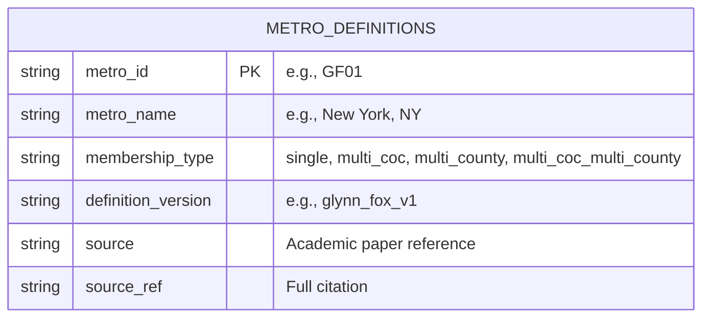

| Column | Type | Description |
|--------|------|-------------|
| `metro_id` | string | Zero-padded identifier (e.g., `GF01` through `GF25`) |
| `metro_name` | string | Human-readable metro name |
| `membership_type` | string | Aggregation rule: `single`, `multi_coc`, `multi_county`, or `multi_coc_multi_county` |
| `definition_version` | string | Version identifier (e.g., `glynn_fox_v1`) |
| `source` | string | Source attribution |
| `source_ref` | string | Full citation or URL |

### Metro CoC Membership

Maps each metro to its constituent CoCs for PIT aggregation:

| Column | Type | Description |
|--------|------|-------------|
| `metro_id` | string | Metro identifier |
| `coc_id` | string | Member CoC code (e.g., `CA-600`) |
| `definition_version` | string | Definition version |

### Metro County Membership

Maps each metro to its constituent counties for PEP, ZORI, and ACS aggregation:

| Column | Type | Description |
|--------|------|-------------|
| `metro_id` | string | Metro identifier |
| `county_fips` | string | 5-digit county FIPS code |
| `definition_version` | string | Definition version |

### Membership Types

| Type | PIT Rule | Population/Rent Rule |
|------|----------|---------------------|
| `single` | One CoC, identity | One county, identity |
| `multi_coc` | Sum PIT across member CoCs | One county, identity |
| `multi_county` | One CoC, identity | Aggregate across member counties |
| `multi_coc_multi_county` | Sum PIT across member CoCs | Aggregate across member counties |

## Metro Panel Schema

Analysis-ready metro×year panels combining PIT counts with ACS measures:

| Column | Type | Description |
|--------|------|-------------|
| `metro_id` | string | Metro identifier (e.g., `GF01`) |
| `geo_type` | string | Always `"metro"` |
| `geo_id` | string | Same as `metro_id` |
| `year` | int | Panel year |
| `pit_total` | int | Total homeless count (summed over member CoCs) |
| `pit_sheltered` | int | Sheltered count (nullable) |
| `pit_unsheltered` | int | Unsheltered count (nullable) |
| `definition_version_used` | string | Metro definition version applied |
| `acs_vintage_used` | string | ACS estimate version applied |
| `tract_vintage_used` | string | Tract vintage used for crosswalk |
| `alignment_type` | string | `definition_fixed` (metro) or `retrospective`/`period_faithful` (CoC) |
| `weighting_method` | string | `area` or `population` |
| `total_population` | float | Aggregated from county PEP or ACS |
| `adult_population` | float | Population 18 and older |
| `population_below_poverty` | float | Below 100% federal poverty line |
| `median_household_income` | float | Population-weighted median |
| `median_gross_rent` | float | Population-weighted median |
| `coverage_ratio` | float | Fraction of metro area with data |
| `boundary_changed` | bool | Always `False` for metro (definitions are version-fixed) |
| `source` | string | Data source identifier |

When ZORI is enabled, the same ZORI columns as CoC panels are appended (`zori_coc`, `zori_coverage_ratio`, `zori_is_eligible`, `zori_excluded_reason`, `rent_to_income`).

When ACS 1-year data is included (`include_acs1`), metro panels also carry:
- `unemployment_rate_acs1` — ACS 1-year unemployment rate (metro-native, from CBSA-level B23025)
- `acs1_vintage_used` — Which ACS1 vintage contributed (nullable when no ACS1 data available)
- `acs_products_used` — Comma-separated product list: `"acs5"` or `"acs5,acs1"`

## ACS 1-Year Metro Schema

ACS 1-year data is ingested at CBSA geography and mapped to Glynn/Fox metro IDs. Stored under `data/curated/acs/`.

| Column | Type | Description |
|--------|------|-------------|
| `metro_id` | string | Metro identifier (e.g., `GF01`) |
| `geo_type` | string | Always `"metro"` |
| `geo_id` | string | Same as `metro_id` |
| `unemployment_rate_acs1` | float | Unemployment rate from ACS 1-year B23025 |
| `definition_version` | string | Metro definition version |
| `acs1_vintage` | int | ACS 1-year vintage end year |

Storage: `data/curated/acs/acs1__metro__A{vintage}@D{version}.parquet`

ACS 1-year estimates are only available for geographies with population >= 65,000. All 25 Glynn/Fox metros qualify.

## Metro Derived Dataset Storage

| File | Path Pattern | Description |
|------|--------------|-------------|
| Metro definitions | `data/curated/metro/metro_definitions__glynn_fox_v1.parquet` | Metro identity and membership type |
| Metro CoC membership | `data/curated/metro/metro_coc_membership__glynn_fox_v1.parquet` | Metro→CoC mapping |
| Metro county membership | `data/curated/metro/metro_county_membership__glynn_fox_v1.parquet` | Metro→county mapping |
| Metro PIT | `data/curated/pit/pit__metro__P{year}@D{version}.parquet` | Metro-level PIT counts |
| Metro measures | `data/curated/measures/measures__metro__A{acs}@D{version}xT{tract}.parquet` | Metro ACS measures |
| Metro PEP | `data/curated/pep/pep__metro__D{version}xC{county}__w{weight}__{start}_{end}.parquet` | Metro population estimates |
| Metro ZORI | `data/curated/zori/zori__metro__A{acs}@D{version}xC{county}__w{weight}.parquet` | Metro rent index |
| Metro ZORI yearly | `data/curated/zori/zori_yearly__metro__A{acs}@D{version}xC{county}__w{weight}__m{method}.parquet` | Metro yearly-collapsed rent index |
| Metro panels | `data/curated/panel/panel__metro__Y{start}-{end}@D{version}.parquet` | Metro analysis panels |
| Metro ACS1 | `data/curated/acs/acs1__metro__A{vintage}@D{version}.parquet` | Metro-native ACS 1-year unemployment |

## Normalized ZORI Schema

ZORI data from Zillow is normalized to this long-format schema:

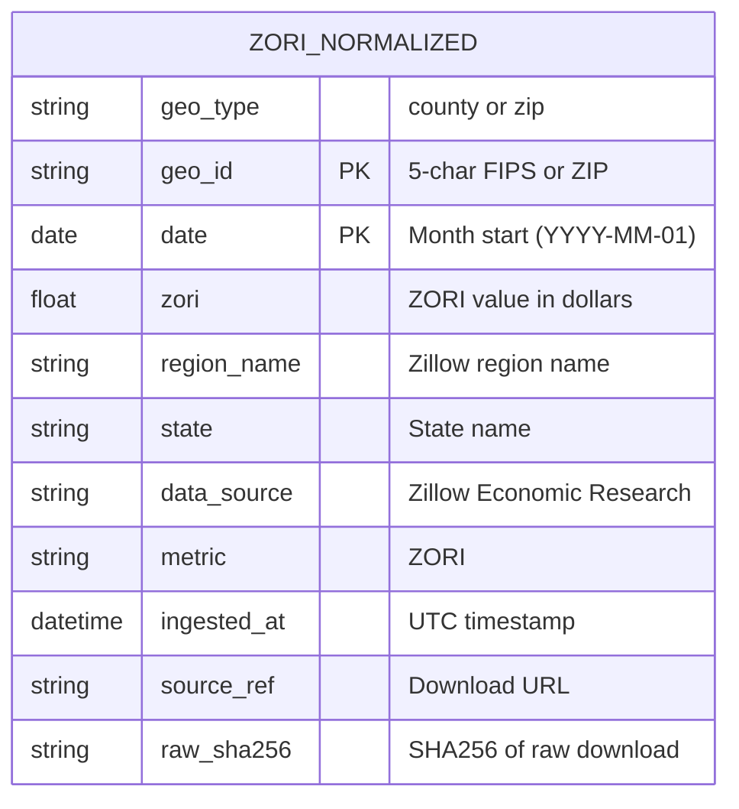

| Column | Type | Description |
|--------|------|-------------|
| `geo_type` | string | Geography type: `county` or `zip` |
| `geo_id` | string | 5-character FIPS code (county) or ZIP code |
| `date` | date | Month start date (e.g., `2024-01-01`) |
| `zori` | float | ZORI value (level) in dollars |
| `region_name` | string | Zillow's region name |
| `state` | string | State name |
| `data_source` | string | Always `Zillow Economic Research` |
| `metric` | string | Always `ZORI` |
| `ingested_at` | datetime | UTC timestamp of ingestion |
| `source_ref` | string | Download URL |
| `raw_sha256` | string | SHA256 hash of raw download for provenance |

## CoC ZORI Schema

Aggregated ZORI data at CoC level:

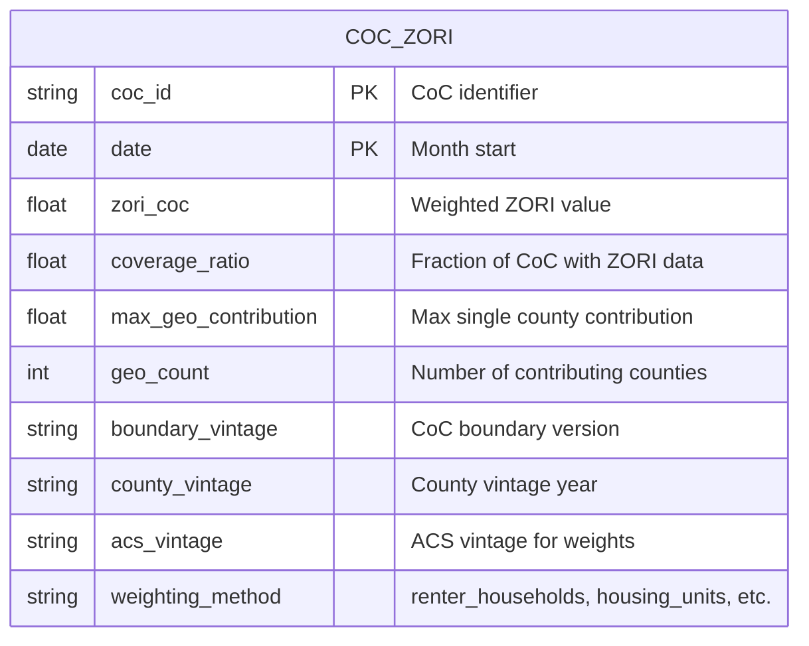

| Column | Type | Description |
|--------|------|-------------|
| `coc_id` | string | CoC identifier (e.g., `CO-500`) |
| `date` | date | Month start date |
| `zori_coc` | float | Weighted average ZORI for CoC |
| `coverage_ratio` | float | Sum of weights for counties with ZORI data |
| `max_geo_contribution` | float | Largest single county weight |
| `geo_count` | int | Number of counties contributing to estimate |
| `boundary_vintage` | string | CoC boundary version used |
| `county_vintage` | string | TIGER county vintage |
| `acs_vintage` | string | ACS vintage for demographic weights |
| `weighting_method` | string | Weighting method used |

## County Weights Schema

ACS-based county weights for ZORI aggregation:

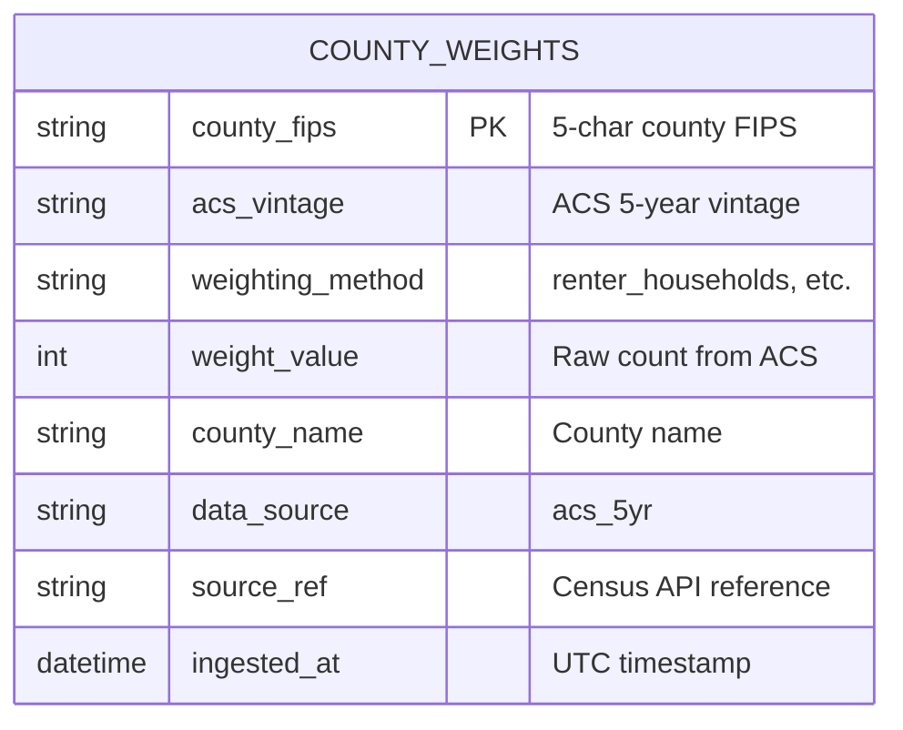

| Column | Type | Description |
|--------|------|-------------|
| `county_fips` | string | 5-character county FIPS code |
| `acs_vintage` | string | ACS 5-year estimate vintage |
| `weighting_method` | string | `renter_households`, `housing_units`, or `population` |
| `weight_value` | int | Raw count from ACS table |
| `county_name` | string | County name from Census |
| `data_source` | string | Always `acs_5yr` |
| `source_ref` | string | Census API endpoint reference |
| `ingested_at` | datetime | UTC timestamp of retrieval |

## Storage Locations

Filenames use temporal shorthand notation (see [[08-Temporal-Terminology]]).

| File | Path Pattern | Description |
|------|--------------|-------------|
| Boundary data | `data/curated/coc_boundaries/coc__B{vintage}.parquet` | GeoParquet with boundaries |
| Registry | `data/curated/boundary_registry.parquet` | Vintage tracking |
| Maps | `data/curated/maps/{coc_id}__B{vintage}.html` | Generated HTML maps |
| Raw downloads | `data/raw/hud_exchange/{vintage}/` | Original source files |
| Census tracts | `data/curated/tiger/tracts__T{year}.parquet` | TIGER tract geometries |
| Census counties | `data/curated/tiger/counties__C{year}.parquet` | TIGER county geometries |
| Tract crosswalks | `data/curated/xwalks/xwalk__B{boundary}xT{tract}.parquet` | CoC-tract mapping |
| County crosswalks | `data/curated/xwalks/xwalk__B{boundary}xC{county}.parquet` | CoC-county mapping |
| CoC measures | `data/curated/measures/measures__A{acs_end}@B{boundary}xT{tract}.parquet` | Aggregated ACS data |
| PIT counts | `data/curated/pit/pit__P{year}.parquet` | Canonical PIT data (single year) |
| PIT vintages | `data/curated/pit/pit_vintage__P{vintage}.parquet` | All years from a vintage release |
| PIT registry | `data/curated/pit/pit_registry.parquet` | PIT year tracking |
| PIT vintage registry | `data/curated/pit/pit_vintage_registry.parquet` | PIT vintage tracking |
| CoC panels | `data/curated/panel/panel__Y{start}-{end}@B{boundary}.parquet` | Analysis-ready panels |
| Tract population | `data/curated/acs/acs5_tracts__A{acs}xT{tract}.parquet` | ACS tract population |
| CoC population rollup | `data/curated/acs/coc_population__A{acs}@B{boundary}xT{tract}__{weighting}.parquet` | Aggregated CoC population |
| Population crosscheck | `data/curated/acs/crosscheck__A{acs}@B{boundary}xT{tract}__{weighting}.parquet` | Validation report |
| Tract relationship | `data/curated/tiger/tract_relationship__T2010xT2020.parquet` | 2010↔2020 tract bridge |
| PEP county | `data/curated/pep/pep_county__v{vintage}.parquet` | PEP county estimates |
| PEP combined | `data/curated/pep/pep_county__combined.parquet` | Combined PEP series |
| CoC PEP | `data/curated/pep/coc_pep__B{boundary}xC{county}__w{weight}__{start}_{end}.parquet` | Aggregated CoC PEP |
| Raw ZORI | `data/raw/zori/zori__{geography}__{date}.csv` | Downloaded Zillow CSV |
| Normalized ZORI | `data/curated/zori/zori__{geography}__Z{max_year}.parquet` | Normalized ZORI data |
| County weights | `data/curated/acs/county_weights__A{acs}__w{method}.parquet` | ACS county weights |
| CoC ZORI | `data/curated/zori/zori__A{acs}@B{boundary}xC{county}__w{weight}.parquet` | Aggregated CoC ZORI |
| CoC ZORI yearly | `data/curated/zori/zori_yearly__A{acs}@B{boundary}xC{county}__w{weight}__m{method}.parquet` | Yearly collapsed ZORI |
| Source registry | `data/curated/source_registry.parquet` | External source tracking |
| **Metro artifacts** | | |
| Metro definitions | `data/curated/metro/metro_definitions__{version}.parquet` | Metro identity and membership type |
| Metro CoC membership | `data/curated/metro/metro_coc_membership__{version}.parquet` | Metro→CoC mapping for PIT |
| Metro county membership | `data/curated/metro/metro_county_membership__{version}.parquet` | Metro→county mapping |
| Metro PIT | `data/curated/pit/pit__metro__P{year}@D{version}.parquet` | Metro-level PIT counts |
| Metro measures | `data/curated/measures/measures__metro__A{acs}@D{version}xT{tract}.parquet` | Metro ACS measures |
| Metro PEP | `data/curated/pep/pep__metro__D{version}xC{county}__w{weight}__{start}_{end}.parquet` | Metro population estimates |
| Metro ZORI | `data/curated/zori/zori__metro__A{acs}@D{version}xC{county}__w{weight}.parquet` | Metro ZORI |
| Metro ZORI yearly | `data/curated/zori/zori_yearly__metro__A{acs}@D{version}xC{county}__w{weight}__m{method}.parquet` | Metro yearly ZORI |
| Metro panels | `data/curated/panel/panel__metro__Y{start}-{end}@D{version}.parquet` | Metro analysis panels |

## Dataset Provenance

All CoC Lab Parquet files embed **provenance metadata** in the file schema, enabling full reproducibility without sidecar files.

### Provenance Block Schema

```json
{
  "boundary_vintage": "2025",
  "tract_vintage": "2020",
  "county_vintage": "2020",
  "acs_vintage": "2022",
  "notation": "A2022@B2025×T2020",
  "weighting": "population",
  "geo_type": "coc",
  "definition_version": null,
  "created_at": "2025-01-05T12:30:00+00:00",
  "coclab_version": "0.1.0",
  "extra": {
    "dataset_type": "coc_measures",
    "crosswalk_path": "data/curated/xwalks/xwalk__B2025xT2020.parquet"
  }
}
```

The `notation` field uses the shorthand from [[08-Temporal-Terminology|Temporal Terminology]]: this example describes ACS 2022 aggregated to 2025 CoC boundaries via a 2020-era tract crosswalk (`A2022@B2025×T2020`).

| Field | Type | Description |
|-------|------|-------------|
| `boundary_vintage` | string | CoC boundary version used |
| `tract_vintage` | string | Census tract geometry version |
| `county_vintage` | string | Census county vintage (nullable) |
| `acs_vintage` | string | ACS 5-year estimate end year |
| `notation` | string | Compound temporal notation, e.g. `A2022@B2025×T2020` (nullable) |
| `weighting` | string | Weighting method (`area`, `population`, `area+population`) |
| `geo_type` | string | Analysis geography type, e.g. `coc` or `metro` (nullable) |
| `definition_version` | string | Synthetic geography definition version, e.g. `glynn_fox_v1` (nullable) |
| `created_at` | ISO 8601 | Timestamp of dataset creation |
| `coclab_version` | string | CoC Lab version that produced the file |
| `extra` | object | Extensible metadata (dataset type, source paths, etc.) |

### Reading Provenance

```python
from coclab.provenance import read_provenance

provenance = read_provenance("data/curated/measures/measures__A2022@B2025.parquet")
print(provenance.boundary_vintage)  # "2025"
print(provenance.weighting)         # "population"
print(provenance.to_json())         # Full JSON representation
```

### Design Rationale

- **Embedded in Parquet metadata**: Provenance travels with the data file
- **Extensible**: The `extra` field allows adding fields without schema changes
- **No sidecar files**: Eliminates file proliferation and sync issues
- **Read without loading data**: Provenance can be inspected via schema metadata

### PIT Provenance Metadata

PIT count Parquet files include additional provenance fields tracking data lineage and any CoC ID transformations:

```json
{
  "created_at": "2025-01-05T22:02:41.946985+00:00",
  "coclab_version": "0.1.0",
  "extra": {
    "pit_year": 2024,
    "row_count": 385,
    "data_source": "hud_exchange",
    "source_ref": "https://www.huduser.gov/.../2007-2024-PIT-Counts-by-CoC.xlsb",
    "ingested_at": "2025-01-05T22:02:41.929693+00:00",
    "rows_read": 390,
    "rows_skipped": 5,
    "cross_state_mappings": {
      "MO-604a": "MO-604"
    }
  }
}
```

| Field | Type | Description |
|-------|------|-------------|
| `pit_year` | int | PIT count year |
| `row_count` | int | Number of CoC records in output |
| `data_source` | string | Source identifier (e.g., `hud_exchange`) |
| `source_ref` | string | Download URL or file reference |
| `ingested_at` | ISO 8601 | Timestamp when data was parsed |
| `rows_read` | int | Total rows read from source file |
| `rows_skipped` | int | Rows skipped due to invalid CoC IDs or missing data |
| `cross_state_mappings` | object | CoC IDs with letter suffixes mapped to base IDs |

**Reading PIT Provenance:**

```python
from coclab.provenance import read_provenance

provenance = read_provenance("data/curated/pit/pit__P2024.parquet")
print(provenance.extra["pit_year"])           # 2024
print(provenance.extra["source_ref"])         # HUD download URL
print(provenance.extra["cross_state_mappings"])  # {"MO-604a": "MO-604"}
```

---

**Previous:** [[06-Python-API]] | **Next:** [[08-Temporal-Terminology]]
