# Data Model

Unless stated otherwise, path examples in this chapter show the built-in
default layout. Replace `data/raw/...`, `data/curated/...`, and
`outputs/<recipe-name>/...` with the configured `asset_store_root` and
`output_root` when your environment uses custom storage roots.

## Source Availability Catalog

This catalog is the front door for deciding what information HHP-Lab can use
from each supported source. Detailed schemas remain in the sections below, and
the CLI can inspect local curated artifacts with
`hhplab list curated --json` for exact row counts, columns, and file sizes.

| Provider | Product | Native geometry | Years | Available information | Primary derived outputs | Notes |
|----------|---------|-----------------|-------|-----------------------|-------------------------|-------|
| HUD | CoC boundaries | CoC polygons | Varies by boundary vintage | CoC ID, CoC name, state, boundary geometry, source URL/reference, ingest timestamp, geometry hash | CoC boundary GeoParquet, boundary registry, maps, CoC crosswalk inputs | Used as the default analysis geography surface. |
| HUD | PIT counts | CoC | 2007-ongoing | `pit_total`, `pit_sheltered`, `pit_unsheltered`, PIT year, source/provenance fields, notes | CoC PIT by year, PIT vintages, metro PIT rollups, CoC/metro panels | PIT is January point-in-time count data. |
| Census | TIGER counties | county polygons | Decennial/current vintages used by recipes | county FIPS, county name/state, geometry, vintage/provenance | county boundaries, CoC-county crosswalks, metro county membership joins | County-native sources such as PEP and ZORI use this geometry for aggregation. |
| Census | TIGER/NHGIS tracts | tract polygons | Decennial tract eras | tract GEOID, tract vintage, geometry, provenance | tract boundaries, CoC-tract crosswalks, tract relationship bridges | ACS and tract crosswalks must match the correct decennial tract era. |
| Census | ACS 5-year | tract | 2009-ongoing | `total_population`, `adult_population`, `population_below_poverty`, `median_household_income`, `median_gross_rent`, `moe_total_population`, ACS vintage | CoC ACS measures, metro ACS measures, county weights for ZORI, panel demographic columns | ACS 5-year vintages are end years for five-year collection windows. |
| Census | ACS 1-year | CBSA/metro or county | 2012-ongoing except 2020; available where ACS1 population thresholds are met | CBSA or county employment counts and `unemployment_rate_acs1`; income distribution; rent and owner-cost measures; rent/owner-cost burden bins; tenure-by-income; utility costs; heating fuel; gross rent by bedrooms; structure age; units-in-structure; household size; ACS1 vintage; metro definition version for metro artifacts | metro-native ACS1 artifact, county-native ACS1 artifact, optional metro panel ACS1 measures | Utility-cost tables begin in 2021 and are null-backed in earlier supported vintages. County ACS1 artifacts contain only published threshold counties. |
| Census | PEP | county | 2010-ongoing | annual `population`, county FIPS/name/state, reference date, PEP vintage/provenance | CoC PEP population, metro PEP population, optional panel `population` measure | PEP reference dates are July 1 annual estimates; recipes can use temporal filters to align to January when needed. |
| Zillow | ZORI | county or ZIP, normalized to county for standard panels | 2015-ongoing | monthly `zori`, region name/state, source URL, raw hash, metric/provenance fields | normalized ZORI, CoC ZORI, metro ZORI, yearly collapsed ZORI, panel rent columns | Standard panel alignment uses January observations to match PIT timing. |

## Analysis Geography Model

HHP-Lab supports multiple analysis geographies—the unit of observation in derived outputs. The abstraction separates *analysis geography* (what you want to measure) from *source geometry* (how input data is natively organized).

| Property | CoC | Metro |
|----------|-----|-------|
| `geo_type` | `"coc"` | `"metro"` |
| `geo_id` | CoC code (e.g., `CO-500`) | Canonical CBSA code by default (e.g., `35620`), or profile metro ID for explicit subset outputs (e.g., `GF01`) |
| Version key | `boundary_vintage` (e.g., `"2025"`) | `definition_version` (e.g., `"census_msa_2023"` or `"glynn_fox_v1"`) |
| Identity source | HUD boundary polygons | Researcher membership rules |
| PIT aggregation | Native (identity) | Summed over member CoCs |
| ACS aggregation | Tract crosswalk | County-membership tract crosswalk |
| PEP aggregation | County crosswalk | County membership |
| ZORI aggregation | County crosswalk | County membership |

### Canonical Column Contract

Derived datasets use these canonical columns:

| Column | Type | Description |
|--------|------|-------------|
| `geo_type` | string | Geography family: `"coc"` or `"metro"` |
| `geo_id` | string | Canonical identifier within the family |
| `year` | int | Observation year |

CoC outputs retain `coc_id` for backward compatibility. Metro outputs use `metro_id` as the native identifier alongside `geo_type` and `geo_id`. Metro outputs never invent a fake `coc_id`.

## Canonical Boundary Schema

All boundary data is normalized to this schema before storage:

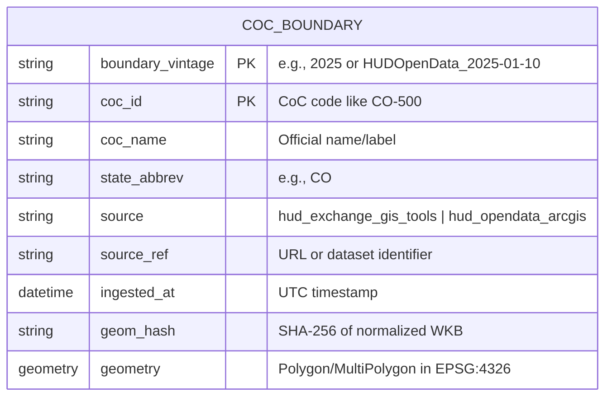

| Column | Type | Description |
|--------|------|-------------|
| `boundary_vintage` | string | Version identifier (e.g., `2025`) |
| `coc_id` | string | CoC identifier (e.g., `CO-500`) |
| `coc_name` | string | Official CoC name |
| `state_abbrev` | string | US state abbreviation |
| `source` | string | Data source identifier |
| `source_ref` | string | URL or reference to original data |
| `ingested_at` | datetime | UTC timestamp of ingestion |
| `geom_hash` | string | SHA-256 hash for change detection |
| `geometry` | Polygon/MultiPolygon | Boundary in EPSG:4326 |

## Registry Schema

The registry tracks all available boundary vintages:

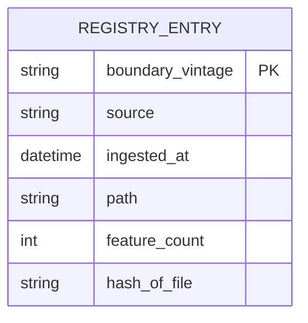

## Crosswalk Schema

Crosswalks link CoC boundaries to census geographies:

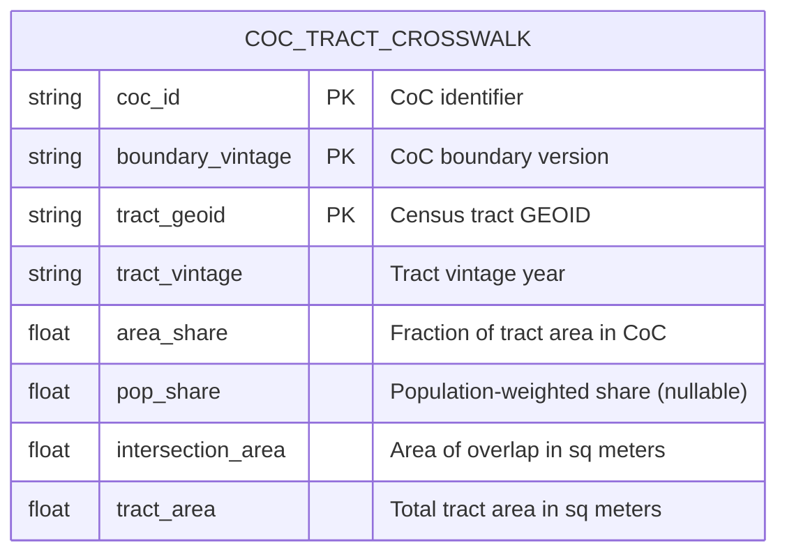

| Column | Type | Description |
|--------|------|-------------|
| `coc_id` | string | CoC identifier (e.g., `CO-500`) |
| `boundary_vintage` | string | CoC boundary version |
| `tract_geoid` | string | 11-digit census tract GEOID |
| `tract_vintage` | string | Census tract vintage year |
| `area_share` | float | `intersection_area / tract_area` |
| `pop_share` | float | Population-weighted share (nullable) |
| `intersection_area` | float | Overlap area in square meters |
| `tract_area` | float | Total tract area in square meters |

## County Crosswalk Schema

Crosswalks linking CoC boundaries to county geographies:

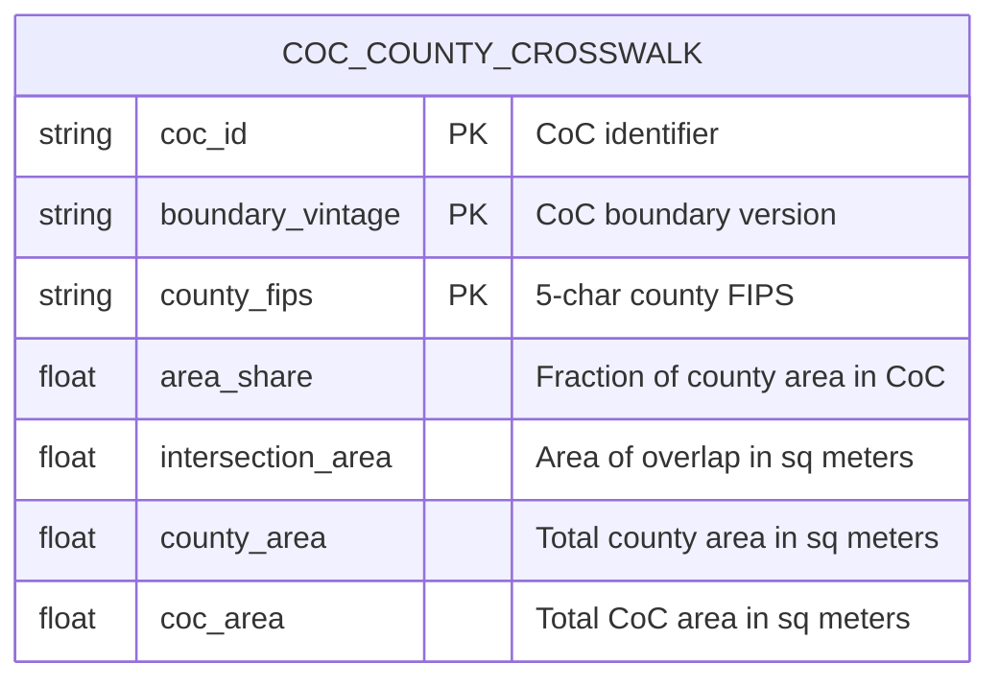

| Column | Type | Description |
|--------|------|-------------|
| `coc_id` | string | CoC identifier (e.g., `CO-500`) |
| `boundary_vintage` | string | CoC boundary version |
| `county_fips` | string | 5-character county FIPS code |
| `area_share` | float | `intersection_area / county_area` (for county→CoC aggregation) |
| `intersection_area` | float | Overlap area in square meters (ESRI:102003) |
| `county_area` | float | Total county area in square meters |
| `coc_area` | float | Total CoC area in square meters |

**Deriving Alternative Shares:**

- **County share (default):** `area_share = intersection_area / county_area`
  Used for aggregating county-level data to CoC level (e.g., PEP population, ZORI rents).

- **CoC share:** `coc_share = intersection_area / coc_area`
  Can be derived for disaggregating CoC-level data to counties.

## CoC Measures Schema

Aggregated demographic measures at CoC level:

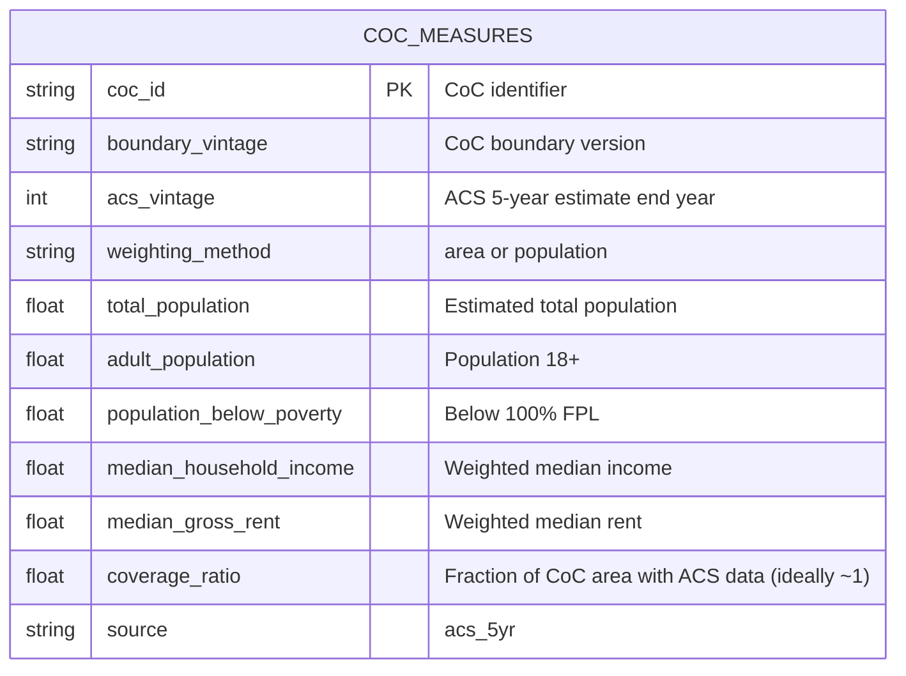

| Column | Type | Description |
|--------|------|-------------|
| `coc_id` | string | CoC identifier |
| `boundary_vintage` | string | CoC boundary version used |
| `acs_vintage` | int | ACS 5-year estimate end year |
| `weighting_method` | string | `area` or `population` |
| `total_population` | float | Weighted population estimate |
| `adult_population` | float | Population 18 and older |
| `population_below_poverty` | float | Below 100% federal poverty line |
| `median_household_income` | float | Population-weighted median |
| `median_gross_rent` | float | Population-weighted median |
| `coverage_ratio` | float | Fraction of CoC area covered by tracts with data |
| `source` | string | Always `acs_5yr` |

## PIT Counts Schema

Canonical PIT (Point-in-Time) count data:

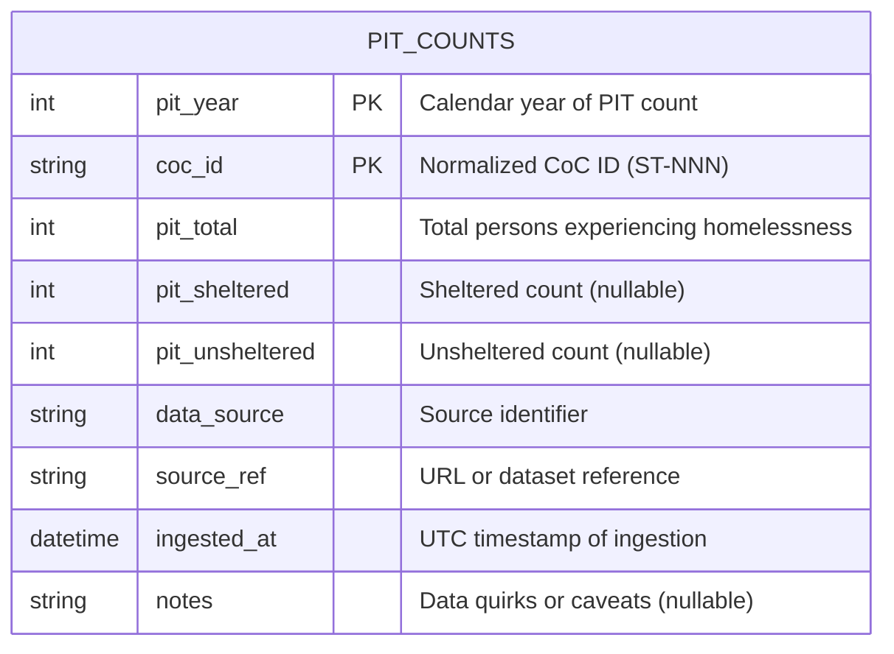

| Column | Type | Description |
|--------|------|-------------|
| `pit_year` | int | Calendar year of PIT count |
| `coc_id` | string | Normalized CoC ID (e.g., `CO-500`) |
| `pit_total` | int | Total persons experiencing homelessness |
| `pit_sheltered` | int | Sheltered count (nullable) |
| `pit_unsheltered` | int | Unsheltered count (nullable) |
| `data_source` | string | Source identifier (e.g., `hud_exchange`) |
| `source_ref` | string | URL or dataset reference |
| `ingested_at` | datetime | UTC timestamp of ingestion |
| `notes` | string | Data quirks or caveats (nullable) |

## PEP Population Schemas

PEP (Population Estimates Program) data is ingested from Census county files
and normalized to annual county population estimates before aggregation.

### County PEP Schema

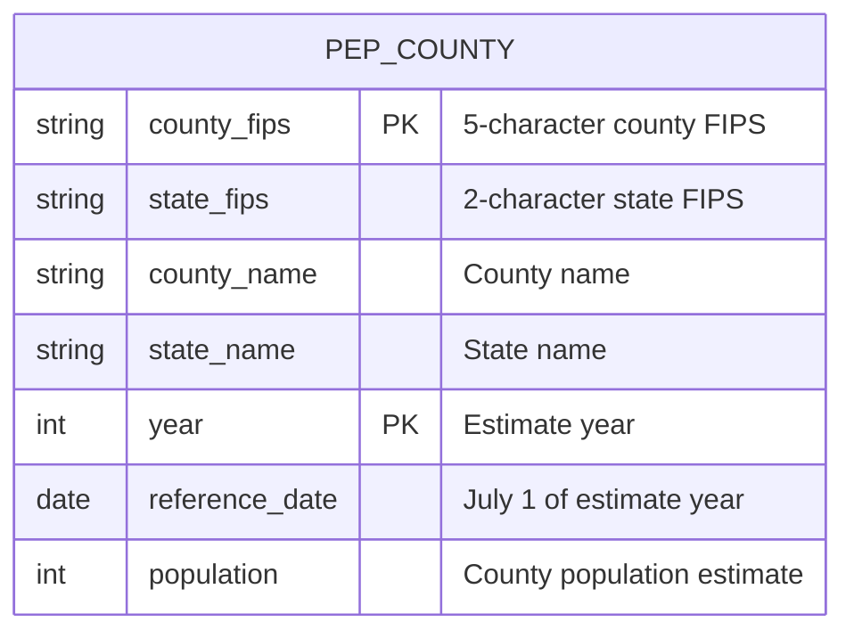

| Column | Type | Description |
|--------|------|-------------|
| `county_fips` | string | 5-character county FIPS code |
| `state_fips` | string | 2-character state FIPS code |
| `county_name` | string | County name from Census |
| `state_name` | string | State name from Census |
| `year` | int | Estimate year |
| `reference_date` | date | July 1 reference date for the annual estimate |
| `population` | int | County population estimate |

### CoC PEP Schema

CoC PEP aggregates county population to CoC boundaries through the
CoC-county crosswalk.

| Column | Type | Description |
|--------|------|-------------|
| `coc_id` | string | CoC identifier |
| `year` | int | Estimate year |
| `reference_date` | date | July 1 reference date for the annual estimate |
| `population` | float | Weighted CoC population estimate |
| `coverage_ratio` | float | Covered crosswalk weight for the CoC-year |
| `county_count` | int | Number of contributing counties |
| `max_county_contribution` | float | Largest single-county contribution share |
| `boundary_vintage` | string | CoC boundary vintage used |
| `county_vintage` | string | TIGER county vintage used |
| `weighting_method` | string | Usually `area_share`; `equal` is supported for diagnostics |

### Metro PEP Schema

Metro PEP sums member county population through the metro county membership
table. Single-county metros are identity passthroughs; multi-county metros
sum all member counties.

| Column | Type | Description |
|--------|------|-------------|
| `metro_id` | string | Metro identifier |
| `year` | int | Estimate year |
| `reference_date` | date | July 1 reference date for the annual estimate |
| `population` | float | Metro population estimate |
| `coverage_ratio` | float | Fraction of member-county weight covered |
| `county_count` | int | Number of contributing counties |
| `max_county_contribution` | float | Largest single-county contribution share |
| `county_expected` | int | Number of counties expected for the metro |
| `missing_counties` | string | Comma-separated missing county FIPS values, when any |
| `definition_version` | string | Metro definition version |
| `weighting_method` | string | Usually `area_share`; `equal` is supported for diagnostics |

## Panel Schema

Analysis-ready CoC × year panels combining PIT counts with ACS measures:

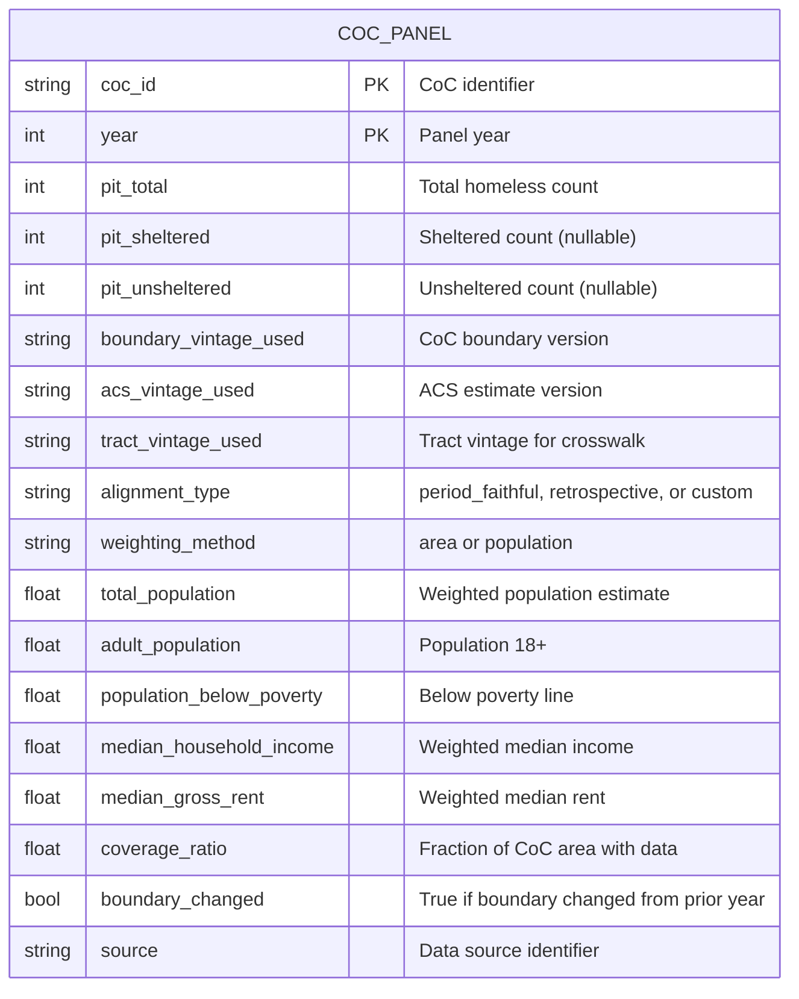

| Column | Type | Description |
|--------|------|-------------|
| `coc_id` | string | CoC identifier (e.g., `CO-500`) |
| `year` | int | Panel year |
| `pit_total` | int | Total homeless count from PIT |
| `pit_sheltered` | int | Sheltered count (nullable) |
| `pit_unsheltered` | int | Unsheltered count (nullable) |
| `boundary_vintage_used` | string | CoC boundary version applied |
| `acs_vintage_used` | string | ACS estimate version applied |
| `tract_vintage_used` | string | Tract vintage used for the crosswalk |
| `alignment_type` | string | Alignment policy label (`period_faithful`, `retrospective`, or `custom`) |
| `weighting_method` | string | `area` or `population` |
| `total_population` | float | Weighted population estimate |
| `adult_population` | float | Population 18 and older |
| `population_below_poverty` | float | Below 100% federal poverty line |
| `median_household_income` | float | Population-weighted median |
| `median_gross_rent` | float | Population-weighted median |
| `coverage_ratio` | float | Fraction of CoC area covered by tracts with data |
| `boundary_changed` | bool | True if CoC boundary changed from prior year |
| `source` | string | Data source identifier |

When ZORI is enabled, the panel appends:
- `zori_coc`
- `zori_coverage_ratio`
- `zori_is_eligible`
- `zori_excluded_reason`
- `rent_to_income`
- provenance fields `rent_metric`, `rent_alignment`, `zori_min_coverage`

## Metro Definition Schemas

Metro areas use a two-layer contract:

- the canonical Census metro universe, keyed by CBSA code and definition version
- optional subset profiles such as Glynn/Fox layered over that universe

The legacy Glynn/Fox membership tables remain available for compatibility and audit workflows.

### Canonical Metro Universe

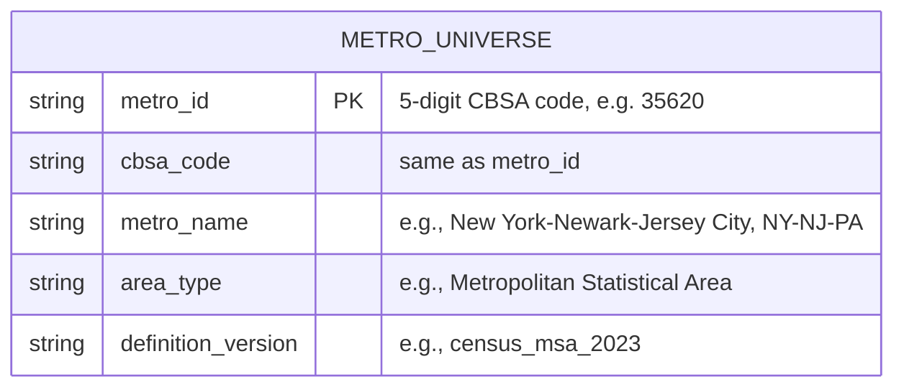

| Column | Type | Description |
|--------|------|-------------|
| `metro_id` | string | Canonical 5-digit CBSA code |
| `cbsa_code` | string | Same value as `metro_id` |
| `metro_name` | string | Canonical Census metro name |
| `area_type` | string | Census area type |
| `definition_version` | string | Canonical universe version |

### Metro Subset Profile

### Metro Definitions

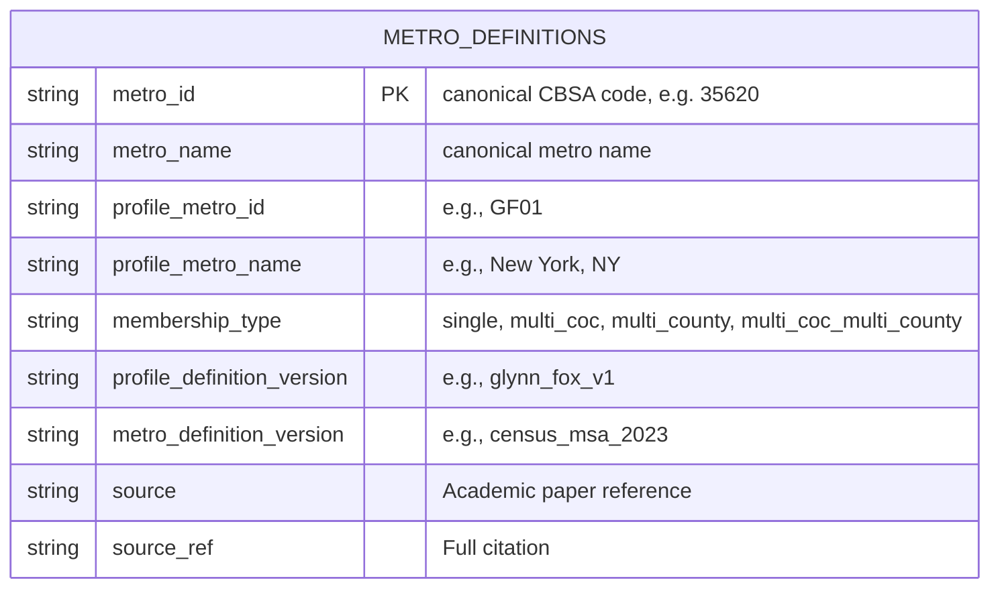

| Column | Type | Description |
|--------|------|-------------|
| `metro_id` | string | Canonical 5-digit CBSA code |
| `metro_name` | string | Canonical metro name |
| `profile_metro_id` | string | Subset-specific identifier (e.g., `GF01` through `GF25`) |
| `profile_metro_name` | string | Human-readable subset label |
| `membership_type` | string | Aggregation rule: `single`, `multi_coc`, `multi_county`, or `multi_coc_multi_county` |
| `profile_definition_version` | string | Subset profile version |
| `metro_definition_version` | string | Canonical universe version the profile is attached to |
| `source` | string | Source attribution |
| `source_ref` | string | Full citation or URL |

### Metro CoC Membership

Maps each metro to its constituent CoCs for PIT aggregation:

| Column | Type | Description |
|--------|------|-------------|
| `metro_id` | string | Canonical metro identifier |
| `coc_id` | string | Member CoC code (e.g., `CA-600`) |
| `definition_version` | string | Compatibility definition version for the legacy Glynn/Fox tables |

### Metro County Membership

Maps each metro to its constituent counties for PEP, ZORI, and ACS aggregation:

| Column | Type | Description |
|--------|------|-------------|
| `metro_id` | string | Canonical metro identifier |
| `county_fips` | string | 5-digit county FIPS code |
| `definition_version` | string | Compatibility definition version for the legacy Glynn/Fox tables |

### Membership Types

| Type | PIT Rule | Population/Rent Rule |
|------|----------|---------------------|
| `single` | One CoC, identity | One county, identity |
| `multi_coc` | Sum PIT across member CoCs | One county, identity |
| `multi_county` | One CoC, identity | Aggregate across member counties |
| `multi_coc_multi_county` | Sum PIT across member CoCs | Aggregate across member counties |

## Metro Panel Schema

Analysis-ready metro×year panels combining PIT counts with ACS measures:

| Column | Type | Description |
|--------|------|-------------|
| `metro_id` | string | Canonical CBSA code by default, or profile metro ID for subset outputs |
| `geo_type` | string | Always `"metro"` |
| `geo_id` | string | Same as `metro_id` |
| `year` | int | Panel year |
| `pit_total` | int | Total homeless count (summed over member CoCs) |
| `pit_sheltered` | int | Sheltered count (nullable) |
| `pit_unsheltered` | int | Unsheltered count (nullable) |
| `definition_version_used` | string | Metro definition version applied |
| `acs_vintage_used` | string | ACS estimate version applied |
| `tract_vintage_used` | string | Tract vintage used for crosswalk |
| `alignment_type` | string | `definition_fixed` (metro) or `retrospective`/`period_faithful` (CoC) |
| `weighting_method` | string | `area` or `population` |
| `total_population` | float | Aggregated from county PEP or ACS |
| `adult_population` | float | Population 18 and older |
| `population_below_poverty` | float | Below 100% federal poverty line |
| `median_household_income` | float | Population-weighted median |
| `median_gross_rent` | float | Population-weighted median |
| `coverage_ratio` | float | Fraction of metro area with data |
| `boundary_changed` | bool | Always `False` for metro (definitions are version-fixed) |
| `source` | string | Data source identifier |

When ZORI is enabled, the same ZORI columns as CoC panels are appended (`zori_coc`, `zori_coverage_ratio`, `zori_is_eligible`, `zori_excluded_reason`, `rent_to_income`).

When ACS 1-year data is included (`panel_policy.acs1.include: true`), metro panels also carry requested ACS1 metro-native measures. Current examples commonly request:
- `unemployment_rate_acs1` — ACS 1-year unemployment rate (metro-native, from CBSA-level B23025)
- `acs1_vintage_used` — Which ACS1 vintage contributed (nullable when no ACS1 data available)
- `acs_products_used` — Comma-separated product list: `"acs5"` or `"acs5,acs1"`

## ACS 1-Year Metro Schema

ACS 1-year data is ingested at CBSA geography and stored against the canonical metro universe by default. Subset-profile outputs such as Glynn/Fox are derived by requesting the corresponding `definition_version`. Stored under `data/curated/acs/`.

| Column | Type | Description |
|--------|------|-------------|
| `metro_id` | string | Canonical CBSA code by default, or profile metro ID for subset outputs |
| `metro_name` | string | Metro area name |
| `definition_version` | string | Metro definition version |
| `acs1_vintage` | string | ACS 1-year vintage end year |
| `cbsa_code` | string | Census CBSA code used for source traceability |
| `pop_16_plus` | Int64 | Population age 16 and over from B23025 |
| `civilian_labor_force` | Int64 | Civilian labor force from B23025 |
| `unemployed_count` | Int64 | Unemployed civilians from B23025 |
| `unemployment_rate_acs1` | Float64 | `unemployed_count / civilian_labor_force` |
| income distribution columns | Int64/Float64 | Household income quintile cutoffs, mean income by quintile, and aggregate income shares from B19080/B19081/B19082 |
| housing-cost columns | Int64 | Median gross rent, median and aggregate owner costs, gross-rent burden bins, and owner-cost burden bins from B25064/B25088/B25089/B25070/B25091 |
| tenure and household columns | Int64/Float64 | Tenure-by-income, median household income by tenure, and average household size by tenure from B25118/B25119/B25010 |
| utility and fuel columns | Int64 | Electricity, gas, water/sewer cost bins, and heating-fuel categories from B25132/B25133/B25134/B25040 |
| housing-stock columns | Int64 | Gross rent by bedrooms, median structure year built, and units in structure from B25068/B25035/B25024 |
| `data_source` | string | Always `"census_acs1"` |
| `source_ref` | string | Census API endpoint and fetched table set |
| `ingested_at` | datetime | UTC ingest timestamp |

The canonical metro output schema currently has 187 columns: 5 identity/version columns, 179 ACS1 measure columns, and 3 provenance columns. The canonical county output uses county identity columns (`state`, `county`, `county_fips`, `geo_id`, `county_name`, `NAME`), `acs1_vintage`, the same 179 ACS1 measure columns, and provenance columns. The requested ACS1 tables are B23025, B19080, B19081, B19082, B25064, B25088, B25089, B25070, B25091, B25119, B25118, B25132, B25133, B25134, B25040, B25068, B25035, B25024, and B25010. Utility-cost tables B25132, B25133, and B25134 are available beginning with ACS1 vintage 2021; earlier supported vintages keep those columns as nulls for schema stability.

Storage: `data/curated/acs/acs1_metro__A{vintage}@D{version}.parquet` and `data/curated/acs/acs1_county__A{vintage}.parquet`

ACS 1-year estimates are only available for geographies with population >= 65,000. Subset profiles such as Glynn/Fox inherit eligibility from their underlying CBSAs. County ACS1 does not manufacture rows for counties that Census omits.

## Metro Derived Dataset Storage

| File | Path Pattern | Description |
|------|--------------|-------------|
| Metro universe | `data/curated/metro/metro_universe__census_msa_2023.parquet` | Canonical CBSA metro identity table |
| Metro subset membership | `data/curated/metro/metro_subset_membership__glynn_fox_v1xMcensus_msa_2023.parquet` | Glynn/Fox subset profile over the canonical universe |
| Metro definitions | `data/curated/metro/metro_definitions__glynn_fox_v1.parquet` | Legacy compatibility identity and membership type table |
| Metro CoC membership | `data/curated/metro/metro_coc_membership__glynn_fox_v1.parquet` | Legacy compatibility metro→CoC mapping |
| Metro county membership | `data/curated/metro/metro_county_membership__glynn_fox_v1.parquet` | Legacy compatibility metro→county mapping |
| Metro PIT | `data/curated/pit/pit__metro__P{year}@D{version}.parquet` | Metro-level PIT counts |
| Metro measures | `data/curated/measures/measures__metro__A{acs}@D{version}xT{tract}.parquet` | Metro ACS measures |
| Metro PEP | `data/curated/pep/pep__metro__D{version}xC{county}__w{weight}__{start}_{end}.parquet` | Metro population estimates |
| Metro ZORI | `data/curated/zori/zori__metro__A{acs}@D{version}xC{county}__w{weight}.parquet` | Metro rent index |
| Metro ZORI yearly | `data/curated/zori/zori_yearly__metro__A{acs}@D{version}xC{county}__w{weight}__m{method}.parquet` | Metro yearly-collapsed rent index |
| Metro panels | `outputs/<recipe-name>/panel__metro__Y{start}-{end}@D{version}.parquet` | Metro analysis panels |
| Metro ACS1 | `data/curated/acs/acs1_metro__A{vintage}@D{version}.parquet` | Metro-native ACS 1-year measures |
| County ACS1 | `data/curated/acs/acs1_county__A{vintage}.parquet` | County-native ACS 1-year measures |

## Normalized ZORI Schema

ZORI data from Zillow is normalized to this long-format schema:

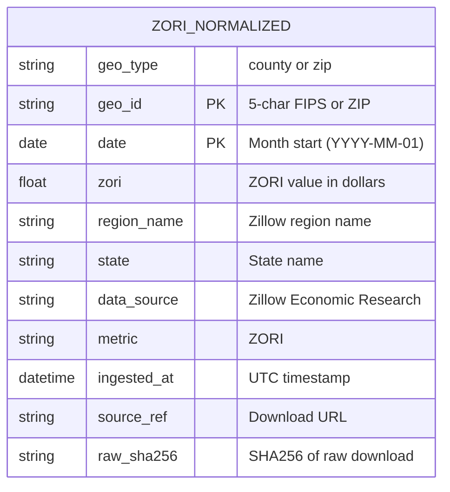

| Column | Type | Description |
|--------|------|-------------|
| `geo_type` | string | Geography type: `county` or `zip` |
| `geo_id` | string | 5-character FIPS code (county) or ZIP code |
| `date` | date | Month start date (e.g., `2024-01-01`) |
| `zori` | float | ZORI value (level) in dollars |
| `region_name` | string | Zillow's region name |
| `state` | string | State name |
| `data_source` | string | Always `Zillow Economic Research` |
| `metric` | string | Always `ZORI` |
| `ingested_at` | datetime | UTC timestamp of ingestion |
| `source_ref` | string | Download URL |
| `raw_sha256` | string | SHA256 hash of raw download for provenance |

## CoC ZORI Schema

Aggregated ZORI data at CoC level:

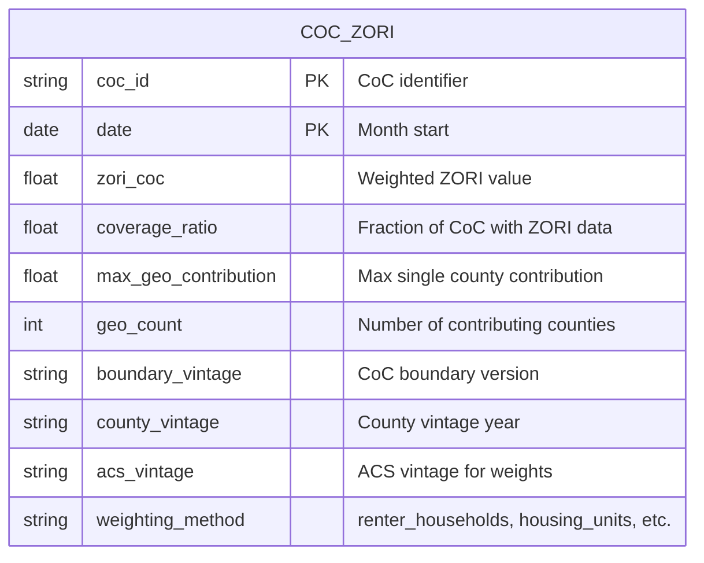

| Column | Type | Description |
|--------|------|-------------|
| `coc_id` | string | CoC identifier (e.g., `CO-500`) |
| `date` | date | Month start date |
| `zori_coc` | float | Weighted average ZORI for CoC |
| `coverage_ratio` | float | Sum of weights for counties with ZORI data |
| `max_geo_contribution` | float | Largest single county weight |
| `geo_count` | int | Number of counties contributing to estimate |
| `boundary_vintage` | string | CoC boundary version used |
| `county_vintage` | string | TIGER county vintage |
| `acs_vintage` | string | ACS vintage for demographic weights |
| `weighting_method` | string | Weighting method used |

## County Weights Schema

ACS-based county weights for ZORI aggregation:

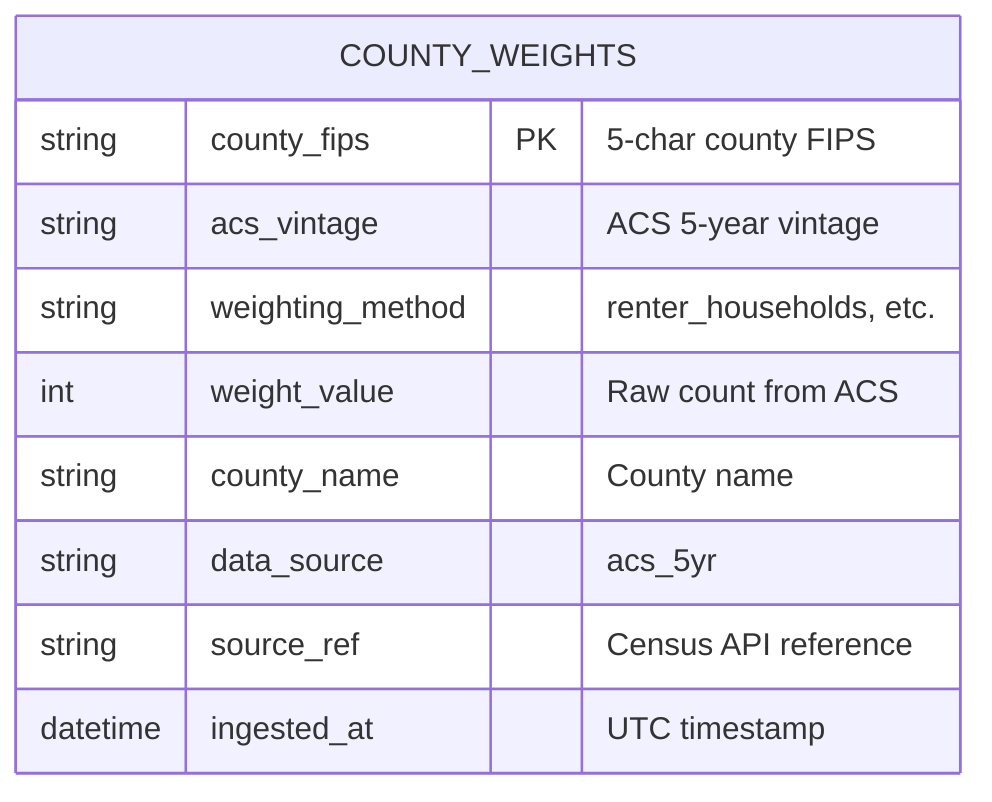

| Column | Type | Description |
|--------|------|-------------|
| `county_fips` | string | 5-character county FIPS code |
| `acs_vintage` | string | ACS 5-year estimate vintage |
| `weighting_method` | string | `renter_households`, `housing_units`, or `population` |
| `weight_value` | int | Raw count from ACS table |
| `county_name` | string | County name from Census |
| `data_source` | string | Always `acs_5yr` |
| `source_ref` | string | Census API endpoint reference |
| `ingested_at` | datetime | UTC timestamp of retrieval |

## Storage Locations

Filenames use temporal shorthand notation (see [[08-Temporal-Terminology]]).

| File | Path Pattern | Description |
|------|--------------|-------------|
| Boundary data | `data/curated/coc_boundaries/coc__B{vintage}.parquet` | GeoParquet with boundaries |
| Registry | `data/curated/boundary_registry.parquet` | Vintage tracking |
| Maps | `data/curated/maps/{coc_id}__B{vintage}.html` | Generated HTML maps |
| Raw downloads | `data/raw/hud_exchange/{vintage}/` | Original source files |
| Census tracts | `data/curated/tiger/tracts__T{year}.parquet` | TIGER tract geometries |
| Census counties | `data/curated/tiger/counties__C{year}.parquet` | TIGER county geometries |
| Tract crosswalks | `data/curated/xwalks/xwalk__B{boundary}xT{tract}.parquet` | CoC-tract mapping |
| County crosswalks | `data/curated/xwalks/xwalk__B{boundary}xC{county}.parquet` | CoC-county mapping |
| Tract-mediated county crosswalks | `data/curated/xwalks/xwalk_tract_mediated_county__A{acs}@B{boundary}xC{county}xT{tract}.parquet` | County-to-CoC weights derived through tract intersections and ACS tract denominators; includes `area_weight`, `population_weight`, `household_weight`, and `renter_household_weight` where denominators are available |
| CoC measures | `data/curated/measures/measures__A{acs_end}@B{boundary}xT{tract}.parquet` | Aggregated ACS data |
| PIT counts | `data/curated/pit/pit__P{year}.parquet` | Canonical PIT data (single year) |
| PIT vintages | `data/curated/pit/pit_vintage__P{vintage}.parquet` | All years from a vintage release |
| PIT registry | `data/curated/pit/pit_registry.parquet` | PIT year tracking |
| PIT vintage registry | `data/curated/pit/pit_vintage_registry.parquet` | PIT vintage tracking |
| CoC panels | `outputs/<recipe-name>/panel__Y{start}-{end}@B{boundary}.parquet` | Analysis-ready panels |
| Tract population | `data/curated/acs/acs5_tracts__A{acs}xT{tract}.parquet` | ACS tract population |
| CoC population rollup | `data/curated/acs/coc_population__A{acs}@B{boundary}xT{tract}__{weighting}.parquet` | Aggregated CoC population |
| Population crosscheck | `data/curated/acs/crosscheck__A{acs}@B{boundary}xT{tract}__{weighting}.parquet` | Validation report |
| Tract relationship | `data/curated/tiger/tract_relationship__T2010xT2020.parquet` | 2010↔2020 tract bridge |
| PEP county | `data/curated/pep/pep_county__v{vintage}.parquet` | PEP county estimates |
| PEP combined | `data/curated/pep/pep_county__combined.parquet` | Combined PEP series |
| CoC PEP | `data/curated/pep/coc_pep__B{boundary}xC{county}__w{weight}__{start}_{end}.parquet` | Aggregated CoC PEP |
| Raw ZORI | `data/raw/zori/zori__{geography}__{date}.csv` | Downloaded Zillow CSV |
| Normalized ZORI | `data/curated/zori/zori__{geography}__Z{max_year}.parquet` | Normalized ZORI data |
| County weights | `data/curated/acs/county_weights__A{acs}__w{method}.parquet` | ACS county weights |
| CoC ZORI | `data/curated/zori/zori__A{acs}@B{boundary}xC{county}__w{weight}.parquet` | Aggregated CoC ZORI |
| CoC ZORI yearly | `data/curated/zori/zori_yearly__A{acs}@B{boundary}xC{county}__w{weight}__m{method}.parquet` | Yearly collapsed ZORI |
| Source registry | `data/curated/source_registry.parquet` | External source tracking |
| **Metro artifacts** | | |
| Metro definitions | `data/curated/metro/metro_definitions__{version}.parquet` | Metro identity and membership type |
| Metro CoC membership | `data/curated/metro/metro_coc_membership__{version}.parquet` | Metro→CoC mapping for PIT |
| Metro county membership | `data/curated/metro/metro_county_membership__{version}.parquet` | Metro→county mapping |
| Metro PIT | `data/curated/pit/pit__metro__P{year}@D{version}.parquet` | Metro-level PIT counts |
| Metro measures | `data/curated/measures/measures__metro__A{acs}@D{version}xT{tract}.parquet` | Metro ACS measures |
| Metro PEP | `data/curated/pep/pep__metro__D{version}xC{county}__w{weight}__{start}_{end}.parquet` | Metro population estimates |
| Metro ZORI | `data/curated/zori/zori__metro__A{acs}@D{version}xC{county}__w{weight}.parquet` | Metro ZORI |
| Metro ZORI yearly | `data/curated/zori/zori_yearly__metro__A{acs}@D{version}xC{county}__w{weight}__m{method}.parquet` | Metro yearly ZORI |
| Metro panels | `outputs/<recipe-name>/panel__metro__Y{start}-{end}@D{version}.parquet` | Metro analysis panels |

## Dataset Provenance

All HHP-Lab Parquet files embed **provenance metadata** in the file schema, enabling full reproducibility without sidecar files.

### Provenance Block Schema

```json
{
  "boundary_vintage": "2025",
  "tract_vintage": "2020",
  "county_vintage": "2020",
  "acs_vintage": "2022",
  "notation": "A2022@B2025×T2020",
  "weighting": "population",
  "geo_type": "coc",
  "definition_version": null,
  "created_at": "2025-01-05T12:30:00+00:00",
  "hhplab_version": "0.1.0",
  "extra": {
    "dataset_type": "coc_measures",
    "crosswalk_path": "data/curated/xwalks/xwalk__B2025xT2020.parquet"
  }
}
```

The `notation` field uses the shorthand from [[08-Temporal-Terminology|Temporal Terminology]]: this example describes ACS 2022 aggregated to 2025 CoC boundaries via a 2020-era tract crosswalk (`A2022@B2025×T2020`).

| Field | Type | Description |
|-------|------|-------------|
| `boundary_vintage` | string | CoC boundary version used |
| `tract_vintage` | string | Census tract geometry version |
| `county_vintage` | string | Census county vintage (nullable) |
| `acs_vintage` | string | ACS 5-year estimate end year |
| `notation` | string | Compound temporal notation, e.g. `A2022@B2025×T2020` (nullable) |
| `weighting` | string | Weighting method (`area`, `population`, `area+population`) |
| `geo_type` | string | Analysis geography type, e.g. `coc` or `metro` (nullable) |
| `definition_version` | string | Synthetic geography definition version, e.g. `glynn_fox_v1` (nullable) |
| `created_at` | ISO 8601 | Timestamp of dataset creation |
| `hhplab_version` | string | Current project version that produced the file |
| `extra` | object | Extensible metadata (dataset type, source paths, etc.) |

### Reading Provenance

```python
from hhplab.provenance import read_provenance

provenance = read_provenance("data/curated/measures/measures__A2022@B2025.parquet")
print(provenance.boundary_vintage)  # "2025"
print(provenance.weighting)         # "population"
print(provenance.to_json())         # Full JSON representation
```

### Design Rationale

- **Embedded in Parquet metadata**: Provenance travels with the data file
- **Extensible**: The `extra` field allows adding fields without schema changes
- **No sidecar files**: Eliminates file proliferation and sync issues
- **Read without loading data**: Provenance can be inspected via schema metadata

### PIT Provenance Metadata

PIT count Parquet files include additional provenance fields tracking data lineage and any CoC ID transformations:

```json
{
  "created_at": "2025-01-05T22:02:41.946985+00:00",
  "hhplab_version": "0.1.0",
  "extra": {
    "pit_year": 2024,
    "row_count": 385,
    "data_source": "hud_exchange",
    "source_ref": "https://www.huduser.gov/.../2007-2024-PIT-Counts-by-CoC.xlsb",
    "ingested_at": "2025-01-05T22:02:41.929693+00:00",
    "rows_read": 390,
    "rows_skipped": 5,
    "cross_state_mappings": {
      "MO-604a": "MO-604"
    }
  }
}
```

| Field | Type | Description |
|-------|------|-------------|
| `pit_year` | int | PIT count year |
| `row_count` | int | Number of CoC records in output |
| `data_source` | string | Source identifier (e.g., `hud_exchange`) |
| `source_ref` | string | Download URL or file reference |
| `ingested_at` | ISO 8601 | Timestamp when data was parsed |
| `rows_read` | int | Total rows read from source file |
| `rows_skipped` | int | Rows skipped due to invalid CoC IDs or missing data |
| `cross_state_mappings` | object | CoC IDs with letter suffixes mapped to base IDs |

**Reading PIT Provenance:**

```python
from hhplab.provenance import read_provenance

provenance = read_provenance("data/curated/pit/pit__P2024.parquet")
print(provenance.extra["pit_year"])           # 2024
print(provenance.extra["source_ref"])         # HUD download URL
print(provenance.extra["cross_state_mappings"])  # {"MO-604a": "MO-604"}
```

---

**Previous:** [[06-Python-API]] | **Next:** [[08-Temporal-Terminology]]
