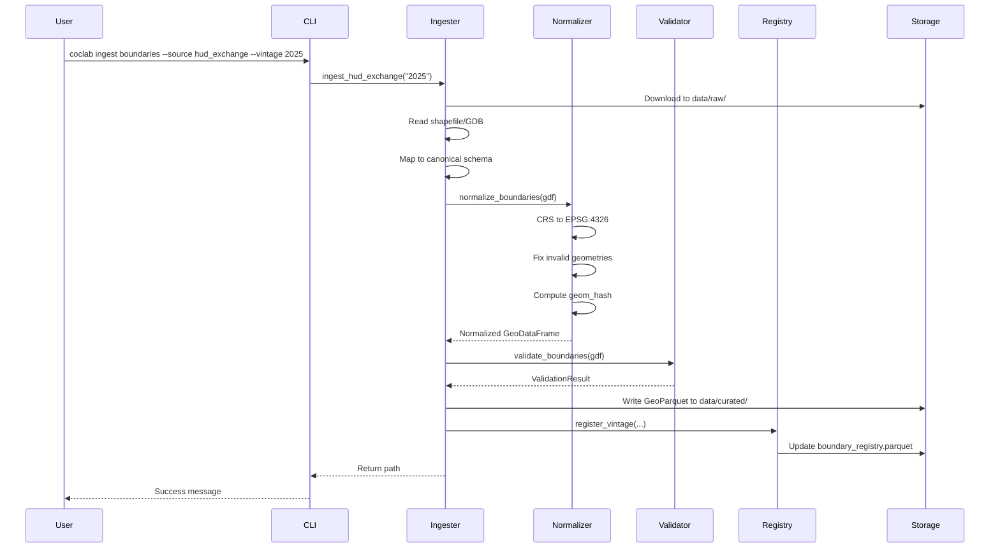
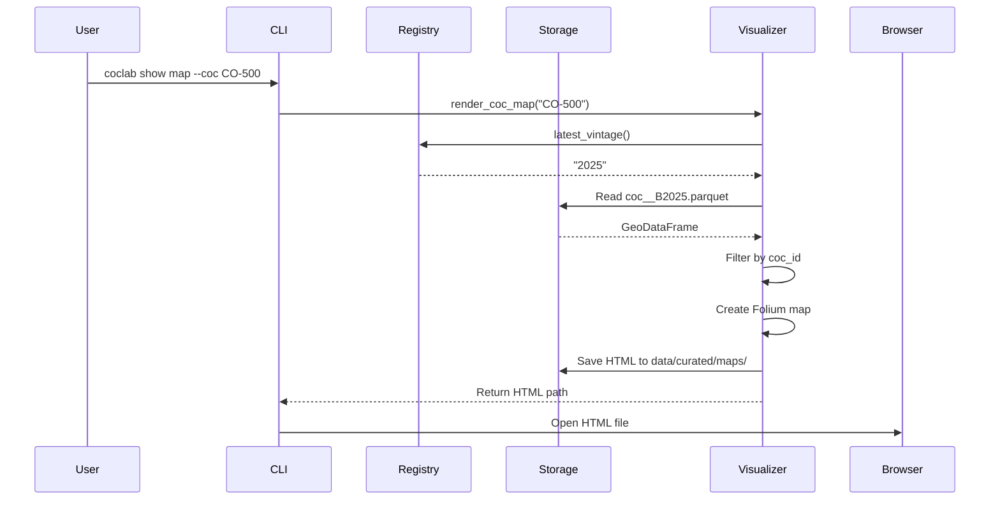
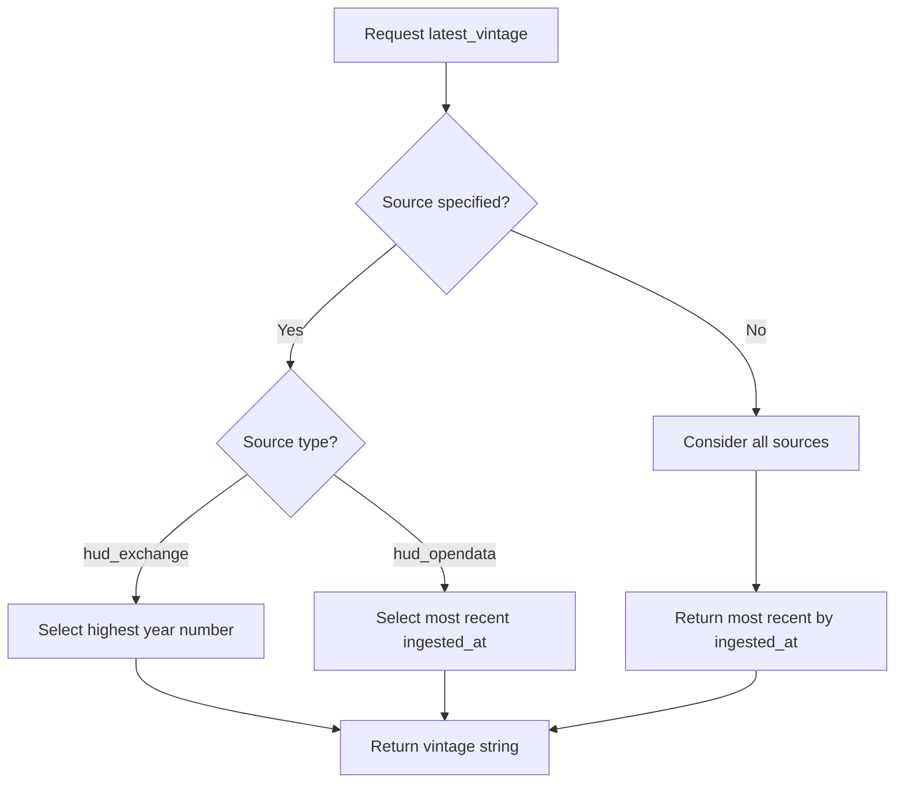
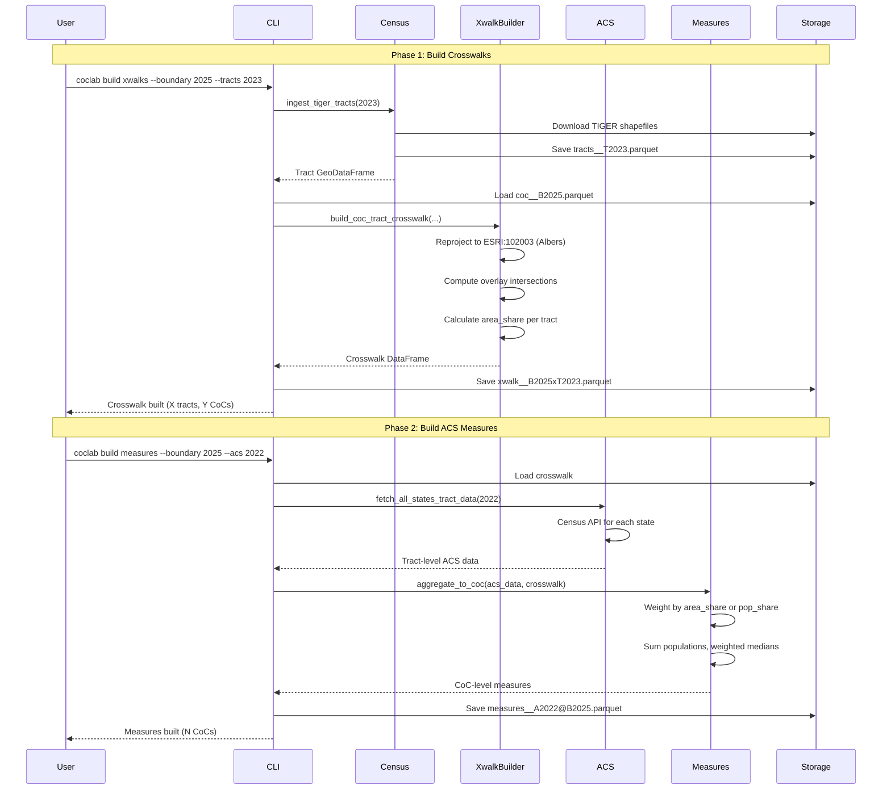

# Workflows

## Ingestion Workflow



## Visualization Workflow



## Version Selection Logic



## Crosswalk & Measures Workflow



## Typical Use Sequence: Building a Panel from Scratch

This section demonstrates the complete command sequence to build an analysis-ready CoC × year panel with ZORI rent data, starting from a clean slate with no previously ingested files.

**Goal:** Export bundle covering 2015–2024 with ZORI integration.

### Phase 1: Ingest External Data Sources

```bash
# 1a. Ingest CoC boundaries for each year (2015-2024)
coclab ingest boundaries --source hud_exchange --vintage 2015
coclab ingest boundaries --source hud_exchange --vintage 2016
coclab ingest boundaries --source hud_exchange --vintage 2017
coclab ingest boundaries --source hud_exchange --vintage 2018
coclab ingest boundaries --source hud_exchange --vintage 2019
coclab ingest boundaries --source hud_exchange --vintage 2020
coclab ingest boundaries --source hud_exchange --vintage 2021
coclab ingest boundaries --source hud_exchange --vintage 2022
coclab ingest boundaries --source hud_exchange --vintage 2023
coclab ingest boundaries --source hud_exchange --vintage 2024

# 1b. Ingest Census geometries (tracts and counties)
coclab ingest census --year 2023 --type all

# 1c. Ingest PIT counts (one vintage contains all historical years)
coclab ingest pit-vintage --vintage 2024

# 1d. Ingest ZORI rent data
coclab ingest zori --geography county
```

### Phase 2: Build Crosswalks

Build crosswalks for each boundary vintage against the 2023 Census geometries:

```bash
coclab build xwalks --boundary 2015 --tracts 2023 --counties 2023
coclab build xwalks --boundary 2016 --tracts 2023 --counties 2023
coclab build xwalks --boundary 2017 --tracts 2023 --counties 2023
coclab build xwalks --boundary 2018 --tracts 2023 --counties 2023
coclab build xwalks --boundary 2019 --tracts 2023 --counties 2023
coclab build xwalks --boundary 2020 --tracts 2023 --counties 2023
coclab build xwalks --boundary 2021 --tracts 2023 --counties 2023
coclab build xwalks --boundary 2022 --tracts 2023 --counties 2023
coclab build xwalks --boundary 2023 --tracts 2023 --counties 2023
coclab build xwalks --boundary 2024 --tracts 2023 --counties 2023
```

### Phase 3: Build ACS Measures

The default alignment policy maps PIT year Y → ACS vintage Y-1. Build measures for each required (boundary, ACS) pair:

```bash
# PIT 2015 → boundary 2015, ACS 2014 (2010-2014 estimates)
coclab build measures --boundary 2015 --acs 2010-2014 --tracts 2023

# PIT 2016 → boundary 2016, ACS 2015 (2011-2015 estimates)
coclab build measures --boundary 2016 --acs 2011-2015 --tracts 2023

# PIT 2017 → boundary 2017, ACS 2016 (2012-2016 estimates)
coclab build measures --boundary 2017 --acs 2012-2016 --tracts 2023

# PIT 2018 → boundary 2018, ACS 2017 (2013-2017 estimates)
coclab build measures --boundary 2018 --acs 2013-2017 --tracts 2023

# PIT 2019 → boundary 2019, ACS 2018 (2014-2018 estimates)
coclab build measures --boundary 2019 --acs 2014-2018 --tracts 2023

# PIT 2020 → boundary 2020, ACS 2019 (2015-2019 estimates)
coclab build measures --boundary 2020 --acs 2015-2019 --tracts 2023

# PIT 2021 → boundary 2021, ACS 2020 (2016-2020 estimates)
coclab build measures --boundary 2021 --acs 2016-2020 --tracts 2023

# PIT 2022 → boundary 2022, ACS 2021 (2017-2021 estimates)
coclab build measures --boundary 2022 --acs 2017-2021 --tracts 2023

# PIT 2023 → boundary 2023, ACS 2022 (2018-2022 estimates)
coclab build measures --boundary 2023 --acs 2018-2022 --tracts 2023

# PIT 2024 → boundary 2024, ACS 2023 (2019-2023 estimates)
coclab build measures --boundary 2024 --acs 2019-2023 --tracts 2023
```

### Phase 4: Aggregate ZORI to CoC Level

Aggregate county-level ZORI to CoC geography with yearly collapse:

```bash
coclab build zori \
  --boundary 2024 \
  --counties 2023 \
  --acs 2019-2023 \
  --weighting renter_households \
  --to-yearly
```

### Phase 5: Build the Panel

Assemble the CoC × year panel with ZORI integration:

```bash
coclab build panel \
  --start 2015 \
  --end 2024 \
  --weighting population \
  --include-zori \
  --zori-min-coverage 0.90
```

### Phase 6: Export the Bundle

Create an analysis-ready export bundle:

```bash
coclab build export \
  --name coc_analysis_2015_2024 \
  --years 2015-2024 \
  --include panel,manifest,codebook,diagnostics \
  --compress
```

### Output Summary

| Phase | Output Location |
|-------|-----------------|
| 1a. Boundaries | `data/curated/coc_boundaries/coc__B{year}.parquet` |
| 1b. Census | `data/curated/census/tracts__T2023.parquet`, `counties__C2023.parquet` |
| 1c. PIT | `data/curated/pit/pit_vintage__P2024.parquet` |
| 1d. ZORI | `data/curated/zori/zori__county.parquet` |
| 2. Crosswalks | `data/curated/xwalks/xwalk__B{year}xT2023.parquet` |
| 3. Measures | `data/curated/measures/measures__A{acs}@B{year}.parquet` |
| 4. CoC ZORI | `data/curated/zori/zori_yearly__*.parquet` |
| 5. Panel | `data/curated/panel/panel__Y2015-2024@B{boundary}.parquet` |
| 6. Export | `exports/export-1/` (with MANIFEST.json, codebook, etc.) |

### Alignment Policy Reference

The default alignment policy determines vintage matching. See [[07-Temporal-Terminology|Temporal Terminology]] for notation conventions.

| PIT Year | Boundary | ACS | ACS 5-Year Range | Notation |
|----------|----------|-----|------------------|----------|
| 2015 | B2015 | A2014 | 2010-2014 | P2015@B2015 + A2014 |
| 2016 | B2016 | A2015 | 2011-2015 | P2016@B2016 + A2015 |
| 2017 | B2017 | A2016 | 2012-2016 | P2017@B2017 + A2016 |
| 2018 | B2018 | A2017 | 2013-2017 | P2018@B2018 + A2017 |
| 2019 | B2019 | A2018 | 2014-2018 | P2019@B2019 + A2018 |
| 2020 | B2020 | A2019 | 2015-2019 | P2020@B2020 + A2019 |
| 2021 | B2021 | A2020 | 2016-2020 | P2021@B2021 + A2020 |
| 2022 | B2022 | A2021 | 2017-2021 | P2022@B2022 + A2021 |
| 2023 | B2023 | A2022 | 2018-2022 | P2023@B2023 + A2022 |
| 2024 | B2024 | A2023 | 2019-2023 | P2024@B2024 + A2023 |

This is a **period-faithful** alignment: each PIT year is analyzed using boundaries in effect during that count (P{year}@B{year}).

---

**Previous:** [[07-Temporal-Terminology]] | **Next:** [[09-Methodology-ACS-Aggregation]]
