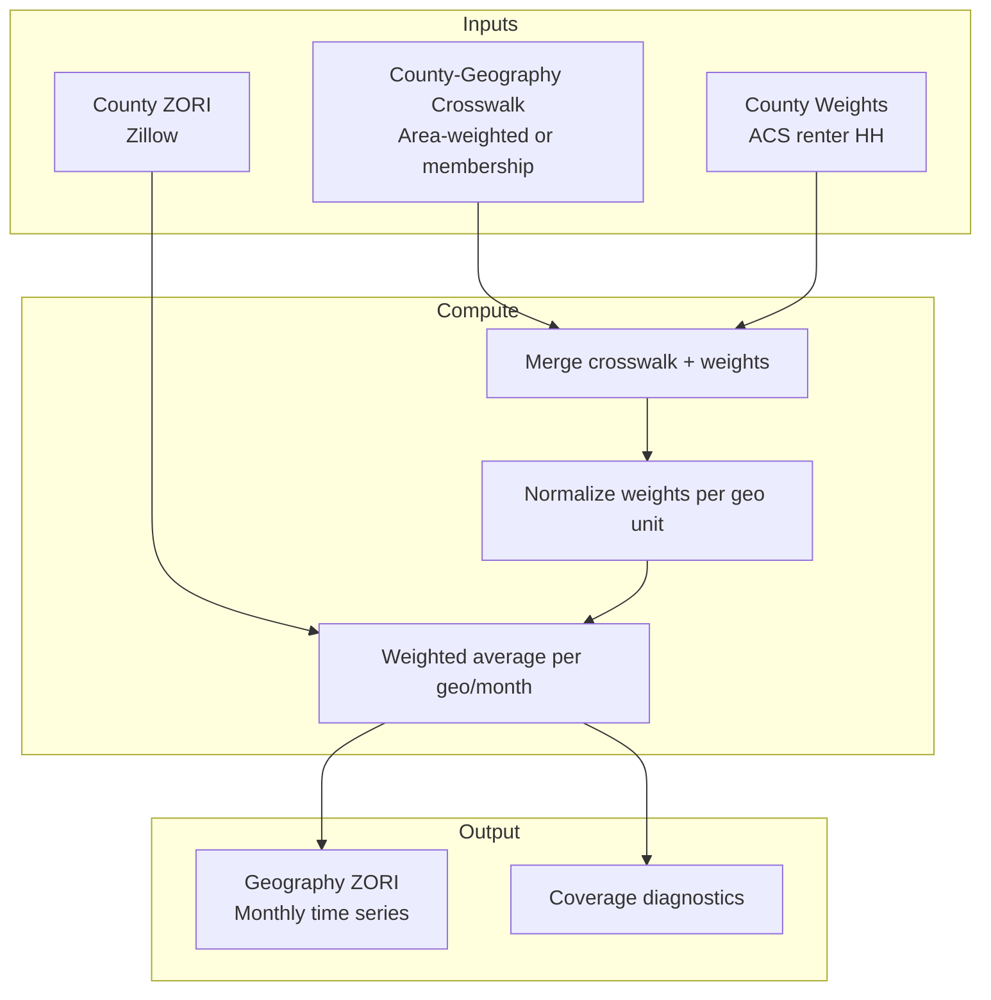

# Methodology: ZORI Aggregation

This section documents how ZORI (Zillow Observed Rent Index) data is aggregated from county geography to analysis geographies (CoC or metro).

## What is ZORI?

ZORI (Zillow Observed Rent Index) measures typical observed rent across a given region. Key characteristics:

- **Monthly time series** - Published monthly at county and ZIP code levels
- **Smoothed measure** - Uses repeat-rent methodology to control for composition changes
- **Covers ~40% of US counties** - Urban/suburban counties with sufficient listings
- **Published by Zillow Economic Research** - Free for public use with attribution

## Target Geographies

The aggregation engine (`coclab.rents.aggregate.aggregate_monthly()`) is geography-neutral via `geo_id_col`:

- **CoC**: counties are assigned to CoCs via area-weighted spatial crosswalk
- **Metro**: counties are assigned to metros via county membership table (no spatial crosswalk needed)

The same weighting formula, coverage tracking, and yearly collapse methods apply to both targets.

## Aggregation Pipeline



## Weighting Methods

ZORI aggregation supports multiple weighting schemes:

| Method | ACS Variable | Description |
|--------|--------------|-------------|
| `renter_households` | B25003_003E | Renter-occupied housing units (recommended) |
| `housing_units` | B25001_001E | Total housing units |
| `population` | B01003_001E | Total population |
| `equal` | N/A | Equal weight per county |

**Recommended:** `renter_households` because ZORI measures rental prices, so weighting by renter population produces more representative estimates.

## Aggregation Algorithm

For each CoC and month:

1. **Load county-CoC crosswalk** with area shares
2. **Load county weights** (e.g., renter households from ACS)
3. **Compute combined weights:**
   ```
   w[county,coc] = area_share[county,coc] × weight_value[county]
   ```
4. **Normalize weights per CoC:**
   ```
   w_norm[county,coc] = w[county,coc] / Σ w[county,coc]
   ```
5. **Filter to counties with ZORI data** for the given month
6. **Compute weighted average:**
   ```
   zori_coc = Σ (w_norm[county,coc] × zori[county])
   ```
7. **Compute coverage ratio:**
   ```
   coverage_ratio = Σ w_norm[county,coc] for counties with ZORI data
   ```

## Coverage Ratio Interpretation

The `coverage_ratio` field indicates what fraction of the CoC (by weight) has ZORI data:

| Value | Interpretation | Recommendation |
|-------|----------------|----------------|
| `0.90 - 1.00` | Excellent coverage | Use estimate directly |
| `0.70 - 0.89` | Good coverage | Use with caution |
| `0.50 - 0.69` | Moderate coverage | Consider limitations |
| `< 0.50` | Poor coverage | May not be representative |

Low coverage typically indicates:
- Rural CoCs with few urban counties
- Newer ZORI data where historical coverage is sparse
- CoCs dominated by counties without sufficient Zillow listings

## Known Limitations

### 1. County-Level Granularity

ZORI is published at county level, not tract level. This means:
- Within-county rent variation is not captured
- Urban/rural mix within CoC affects representativeness
- Small CoCs spanning few counties have less smoothing

### 2. ZORI Coverage Gaps

Not all counties have ZORI data:
- ~1,500 of ~3,100 US counties have ZORI (40-50%)
- Rural counties often lack sufficient Zillow listings
- Coverage varies over time (expanding)

**Zero-Coverage CoCs:** Approximately 96 CoCs have zero ZORI coverage. These are primarily:
- Rural CoCs in states like Montana, Wyoming, and the Dakotas
- Puerto Rico CoCs (PR has limited Zillow presence)
- CoCs dominated by counties without sufficient Zillow rental listings

### ZORI Exclusion Policy for Rent-Affordability Inference

**Design Decision:** CoCs with zero or very low ZORI coverage are EXCLUDED from rent-affordability inference models, NOT imputed. This is intentional.

**Rationale:**
1. **Avoiding systematic bias** - Imputing rental costs for rural/underserved areas would introduce bias. The rental markets in these areas differ structurally from areas with ZORI data.
2. **Transparency over completeness** - It's better to acknowledge missing data than to fabricate estimates.
3. **Model integrity** - The `rent_to_income` predictor is only computed for eligible CoCs to maintain analytical validity.

**Implementation:**
- The panel assembly marks ineligible rows with `zori_excluded_reason`:
  - `zero_coverage`: CoC has no ZORI-covered counties
  - `low_coverage`: Coverage below threshold (default 90%)
  - `missing`: ZORI data unavailable for that CoC-year
- `rent_to_income` is NULL for excluded CoCs
- Analysis should filter to eligible CoCs when using rent-based predictors

**Recommended Practice:**
When analyzing rent-affordability patterns:
1. Report the number of excluded CoCs and their characteristics
2. Consider separate analysis for rural vs. urban CoCs
3. Acknowledge the urban bias in ZORI-based measures

See `coclab/panel/zori_eligibility.py` for implementation details.

### 3. Temporal Alignment

ZORI months represent market conditions at a point in time. When aligning with PIT counts (January), use:
- `pit_january` method: Use January ZORI value (default—aligns with P{year} counts)
- `calendar_mean`: Average over calendar year
- `calendar_median`: Median over calendar year

See [[08-Temporal-Terminology|Temporal Terminology]] for notation conventions describing data vintage combinations.

### 4. Weighting Assumptions

County weights assume uniform distribution of characteristics within the county-CoC intersection. This may not hold for:
- Counties split between urban and rural CoCs
- Counties with diverse housing markets

## Yearly Collapse Methods

The `collapse_to_yearly()` function supports:

| Method | Description | Use Case |
|--------|-------------|----------|
| `pit_january` | January value only | Align with PIT count timing |
| `calendar_mean` | Mean of 12 months | Annual average |
| `calendar_median` | Median of 12 months | Robust to outliers |

## Yearly Alignment of ZORI to PIT Counts

Unless otherwise specified, ZORI is collapsed to yearly values using the **January observation** of each calendar year. This choice aligns the rent measure with HUD Point-in-Time (PIT) counts, which are conducted in January.

Alternative yearly collapse methods (e.g., calendar-year mean or median) may be used for sensitivity analysis, but January-aligned ZORI is the default for all standard HHP-Lab panels and examples.

## Data Attribution

ZORI data requires attribution to Zillow:

> "The Zillow Economic Research team publishes a variety of real estate metrics including median home values and rents... All data accessed and downloaded from this page is free for public use by consumers, media, analysts, academics and policymakers, consistent with our published Terms of Use. Proper and clear attribution of all data to Zillow is required."

## Interpretation Notes: ZORI-Based Rent Affordability

- `rent_to_income` reflects **market asking rents** derived from Zillow listings, not observed lease rents.
- ZORI coverage is systematically lower in rural, tribal, and Puerto Rico CoCs due to limited rental listings; this is a data availability constraint, not a modeling choice.
- As a result, analyses using `rent_to_income` primarily reflect housing market dynamics in urban and suburban CoCs, which account for the majority of the national homeless population.

---

**Previous:** [[10-Methodology-ACS-Aggregation]] | **Next:** [[12-Methodology-Panel-Assembly]]
