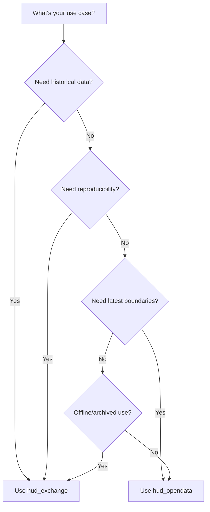
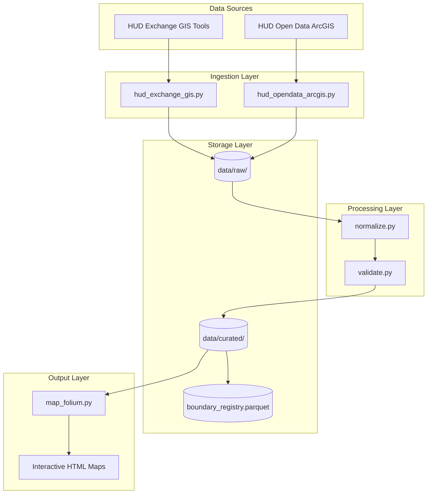
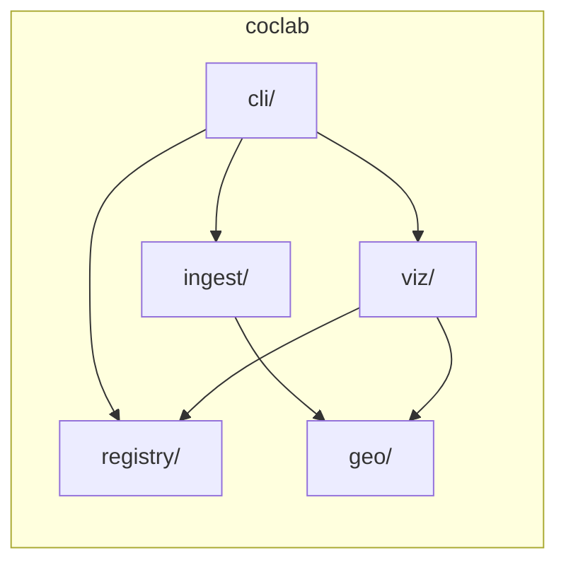
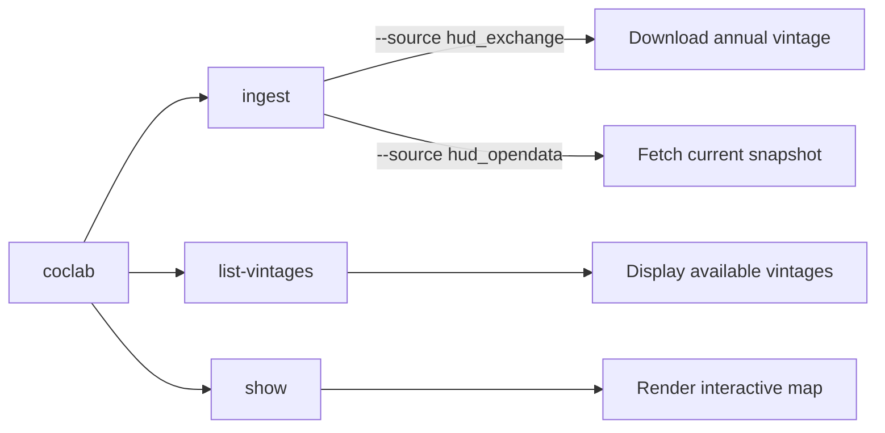
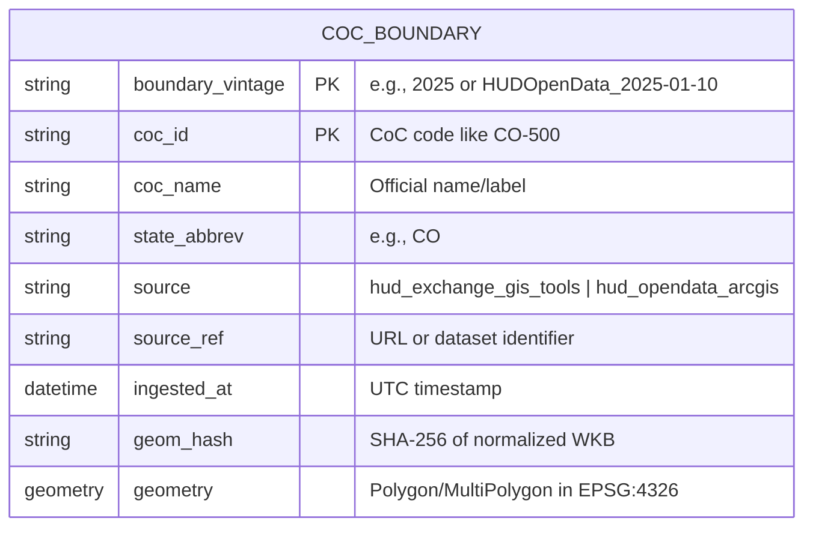
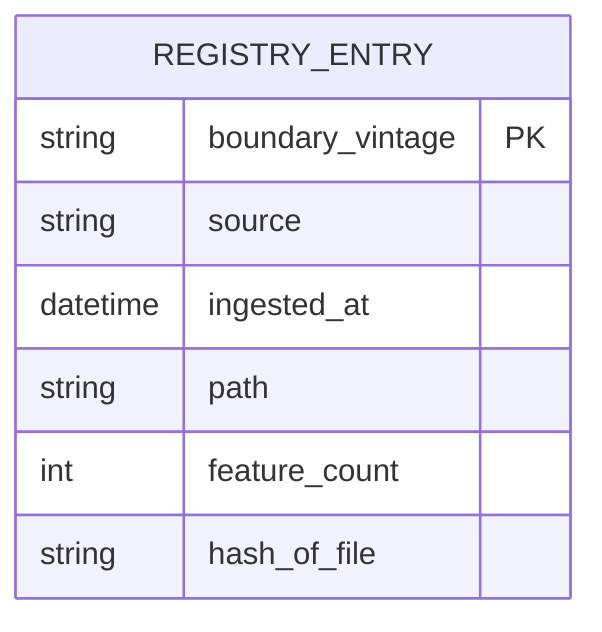
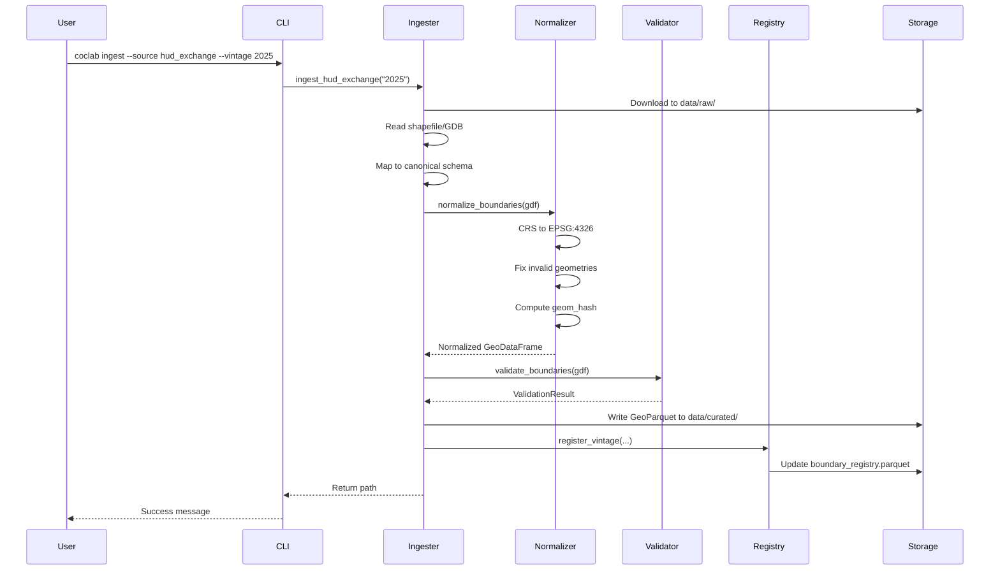
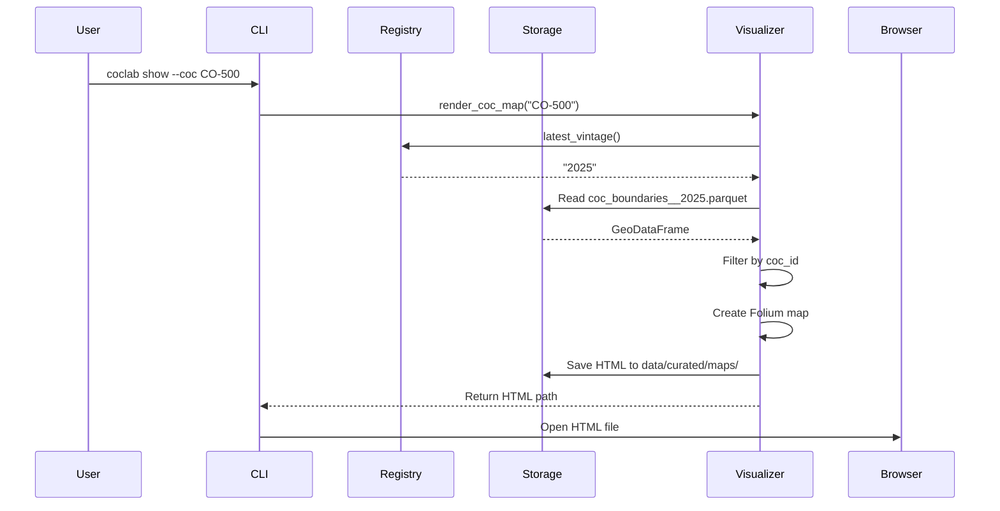
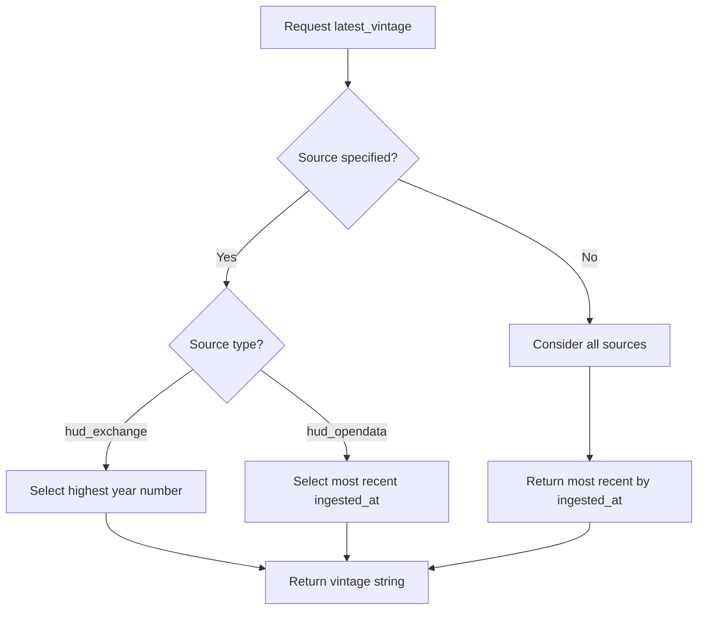

# CoC Lab Manual

> A comprehensive guide to the Continuum of Care (CoC) boundary data infrastructure

---

## Table of Contents

- [[#Overview]]
- [[#Installation]]
- [[#Architecture]]
- [[#CLI Reference]]
- [[#Python API]]
- [[#Data Model]]
- [[#Workflows]]
- [[#Module Reference]]
- [[#Development]]

---

## Overview

CoC Lab is a Python-based data and geospatial infrastructure for working with **Continuum of Care (CoC) boundary data**. It provides tools to:

- **Ingest** CoC boundaries from HUD data sources
- **Validate** geometry and data quality
- **Version** boundary snapshots over time
- **Visualize** boundaries as interactive maps

### What is a Continuum of Care?

A Continuum of Care (CoC) is a regional or local planning body that coordinates housing and services funding for homeless families and individuals. HUD assigns each CoC a unique identifier (e.g., `CO-500` for Colorado Balance of State CoC).

### Data Sources

| Source | Description | Update Frequency |
|--------|-------------|------------------|
| **HUD Exchange GIS Tools** | Annual CoC boundary shapefiles | Yearly vintages |
| **HUD Open Data (ArcGIS)** | Current CoC Grantee Areas | Live snapshots |

### Choosing a Data Source

The two data sources serve different purposes. Choose based on your use case:

#### HUD Exchange (`hud_exchange`)

**Best for:** Historical analysis, reproducible research, compliance documentation

| Aspect | Details |
|--------|---------|
| **Update cadence** | Annual releases tied to HUD fiscal year |
| **Data stability** | Immutable once published—boundaries for a given vintage never change |
| **Historical access** | Multiple years available (e.g., 2020, 2021, 2022, 2023, 2024, 2025) |
| **Format** | Geodatabase or Shapefile downloads |

**Advantages:**
- **Reproducibility** — Running the same vintage always yields identical results
- **Historical comparison** — Compare how CoC boundaries evolved year-over-year
- **Audit trails** — Document which vintage was used for a specific analysis
- **Offline availability** — Downloaded files can be archived and reused

**Disadvantages:**
- **Lag time** — New vintages are published months after fiscal year ends
- **May miss recent changes** — Boundary updates between releases aren't reflected
- **Larger downloads** — Full national dataset for each vintage

#### HUD Open Data (`hud_opendata`)

**Best for:** Current boundary lookups, real-time applications, quick exploration

| Aspect | Details |
|--------|---------|
| **Update cadence** | Live—reflects HUD's current authoritative boundaries |
| **Data stability** | May change at any time as HUD updates boundaries |
| **Historical access** | Current snapshot only (no historical data) |
| **Format** | ArcGIS Feature Service (paginated API) |

**Advantages:**
- **Always current** — Reflects the latest boundary definitions from HUD
- **No manual downloads** — Data fetched directly via API
- **Lightweight** — Only retrieves the data you need

**Disadvantages:**
- **Not reproducible** — Same query on different days may yield different results
- **No history** — Cannot access how boundaries looked in the past
- **API dependency** — Requires network access and relies on HUD service availability

#### Decision Guide



| Use Case | Recommended Source |
|----------|-------------------|
| Year-over-year boundary change analysis | `hud_exchange` |
| Point-in-time count reporting (e.g., FY2024 PIT) | `hud_exchange` (matching vintage) |
| "What CoC is this address in today?" | `hud_opendata` |
| Building a dashboard with current boundaries | `hud_opendata` |
| Research paper requiring reproducible methods | `hud_exchange` |
| Archiving boundaries for compliance records | `hud_exchange` |

---

## Installation

### Prerequisites

- Python 3.12+
- `uv` package manager (recommended) or `pip`

### Quick Install

```bash
# Clone the repository
git clone https://github.com/your-org/coc-pit.git
cd coc-pit

# Install with uv (recommended)
uv sync

# Or install with pip
pip install -e .

# For development (includes pytest, ruff)
uv sync --extra dev
```

### Verify Installation

```bash
# Check CLI is available
coclab --help

# Run tests
pytest tests/test_smoke.py -v
```

---

## Architecture

### System Overview



### Module Structure



### Directory Layout

```
coclab/
  cli/          # CLI commands (Typer)
  geo/          # Geometry normalization and validation
  ingest/       # Data source ingesters
  registry/     # Vintage tracking and version selection
  viz/          # Map rendering (Folium)
data/
  raw/          # Downloaded source files
  curated/      # Processed GeoParquet files
tests/          # Test suite including smoke tests
```

---

## CLI Reference

The `coclab` command provides access to all core functionality.

### Commands Overview



### `coclab ingest`

Ingest CoC boundary data from HUD sources.

**From HUD Exchange (annual vintages):**
```bash
coclab ingest --source hud_exchange --vintage 2025
```

**From HUD Open Data (current snapshot):**
```bash
coclab ingest --source hud_opendata --snapshot latest
```

| Option       | Description                                    | Default                     |
| ------------ | ---------------------------------------------- | --------------------------- |
| `--source`   | Data source (`hud_exchange` or `hud_opendata`) | Required                    |
| `--vintage`  | Year for HUD Exchange data                     | Required for `hud_exchange` |
| `--snapshot` | Snapshot tag for Open Data                     | `latest`                    |

### `coclab list-vintages`

List all available boundary vintages in the registry.

```bash
coclab list-vintages
```

**Example Output:**
```
Available boundary vintages:

Vintage                        Source                    Features   Ingested At
-------------------------------------------------------------------------------------
2025                           hud_exchange_gis_tools    400        2025-01-15 14:30
HUDOpenData_2025-01-10         hud_opendata_arcgis       402        2025-01-10 09:15
```

### `coclab show`

Render an interactive map for a specific CoC boundary.

```bash
# Show using latest vintage
coclab show --coc CO-500

# Specify a vintage
coclab show --coc CO-500 --vintage 2025

# Custom output path
coclab show --coc NY-600 --output my_map.html
```

| Option | Description | Default |
|--------|-------------|---------|
| `--coc` | CoC identifier (e.g., `CO-500`) | Required |
| `--vintage` | Boundary vintage to use | Latest |
| `--output` | Output HTML file path | Auto-generated |

---

## Python API

### Quick Start

```python
from coclab.ingest import ingest_hud_exchange, ingest_hud_opendata
from coclab.registry import latest_vintage, list_vintages
from coclab.viz import render_coc_map

# Ingest a vintage
output_path = ingest_hud_exchange("2025")

# Get the latest vintage
vintage = latest_vintage()

# List all vintages
for entry in list_vintages():
    print(f"{entry.boundary_vintage}: {entry.feature_count} features")

# Render a map
map_path = render_coc_map("CO-500", vintage="2025")
print(f"Map saved to: {map_path}")
```

### API Reference

#### Ingestion Functions

```python
# HUD Exchange GIS Tools (annual vintages)
from coclab.ingest import ingest_hud_exchange

path = ingest_hud_exchange(
    boundary_vintage: str,  # e.g., "2025"
    url: str | None = None,  # Custom download URL
    download_dir: Path | None = None  # Custom download directory
) -> Path  # Returns path to curated GeoParquet

# HUD Open Data ArcGIS (live snapshots)
from coclab.ingest import ingest_hud_opendata

path = ingest_hud_opendata(
    snapshot_tag: str = "latest"  # Snapshot identifier
) -> Path  # Returns path to curated GeoParquet
```

#### Registry Functions

```python
from coclab.registry import (
    register_vintage,
    list_vintages,
    latest_vintage,
    RegistryEntry
)

# Register a new vintage
register_vintage(
    vintage: str,
    path: Path,
    source: str,
    feature_count: int,
    hash_of_file: str | None = None,
    ingested_at: datetime | None = None
) -> None

# List all vintages (sorted by ingested_at descending)
entries: list[RegistryEntry] = list_vintages()

# Get latest vintage string
vintage: str = latest_vintage(source: str | None = None)
```

#### Visualization Functions

```python
from coclab.viz import render_coc_map

html_path = render_coc_map(
    coc_id: str,           # e.g., "CO-500"
    vintage: str | None = None,  # Uses latest if None
    out_html: Path | None = None  # Custom output path
) -> Path  # Returns path to generated HTML
```

#### Geo Processing Functions

```python
from coclab.geo import normalize_boundaries, validate_boundaries
import geopandas as gpd

# Normalize a GeoDataFrame
gdf_normalized = normalize_boundaries(gdf: gpd.GeoDataFrame) -> gpd.GeoDataFrame

# Validate boundaries (returns ValidationResult)
result = validate_boundaries(gdf: gpd.GeoDataFrame) -> ValidationResult
print(result.errors)    # List of error messages
print(result.warnings)  # List of warning messages
print(result.is_valid)  # True if no errors
```

---

## Data Model

### Canonical Boundary Schema

All boundary data is normalized to this schema before storage:



| Column | Type | Description |
|--------|------|-------------|
| `boundary_vintage` | string | Version identifier (e.g., `2025`) |
| `coc_id` | string | CoC identifier (e.g., `CO-500`) |
| `coc_name` | string | Official CoC name |
| `state_abbrev` | string | US state abbreviation |
| `source` | string | Data source identifier |
| `source_ref` | string | URL or reference to original data |
| `ingested_at` | datetime | UTC timestamp of ingestion |
| `geom_hash` | string | SHA-256 hash for change detection |
| `geometry` | Polygon/MultiPolygon | Boundary in EPSG:4326 |

### Registry Schema

The registry tracks all available boundary vintages:



### Storage Locations

| File | Path Pattern | Description |
|------|--------------|-------------|
| Boundary data | `data/curated/coc_boundaries__{vintage}.parquet` | GeoParquet with boundaries |
| Registry | `data/curated/boundary_registry.parquet` | Vintage tracking |
| Maps | `data/curated/maps/{coc_id}__{vintage}.html` | Generated HTML maps |
| Raw downloads | `data/raw/hud_exchange/{vintage}/` | Original source files |

---

## Workflows

### Ingestion Workflow



### Visualization Workflow



### Version Selection Logic



---

## Module Reference

### cli/main.py

The CLI module uses [Typer](https://typer.tiangolo.com/) for command-line parsing.

**Entry Point:** `coclab`

**Commands:**
- `ingest` - Trigger data ingestion
- `list-vintages` - Display registry contents
- `show` - Generate interactive maps

### ingest/hud_exchange_gis.py

Handles ingestion from HUD Exchange GIS Tools.

**Key Functions:**
- `download_hud_exchange_gdb()` - Download and extract source files
- `read_coc_boundaries()` - Parse geodatabase or shapefile
- `map_to_canonical_schema()` - Normalize field names
- `ingest_hud_exchange()` - Complete pipeline

**Field Mapping:**
| Source Fields | Canonical Field |
|---------------|-----------------|
| `COCNUM`, `COC_NUM`, `CocNum` | `coc_id` |
| `COCNAME`, `COC_NAME`, `CocName` | `coc_name` |
| `STUSAB`, `STATE`, `ST` | `state_abbrev` |

### ingest/hud_opendata_arcgis.py

Handles ingestion from HUD Open Data ArcGIS Hub.

**API Endpoint:** Continuum of Care Grantee Areas feature service

**Key Functions:**
- `_fetch_page()` - Fetch paginated data (page size: 1000)
- `_fetch_all_features()` - Handle pagination
- `_features_to_geodataframe()` - Convert GeoJSON to GeoDataFrame
- `ingest_hud_opendata()` - Complete pipeline

### geo/normalize.py

Geometry processing and normalization.

**Functions:**
| Function | Purpose |
|----------|---------|
| `normalize_crs()` | Reproject to EPSG:4326 |
| `fix_geometry()` | Apply `shapely.make_valid()` |
| `ensure_polygon_type()` | Filter to Polygon/MultiPolygon |
| `compute_geom_hash()` | SHA-256 of WKB (6 decimal precision) |
| `normalize_boundaries()` | Full pipeline |

### geo/validate.py

Data quality validation.

**Classes:**
- `ValidationResult` - Container for errors/warnings
- `ValidationIssue` - Individual issue with severity

**Validation Checks:**
- Required columns exist with correct types
- `coc_id` uniqueness within vintage
- Geometry validity (non-empty, valid type)
- Anomaly detection (tiny polygons, invalid coordinates)

### geo/io.py

GeoParquet I/O utilities.

**Functions:**
- `read_geoparquet()` - Load GeoParquet to GeoDataFrame
- `write_geoparquet()` - Save with snappy compression
- `curated_boundary_path()` - Generate canonical file paths
- `registry_path()` - Get registry file location

### registry/registry.py

Vintage tracking and version selection.

**Functions:**
- `register_vintage()` - Idempotent registration with hash checking
- `list_vintages()` - Get all entries sorted by date
- `latest_vintage()` - Resolve current version by source policy
- `compute_file_hash()` - SHA-256 of file contents

### registry/schema.py

Data structures for registry.

**Classes:**
- `RegistryEntry` - Dataclass with serialization methods

### viz/map_folium.py

Interactive map generation with Folium.

**Features:**
- Auto-centering on CoC centroid
- Blue polygon overlay (30% opacity)
- Interactive tooltip (ID, Name, Vintage, Source)
- Auto-fitted bounds

---

## Development

### Running Tests

```bash
# Run all tests
pytest

# Run smoke tests only
pytest tests/test_smoke.py -v

# Run with coverage
pytest --cov=coclab
```

### Code Quality

```bash
# Lint and check
ruff check .

# Format code
ruff format .
```

### Project Dependencies

**Core:**
- `geopandas` - Geospatial data handling
- `shapely` - Geometry operations
- `pyproj` - Coordinate transformations
- `pyarrow` - Parquet I/O
- `pandas` - Data manipulation
- `folium` - Interactive maps
- `typer` - CLI framework

**Development:**
- `pytest` - Testing
- `ruff` - Linting and formatting

### Adding a New Data Source

1. Create new ingester in `coclab/ingest/`
2. Implement the canonical schema mapping
3. Call `normalize_boundaries()` and `validate_boundaries()`
4. Register vintage using `register_vintage()`
5. Add CLI option in `cli/main.py`
6. Add tests

### Extending Validation

Add new checks in `coclab/geo/validate.py`:

```python
def _validate_custom(gdf: gpd.GeoDataFrame, result: ValidationResult) -> None:
    # Your validation logic
    if issue_found:
        result.add_warning("Description of issue", {"metadata": value})
```

---

## Appendix

### CoC ID Format

CoC identifiers follow the pattern: `{STATE}-{NUMBER}`

- `STATE` - Two-letter state abbreviation
- `NUMBER` - Three-digit number

Examples: `CO-500`, `NY-600`, `CA-500`

### Coordinate Reference System

All geometries are stored in **EPSG:4326** (WGS84):
- Latitude: -90 to 90
- Longitude: -180 to 180

### Geometry Hash Algorithm

1. Extract WKB from geometry
2. Round coordinates to 6 decimal places (~11cm precision)
3. Compute SHA-256 hash
4. Store as hex string

This enables efficient change detection between vintages.

---

*Generated for CoC Lab v0*
