# CoC Lab Manual

> A comprehensive guide to the Continuum of Care (CoC) boundary data infrastructure

---

## Table of Contents

- [[#Overview]]
- [[#Installation]]
- [[#Architecture]]
- [[#CLI Reference]]
- [[#Python API]]
- [[#Data Model]]
- [[#Workflows]]
- [[#Methodology: ACS Aggregation to CoC Level]]
- [[#Methodology: ZORI Aggregation to CoC Level]]
- [[#Methodology: Panel Assembly (Phase 3)]]
- [[#Module Reference]]
- [[#Development]]

---

## Overview

CoC Lab is a Python-based data and geospatial infrastructure for working with **Continuum of Care (CoC) boundary data**. It provides tools to:

- **Ingest** CoC boundaries from HUD data sources
- **Validate** geometry and data quality
- **Version** boundary snapshots over time
- **Visualize** boundaries as interactive maps
- **Build crosswalks** linking CoCs to census tracts and counties
- **Compute measures** aggregating ACS demographic data to CoC level

### What is a Continuum of Care?

A Continuum of Care (CoC) is a regional or local planning body that coordinates housing and services funding for homeless families and individuals. HUD assigns each CoC a unique identifier (e.g., `CO-500` for Colorado Balance of State CoC).

### Data Sources

| Source | Description | Update Frequency |
|--------|-------------|------------------|
| **HUD Exchange GIS Tools** | Annual CoC boundary shapefiles | Yearly vintages |
| **HUD Open Data (ArcGIS)** | Current CoC Grantee Areas | Live snapshots |

### Choosing a Data Source

The two data sources serve different purposes. Choose based on your use case:

#### HUD Exchange (`hud_exchange`)

**Best for:** Historical analysis, reproducible research, compliance documentation

| Aspect | Details |
|--------|---------|
| **Update cadence** | Annual releases tied to HUD fiscal year |
| **Data stability** | Immutable once published—boundaries for a given vintage never change |
| **Historical access** | Multiple years available (e.g., 2020, 2021, 2022, 2023, 2024, 2025) |
| **Format** | Geodatabase or Shapefile downloads |

**Advantages:**
- **Reproducibility** — Running the same vintage always yields identical results
- **Historical comparison** — Compare how CoC boundaries evolved year-over-year
- **Audit trails** — Document which vintage was used for a specific analysis
- **Offline availability** — Downloaded files can be archived and reused

**Disadvantages:**
- **Lag time** — New vintages are published months after fiscal year ends
- **May miss recent changes** — Boundary updates between releases aren't reflected
- **Larger downloads** — Full national dataset for each vintage

#### HUD Open Data (`hud_opendata`)

**Best for:** Current boundary lookups, real-time applications, quick exploration

| Aspect | Details |
|--------|---------|
| **Update cadence** | Live—reflects HUD's current authoritative boundaries |
| **Data stability** | May change at any time as HUD updates boundaries |
| **Historical access** | Current snapshot only (no historical data) |
| **Format** | ArcGIS Feature Service (paginated API) |

**Advantages:**
- **Always current** — Reflects the latest boundary definitions from HUD
- **No manual downloads** — Data fetched directly via API
- **Lightweight** — Only retrieves the data you need

**Disadvantages:**
- **Not reproducible** — Same query on different days may yield different results
- **No history** — Cannot access how boundaries looked in the past
- **API dependency** — Requires network access and relies on HUD service availability

#### Decision Guide

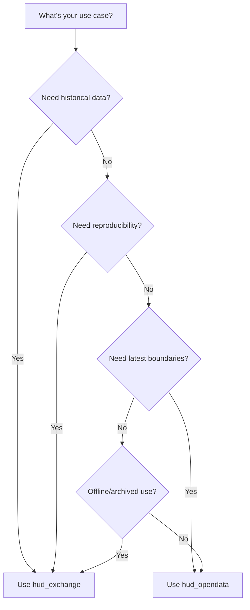
```mermaid
flowchart TD
    A[What's your use case?] --> B{Need historical data?}
    B -->|Yes| C[Use hud_exchange]
    B -->|No| D{Need reproducibility?}
    D -->|Yes| C
    D -->|No| E{Need latest boundaries?}
    E -->|Yes| F[Use hud_opendata]
    E -->|No| G{Offline/archived use?}
    G -->|Yes| C
    G -->|No| F
```

| Use Case | Recommended Source |
|----------|-------------------|
| Year-over-year boundary change analysis | `hud_exchange` |
| Point-in-time count reporting (e.g., FY2024 PIT) | `hud_exchange` (matching vintage) |
| "What CoC is this address in today?" | `hud_opendata` |
| Building a dashboard with current boundaries | `hud_opendata` |
| Research paper requiring reproducible methods | `hud_exchange` |
| Archiving boundaries for compliance records | `hud_exchange` |

---

## Installation

### Prerequisites

- Python 3.12+
- `uv` package manager (recommended) or `pip`

### Quick Install

```bash
# Clone the repository
git clone https://github.com/your-org/coc-pit.git
cd coc-pit

# Install with uv (recommended)
uv sync

# Or install with pip
pip install -e .

# For development (includes pytest, ruff)
uv sync --extra dev
```

### Verify Installation

```bash
# Check CLI is available
coclab --help

# Run tests
pytest tests/test_smoke.py -v
```

### Working Directory

The CLI expects to be run from the CoC-PIT project root directory. If run from a different directory, you'll see a warning:

```
Warning: Current directory may not be the CoC-PIT project root. Missing: pyproject.toml, coclab, data
```

This warning appears when the current directory is missing expected markers (`pyproject.toml`, `coclab/`, `data/`). While commands may still work, file paths assume the project root as the working directory.

---

## Architecture

### System Overview

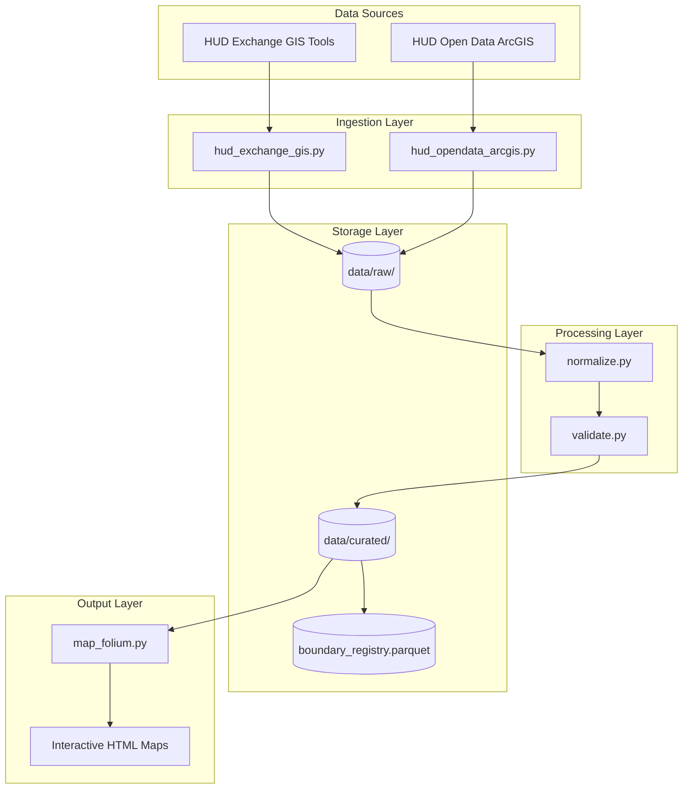
```mermaid
flowchart TB
    subgraph Sources["Data Sources"]
        HUD_EX[HUD Exchange GIS Tools]
        HUD_OD[HUD Open Data ArcGIS]
    end

    subgraph Ingest["Ingestion Layer"]
        ING_EX[hud_exchange_gis.py]
        ING_OD[hud_opendata_arcgis.py]
    end

    subgraph Processing["Processing Layer"]
        NORM[normalize.py]
        VAL[validate.py]
    end

    subgraph Storage["Storage Layer"]
        RAW[(data/raw/)]
        CURATED[(data/curated/)]
        REG[(boundary_registry.parquet)]
    end

    subgraph Output["Output Layer"]
        VIZ[map_folium.py]
        HTML[Interactive HTML Maps]
    end

    HUD_EX --> ING_EX
    HUD_OD --> ING_OD
    ING_EX --> RAW
    ING_OD --> RAW
    RAW --> NORM
    NORM --> VAL
    VAL --> CURATED
    CURATED --> REG
    CURATED --> VIZ
    VIZ --> HTML
```

### Module Structure

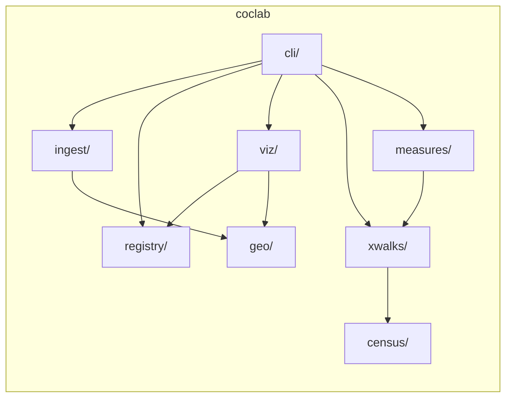
```mermaid
graph LR
    subgraph coclab
        CLI[cli/]
        ING[ingest/]
        GEO[geo/]
        REG[registry/]
        VIZ[viz/]
        CENSUS[census/]
        XWALK[xwalks/]
        MEASURES[measures/]
    end

    CLI --> ING
    CLI --> REG
    CLI --> VIZ
    CLI --> XWALK
    CLI --> MEASURES
    ING --> GEO
    VIZ --> REG
    VIZ --> GEO
    XWALK --> CENSUS
    MEASURES --> XWALK
```

### Directory Layout

```
coclab/
  cli/          # CLI commands (Typer)
  geo/          # Geometry normalization and validation
  ingest/       # Data source ingesters
  registry/     # Vintage tracking and version selection
  viz/          # Map rendering (Folium)
  census/       # Census geometry ingestion (TIGER/Line)
    ingest/     # Tract and county downloaders
  xwalks/       # CoC-to-census crosswalk builders
  measures/     # ACS measure aggregation and diagnostics
  acs/          # ACS population ingest, rollup, and cross-check
    ingest/     # Tract population fetcher
  rents/        # ZORI rent data ingestion and aggregation
  pit/          # PIT count ingestion and QA (Phase 3)
    ingest/     # HUD Exchange PIT downloaders and parsers
  panel/        # CoC × year panel assembly (Phase 3)
data/
  raw/          # Downloaded source files
  curated/      # Processed GeoParquet files
    census/     # TIGER tract/county geometries
    xwalks/     # CoC-tract and CoC-county crosswalks
    measures/   # CoC-level demographic measures
    acs/        # ACS tract population, rollups, and county weights
    rents/      # ZORI rent data (county and CoC-level)
    pit/        # Canonical PIT count files
    panels/     # CoC × year analysis panels
tests/          # Test suite including smoke tests
```

---

## CLI Reference

The `coclab` command provides access to all core functionality.

### Commands Overview

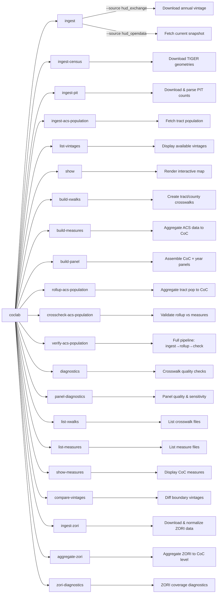
```mermaid
flowchart LR
    coclab --> ingest
    coclab --> ingest-census
    coclab --> ingest-pit
    coclab --> ingest-acs-population
    coclab --> list-vintages
    coclab --> show
    coclab --> build-xwalks
    coclab --> build-measures
    coclab --> build-panel
    coclab --> rollup-acs-population
    coclab --> crosscheck-acs-population
    coclab --> verify-acs-population
    coclab --> diagnostics
    coclab --> panel-diagnostics
    coclab --> list-xwalks
    coclab --> list-measures
    coclab --> show-measures
    coclab --> compare-vintages
    coclab --> ingest-zori
    coclab --> aggregate-zori
    coclab --> zori-diagnostics

    ingest --> |"--source hud_exchange"| HUD_EX[Download annual vintage]
    ingest --> |"--source hud_opendata"| HUD_OD[Fetch current snapshot]
    ingest-census --> TIGER[Download TIGER geometries]
    ingest-pit --> PIT[Download & parse PIT counts]
    ingest-acs-population --> ACSPOP[Fetch tract population]
    list-vintages --> LIST[Display available vintages]
    show --> MAP[Render interactive map]
    build-xwalks --> XWALK[Create tract/county crosswalks]
    build-measures --> MEAS[Aggregate ACS data to CoC]
    build-panel --> PANEL[Assemble CoC × year panels]
    rollup-acs-population --> ROLLUP[Aggregate tract pop to CoC]
    crosscheck-acs-population --> XCHECK[Validate rollup vs measures]
    verify-acs-population --> VERIFY[Full pipeline: ingest→rollup→check]
    ingest-zori --> ZORI_ING[Download & normalize ZORI data]
    aggregate-zori --> ZORI_AGG[Aggregate ZORI to CoC level]
    zori-diagnostics --> ZORI_DIAG[ZORI coverage diagnostics]
    diagnostics --> DIAG[Crosswalk quality checks]
    panel-diagnostics --> PDIAG[Panel quality & sensitivity]
    list-xwalks --> LXWALK[List crosswalk files]
    list-measures --> LMEAS[List measure files]
    show-measures --> SMEAS[Display CoC measures]
    compare-vintages --> COMP[Diff boundary vintages]
```

### `coclab ingest`

Ingest CoC boundary data from HUD sources.

**From HUD Exchange (annual vintages):**
```bash
coclab ingest --source hud_exchange --vintage 2025
```

**From HUD Open Data (current snapshot):**
```bash
coclab ingest --source hud_opendata --snapshot latest
```

| Option       | Description                                    | Default                     |
| ------------ | ---------------------------------------------- | --------------------------- |
| `--source`   | Data source (`hud_exchange` or `hud_opendata`) | Required                    |
| `--vintage`  | Year for HUD Exchange data                     | Required for `hud_exchange` |
| `--snapshot` | Snapshot tag for Open Data                     | `latest`                    |
| `--force`    | Re-ingest even if vintage already exists       | False                       |

### `coclab list-vintages`

List all available boundary vintages in the registry.

```bash
coclab list-vintages
```

**Example Output:**
```
Available boundary vintages:

Vintage                        Source                    Features   Ingested At
-------------------------------------------------------------------------------------
2025                           hud_exchange_gis_tools    400        2025-01-15 14:30
HUDOpenData_2025-01-10         hud_opendata_arcgis       402        2025-01-10 09:15
```

### `coclab show`

Render an interactive map for a specific CoC boundary.

```bash
# Show using latest vintage
coclab show --coc CO-500

# Specify a vintage
coclab show --coc CO-500 --vintage 2025

# Custom output path
coclab show --coc NY-600 --output my_map.html
```

| Option | Description | Default |
|--------|-------------|---------|
| `--coc` | CoC identifier (e.g., `CO-500`) | Required |
| `--vintage` | Boundary vintage to use | Latest |
| `--output` | Output HTML file path | Auto-generated |

### `coclab build-xwalks`

Build area-weighted crosswalks linking CoC boundaries to census tracts and counties.

```bash
# Build crosswalks for a specific boundary and tract vintage
coclab build-xwalks --boundary 2025 --tracts 2023

# Also build county crosswalk
coclab build-xwalks --boundary 2025 --tracts 2023 --counties 2023
```

| Option | Description | Default |
|--------|-------------|---------|
| `--boundary`, `-b` | CoC boundary vintage | Latest |
| `--tracts`, `-t` | Census tract vintage year | 2023 |
| `--counties`, `-c` | Census county vintage year | Same as tracts |
| `--output-dir`, `-o` | Output directory | `data/curated/xwalks` |

**Output:**
- `coc_tract_xwalk__{boundary}__{tracts}.parquet`
- `coc_county_xwalk__{boundary}.parquet`
- Diagnostic summary printed to console

### `coclab build-measures`

Aggregate ACS 5-year estimates to CoC level using tract crosswalks.

```bash
# Build measures with area weighting
coclab build-measures --boundary 2025 --acs 2019-2023

# Use population weighting instead
coclab build-measures --boundary 2025 --acs 2019-2023 --weighting population
```

| Option | Description | Default |
|--------|-------------|---------|
| `--boundary`, `-b` | CoC boundary vintage | Latest |
| `--acs`, `-a` | ACS 5-year estimate vintage (e.g., `2019-2023`) | `2018-2022` |
| `--tracts`, `-t` | Tract vintage for crosswalk | Same as ACS end year |
| `--weighting`, `-w` | `area` or `population` | `area` |
| `--xwalk-dir` | Directory containing crosswalk files | `data/curated/xwalks` |
| `--output-dir`, `-o` | Output directory | `data/curated/measures` |

**Output:**
- `coc_measures__{boundary}__{acs}.parquet`
- Summary statistics printed to console

### `coclab ingest-census`

Download TIGER census geometries (tracts and/or counties).

```bash
# Download both tracts and counties for 2023
coclab ingest-census --year 2023

# Download only tracts
coclab ingest-census --year 2023 --type tracts

# Force re-download even if files exist
coclab ingest-census --year 2023 --force
```

| Option | Description | Default |
|--------|-------------|---------|
| `--year`, `-y` | TIGER vintage year | 2023 |
| `--type`, `-t` | `tracts`, `counties`, or `all` | `all` |
| `--force` | Re-download even if file exists | False |

### `coclab diagnostics`

Run crosswalk quality diagnostics.

```bash
# Basic diagnostics
coclab diagnostics --crosswalk data/curated/xwalks/coc_tract_xwalk__2025__2023.parquet

# Show problem CoCs
coclab diagnostics -x crosswalk.parquet --show-problems

# Custom thresholds and CSV export
coclab diagnostics -x crosswalk.parquet --coverage-threshold 0.90 -o diagnostics.csv
```

| Option | Description | Default |
|--------|-------------|---------|
| `--crosswalk`, `-x` | Path to crosswalk parquet file | Required |
| `--coverage-threshold` | Coverage threshold for flagging | 0.95 |
| `--max-contribution` | Max tract contribution threshold | 0.8 |
| `--show-problems` | Show problem CoCs | False |
| `--output`, `-o` | Save diagnostics to CSV | None |

### `coclab list-xwalks`

List available crosswalk files.

```bash
# List all crosswalks
coclab list-xwalks

# List only tract crosswalks
coclab list-xwalks --type tract
```

| Option | Description | Default |
|--------|-------------|---------|
| `--type`, `-t` | `tract`, `county`, or `all` | `all` |
| `--dir`, `-d` | Directory to scan | `data/curated/xwalks` |

### `coclab list-measures`

List available CoC measure files.

```bash
coclab list-measures
```

| Option | Description | Default |
|--------|-------------|---------|
| `--dir`, `-d` | Directory to scan | `data/curated/measures` |

### `coclab show-measures`

Display computed measures for a specific CoC.

```bash
# Show measures (auto-detect latest files)
coclab show-measures --coc CO-500

# Specify vintages
coclab show-measures --coc CO-500 --boundary 2025 --acs 2022

# Output as JSON
coclab show-measures --coc NY-600 --format json
```

| Option | Description | Default |
|--------|-------------|---------|
| `--coc`, `-c` | CoC identifier | Required |
| `--boundary`, `-b` | Boundary vintage | Auto-detect |
| `--acs`, `-a` | ACS vintage year | Auto-detect |
| `--format`, `-f` | `table`, `json`, or `csv` | `table` |

### `coclab compare-vintages`

Compare CoC boundaries between two vintages.

```bash
# Basic comparison
coclab compare-vintages --vintage1 2024 --vintage2 2025

# Show unchanged CoCs too
coclab compare-vintages -v1 2024 -v2 2025 --show-unchanged

# Save diff to CSV
coclab compare-vintages -v1 2024 -v2 2025 -o diff_report.csv
```

| Option | Description | Default |
|--------|-------------|---------|
| `--vintage1`, `-v1` | First (older) vintage | Required |
| `--vintage2`, `-v2` | Second (newer) vintage | Required |
| `--show-unchanged` | Also list unchanged CoCs | False |
| `--output`, `-o` | Save diff to CSV | None |

**Output:**
- Summary counts of added, removed, changed, unchanged CoCs
- Lists of affected CoC IDs by category

### `coclab ingest-pit`

Download and parse PIT (Point-in-Time) count data from HUD Exchange.

```bash
# Ingest PIT data for a specific year
coclab ingest-pit --year 2024

# Force re-download even if file exists
coclab ingest-pit --year 2024 --force

# Parse only (skip download if file exists)
coclab ingest-pit --year 2024 --parse-only
```

| Option | Description | Default |
|--------|-------------|---------|
| `--year`, `-y` | PIT count year to ingest | Required |
| `--force` | Re-download even if file exists | False |
| `--parse-only` | Skip download, parse existing file | False |

**Workflow:**
1. Downloads PIT Excel file from HUD Exchange
2. Parses to canonical schema (coc_id, pit_total, pit_sheltered, pit_unsheltered)
3. Writes Parquet with embedded provenance
4. Registers in PIT registry
5. Runs QA validation checks

### `coclab build-panel`

Build analysis-ready CoC × year panels combining PIT counts with ACS measures. Optionally includes ZORI rent data for affordability analysis.

```bash
# Build panel for date range
coclab build-panel --start 2018 --end 2024

# Specify weighting method
coclab build-panel --start 2018 --end 2024 --weighting population

# Custom output path
coclab build-panel --start 2020 --end 2024 --output custom_panel.parquet

# Include ZORI rent data for rent-to-income affordability
coclab build-panel --start 2018 --end 2024 --include-zori

# Custom ZORI coverage threshold (default 0.90)
coclab build-panel --start 2018 --end 2024 --include-zori --zori-min-coverage 0.80

# Explicit ZORI data path
coclab build-panel --start 2018 --end 2024 --include-zori --zori-yearly-path data/curated/rents/coc_zori_yearly.parquet
```

| Option | Description | Default |
|--------|-------------|---------|
| `--start`, `-s` | Start year (inclusive) | Required |
| `--end`, `-e` | End year (inclusive) | Required |
| `--weighting`, `-w` | `area` or `population` | `population` |
| `--output`, `-o` | Output file path | Auto-generated |
| `--include-zori` | Include ZORI rent data and compute `rent_to_income` | `False` |
| `--no-include-zori` | Explicitly disable ZORI integration | - |
| `--zori-yearly-path` | Path to yearly ZORI Parquet file | Auto-discover |
| `--zori-min-coverage` | Minimum coverage ratio for ZORI eligibility | `0.90` |

**ZORI Integration:**

When `--include-zori` is enabled, the panel includes:

| Column | Description |
|--------|-------------|
| `zori_coc` | CoC-level ZORI rent value (yearly) |
| `zori_coverage_ratio` | Fraction of CoC covered by ZORI data |
| `zori_is_eligible` | Boolean: meets coverage threshold |
| `zori_excluded_reason` | Why excluded: `missing`, `zero_coverage`, `low_coverage` |
| `rent_to_income` | `zori_coc / (median_household_income / 12.0)` |
| `rent_metric` | Always `ZORI` (provenance) |
| `rent_alignment` | Temporal alignment method (provenance) |
| `zori_min_coverage` | Coverage threshold used (provenance) |

**Eligibility Rules:**
- CoC-year is eligible if `coverage_ratio >= zori_min_coverage`
- Ineligible rows have `zori_coc = null` and `rent_to_income = null`
- High dominance generates warnings but does NOT exclude
- Zero-coverage CoCs are excluded (never imputed)

**Output:**
- Panel Parquet file with embedded provenance
- Summary statistics (years, CoC count, coverage)
- ZORI summary when enabled (eligible count, rent_to_income stats)

### `coclab panel-diagnostics`

Run diagnostics and sensitivity checks on panel files.

```bash
# Run diagnostics on a panel
coclab panel-diagnostics --panel data/curated/panels/coc_panel__2018_2024.parquet

# Export diagnostics to CSV files
coclab panel-diagnostics --panel panel.parquet --output-dir ./diagnostics/ --format csv

# Print text summary only
coclab panel-diagnostics --panel panel.parquet --format text
```

| Option | Description | Default |
|--------|-------------|---------|
| `--panel`, `-p` | Path to panel Parquet file | Required |
| `--output-dir`, `-o` | Directory for CSV exports | None |
| `--format`, `-f` | `text` or `csv` | `text` |

**Diagnostics Included:**
- Coverage ratio distribution over time
- Boundary change flags by CoC/year
- Missingness summaries per column
- Panel structure validation

### `coclab ingest-acs-population`

Ingest tract-level population data from ACS 5-year estimates (Census API table B01003).

```bash
# Ingest tract population for ACS 2019-2023 using 2023 tract geometries
coclab ingest-acs-population --acs 2019-2023 --tracts 2023

# Force re-fetch even if cached file exists
coclab ingest-acs-population --acs 2019-2023 --tracts 2023 --force
```

| Option | Description | Default |
|--------|-------------|---------|
| `--acs`, `-a` | ACS 5-year vintage (e.g., `2019-2023` or `2023`) | Required |
| `--tracts`, `-t` | Census tract vintage year | Required |
| `--force` | Re-fetch even if cached file exists | False |

**Output:**
- `data/curated/acs/tract_population__{acs}__{tracts}.parquet`
- Contains: tract_geoid, acs_vintage, tract_vintage, total_population, moe_total_population, data_source, source_ref, ingested_at

### `coclab rollup-acs-population`

Build CoC population rollup by aggregating tract population to CoC using existing crosswalks.

```bash
# Build rollup with area weighting
coclab rollup-acs-population --boundary 2025 --acs 2019-2023 --tracts 2023 --weighting area

# Use population_mass weighting
coclab rollup-acs-population --boundary 2025 --acs 2019-2023 --tracts 2023 --weighting population_mass

# Force rebuild even if cached
coclab rollup-acs-population --boundary 2025 --acs 2019-2023 --tracts 2023 --weighting area --force
```

| Option | Description | Default |
|--------|-------------|---------|
| `--boundary`, `-b` | CoC boundary vintage | Required |
| `--acs`, `-a` | ACS 5-year vintage | Required |
| `--tracts`, `-t` | Census tract vintage year | Required |
| `--weighting`, `-w` | `area` or `population_mass` | `area` |
| `--force` | Rebuild even if cached file exists | False |

**Output:**
- `data/curated/acs/coc_population_rollup__{boundary}__{acs}__{tracts}__{weighting}.parquet`
- Contains: coc_id, boundary_vintage, acs_vintage, tract_vintage, weighting_method, coc_population, coverage_ratio, max_tract_contribution, tract_count

### `coclab crosscheck-acs-population`

Cross-check population rollup against existing CoC measures (`total_population` from `coc_measures`).

```bash
# Basic crosscheck
coclab crosscheck-acs-population --boundary 2025 --acs 2019-2023 --tracts 2023 --weighting area

# With custom thresholds
coclab crosscheck-acs-population --boundary 2025 --acs 2019-2023 --tracts 2023 --weighting area \
    --warn-pct 0.02 --error-pct 0.10 --min-coverage 0.90
```

| Option | Description | Default |
|--------|-------------|---------|
| `--boundary`, `-b` | CoC boundary vintage | Required |
| `--acs`, `-a` | ACS 5-year vintage | Required |
| `--tracts`, `-t` | Census tract vintage year | Required |
| `--weighting`, `-w` | `area` or `population_mass` | `area` |
| `--warn-pct` | Warning threshold for percent delta | 0.01 (1%) |
| `--error-pct` | Error threshold for percent delta | 0.05 (5%) |
| `--min-coverage` | Minimum coverage ratio | 0.95 |

**Exit Codes:**
- `0` - No errors (warnings allowed)
- `2` - Errors found (threshold exceeded)

**Output:**
- Console report with top 25 worst deltas
- `data/curated/acs/acs_population_crosscheck__{boundary}__{acs}__{tracts}__{weighting}.parquet`

### `coclab verify-acs-population`

One-shot command that runs: ingest → rollup → crosscheck.

```bash
# Full verification pipeline
coclab verify-acs-population --boundary 2025 --acs 2019-2023 --tracts 2023 --weighting area

# With custom thresholds and force rebuild
coclab verify-acs-population --boundary 2025 --acs 2019-2023 --tracts 2023 --weighting area \
    --force --warn-pct 0.02 --error-pct 0.10 --min-coverage 0.90
```

| Option | Description | Default |
|--------|-------------|---------|
| `--boundary`, `-b` | CoC boundary vintage | Required |
| `--acs`, `-a` | ACS 5-year vintage | Required |
| `--tracts`, `-t` | Census tract vintage year | Required |
| `--weighting`, `-w` | `area` or `population_mass` | `area` |
| `--force` | Force re-ingest and rebuild all artifacts | False |
| `--warn-pct` | Warning threshold for percent delta | 0.01 (1%) |
| `--error-pct` | Error threshold for percent delta | 0.05 (5%) |
| `--min-coverage` | Minimum coverage ratio | 0.95 |

**Exit Codes:**
- `0` - No errors (warnings allowed)
- `2` - Errors found (threshold exceeded)

### `coclab ingest-zori`

Download and normalize ZORI (Zillow Observed Rent Index) data from Zillow Economic Research.

```bash
# Ingest county-level ZORI data
coclab ingest-zori --geography county

# Force re-download even if cached
coclab ingest-zori --geography county --force

# Filter to specific date range
coclab ingest-zori --geography county --start 2020-01-01 --end 2024-12-31
```

| Option | Description | Default |
|--------|-------------|---------|
| `--geography`, `-g` | Geography level: `county` or `zip` | `county` |
| `--url` | Override download URL | Auto-detected |
| `--force`, `-f` | Re-download and reprocess even if cached | False |
| `--output-dir`, `-o` | Output directory for curated parquet | `data/curated/rents` |
| `--raw-dir` | Directory for raw downloads | `data/raw/rents` |
| `--start` | Filter to dates >= start (YYYY-MM-DD) | None |
| `--end` | Filter to dates <= end (YYYY-MM-DD) | None |

**Exit Codes:**
- `0` - Success
- `2` - Validation/parse error
- `3` - Download error

**Output:**
- `data/curated/rents/zori__{geography}.parquet`

### `coclab aggregate-zori`

Aggregate ZORI data from county geography to CoC geography using area-weighted crosswalks and ACS-based demographic weights.

```bash
# Basic aggregation with renter household weighting
coclab aggregate-zori --boundary 2025 --counties 2023 --acs 2019-2023

# With yearly output
coclab aggregate-zori -b 2025 -c 2023 --acs 2019-2023 --to-yearly

# Custom weighting method
coclab aggregate-zori -b 2025 -c 2023 --acs 2019-2023 -w housing_units
```

| Option | Description | Default |
|--------|-------------|---------|
| `--boundary`, `-b` | CoC boundary vintage (e.g., `2025`) | Required |
| `--counties`, `-c` | TIGER county vintage year | Required |
| `--acs` | ACS 5-year vintage for weights (e.g., `2019-2023`) | Required |
| `--geography`, `-g` | Base geography type | `county` |
| `--zori-path` | Explicit path to ZORI parquet file | Auto-detected |
| `--xwalk-path` | Explicit crosswalk path | Inferred |
| `--weighting`, `-w` | Weighting: `renter_households`, `housing_units`, `population`, `equal` | `renter_households` |
| `--output-dir`, `-o` | Output directory | `data/curated/rents` |
| `--to-yearly` | Also emit yearly collapsed file | False |
| `--yearly-method` | `pit_january`, `calendar_mean`, `calendar_median` | `pit_january` |
| `--force`, `-f` | Recompute even if output exists | False |

**Prerequisites:**
```bash
coclab ingest --source hud_exchange --vintage 2025
coclab ingest-census --year 2023 --type counties
coclab build-xwalks --boundary 2025 --counties 2023
coclab ingest-zori --geography county
```

**Exit Codes:**
- `0` - Success
- `2` - Missing required inputs / mismatched vintages
- `3` - Failure to compute weights (ACS missing)

**Output:**
- `data/curated/rents/coc_zori__{geography}__b{boundary}__c{counties}__acs{acs}__w{weighting}.parquet`
- Optional yearly: `data/curated/rents/coc_zori_yearly__...parquet`

### `coclab zori-diagnostics`

Summarize CoC ZORI coverage, missingness, and quality metrics.

```bash
# Run diagnostics on CoC ZORI file
coclab zori-diagnostics --coc-zori data/curated/rents/coc_zori__county__b2025.parquet

# Save diagnostics to file
coclab zori-diagnostics --coc-zori coc_zori.parquet --output diagnostics.csv

# Custom thresholds
coclab zori-diagnostics --coc-zori coc_zori.parquet --coverage-threshold 0.85
```

| Option | Description | Default |
|--------|-------------|---------|
| `--coc-zori` | Path to CoC-level ZORI parquet file | Required |
| `--output`, `-o` | Save diagnostics to CSV or parquet | None |
| `--coverage-threshold` | Threshold for flagging low coverage | 0.90 |
| `--dominance-threshold` | Threshold for flagging high dominance | 0.80 |

**Output:**
- Console summary with coverage statistics
- Per-CoC diagnostic flags (low coverage, high dominance)
- Optional CSV/parquet export

### `coclab source-status`

Display status of tracked external data sources. The source registry tracks all ingested external data (ZORI, boundaries, census, etc.) with SHA-256 hashes to detect upstream changes.

```bash
# Show full registry summary
coclab source-status

# Check for upstream data changes
coclab source-status --check-changes

# Filter by source type
coclab source-status --type zori
```

| Option | Description | Default |
|--------|-------------|---------|
| `--type`, `-t` | Filter to source type (`zori`, `boundary`, `census_tract`, etc.) | All |
| `--check-changes`, `-c` | Highlight sources with multiple different hashes | `False` |

**Source Types Tracked:**
- `zori` - Zillow ZORI rent data
- `boundary` - HUD CoC boundaries
- `census_tract` - TIGER tract geometries
- `census_county` - TIGER county geometries
- `acs_tract` - ACS tract-level data
- `acs_county` - ACS county-level data
- `pit` - HUD PIT counts

**Change Detection:**

When `--check-changes` is used, the command identifies sources where the upstream data has changed between ingestions (different SHA-256 hashes). This helps detect silent updates to external data sources.

---

## Python API

### Quick Start

```python
from coclab.ingest import ingest_hud_exchange, ingest_hud_opendata
from coclab.registry import latest_vintage, list_vintages
from coclab.viz import render_coc_map

# Ingest a vintage
output_path = ingest_hud_exchange("2025")

# Get the latest vintage
vintage = latest_vintage()

# List all vintages
for entry in list_vintages():
    print(f"{entry.boundary_vintage}: {entry.feature_count} features")

# Render a map
map_path = render_coc_map("CO-500", vintage="2025")
print(f"Map saved to: {map_path}")
```

### API Reference

#### Ingestion Functions

```python
# HUD Exchange GIS Tools (annual vintages)
from coclab.ingest import ingest_hud_exchange

path = ingest_hud_exchange(
    boundary_vintage: str,  # e.g., "2025"
    url: str | None = None,  # Custom download URL
    download_dir: Path | None = None  # Custom download directory
) -> Path  # Returns path to curated GeoParquet

# HUD Open Data ArcGIS (live snapshots)
from coclab.ingest import ingest_hud_opendata

path = ingest_hud_opendata(
    snapshot_tag: str = "latest"  # Snapshot identifier
) -> Path  # Returns path to curated GeoParquet
```

#### Registry Functions

```python
from coclab.registry import (
    register_vintage,
    list_vintages,
    latest_vintage,
    RegistryEntry
)

# Register a new vintage
register_vintage(
    vintage: str,
    path: Path,
    source: str,
    feature_count: int,
    hash_of_file: str | None = None,
    ingested_at: datetime | None = None
) -> None

# List all vintages (sorted by ingested_at descending)
entries: list[RegistryEntry] = list_vintages()

# Get latest vintage string
vintage: str = latest_vintage(source: str | None = None)
```

#### Visualization Functions

```python
from coclab.viz import render_coc_map

html_path = render_coc_map(
    coc_id: str,           # e.g., "CO-500"
    vintage: str | None = None,  # Uses latest if None
    out_html: Path | None = None  # Custom output path
) -> Path  # Returns path to generated HTML
```

#### Geo Processing Functions

```python
from coclab.geo import normalize_boundaries, validate_boundaries
import geopandas as gpd

# Normalize a GeoDataFrame
gdf_normalized = normalize_boundaries(gdf: gpd.GeoDataFrame) -> gpd.GeoDataFrame

# Validate boundaries (returns ValidationResult)
result = validate_boundaries(gdf: gpd.GeoDataFrame) -> ValidationResult
print(result.errors)    # List of error messages
print(result.warnings)  # List of warning messages
print(result.is_valid)  # True if no errors
```

#### Census Geometry Functions

```python
from coclab.census.ingest import (
    download_tiger_tracts,
    download_tiger_counties,
    ingest_tiger_tracts,
    ingest_tiger_counties,
)

# Download and normalize tract geometries
tracts_gdf = download_tiger_tracts(year: int = 2023) -> gpd.GeoDataFrame

# Download, normalize, and save to parquet
output_path = ingest_tiger_tracts(year: int = 2023) -> Path

# Same for counties
counties_gdf = download_tiger_counties(year: int = 2023) -> gpd.GeoDataFrame
output_path = ingest_tiger_counties(year: int = 2023) -> Path
```

#### Crosswalk Functions

```python
from coclab.xwalks import (
    build_coc_tract_crosswalk,
    build_coc_county_crosswalk,
    add_population_weights,
    validate_population_shares,
    save_crosswalk,
)

# Build area-weighted tract crosswalk
crosswalk = build_coc_tract_crosswalk(
    coc_gdf: gpd.GeoDataFrame,      # CoC boundaries with 'coc_id' column
    tract_gdf: gpd.GeoDataFrame,    # Tract geometries with 'GEOID' column
    boundary_vintage: str,           # e.g., "2025"
    tract_vintage: str,              # e.g., "2023"
) -> pd.DataFrame

# Add population weights to crosswalk
crosswalk_with_pop = add_population_weights(
    crosswalk: pd.DataFrame,
    population_data: pd.DataFrame,   # Must have 'GEOID' and 'total_population'
) -> pd.DataFrame

# Validate population shares sum to ~1 per CoC
validation = validate_population_shares(crosswalk: pd.DataFrame) -> pd.DataFrame

# Save crosswalk to parquet
output_path = save_crosswalk(
    crosswalk: pd.DataFrame,
    boundary_vintage: str,
    tract_vintage: str,
    output_dir: Path = Path("data/curated/xwalks"),
) -> Path
```

#### ACS Measure Functions

```python
from coclab.measures import (
    fetch_acs_tract_data,
    fetch_all_states_tract_data,
    aggregate_to_coc,
    build_coc_measures,
)

# Fetch ACS data for a single state
tract_data = fetch_acs_tract_data(
    year: int,           # ACS 5-year estimate end year
    state_fips: str,     # e.g., "06" for California
) -> pd.DataFrame

# Fetch for all states
all_tract_data = fetch_all_states_tract_data(year: int) -> pd.DataFrame

# Aggregate tract data to CoC level
coc_measures = aggregate_to_coc(
    acs_data: pd.DataFrame,
    crosswalk: pd.DataFrame,
    weighting: Literal["area", "population"] = "area",
) -> pd.DataFrame

# Full pipeline: fetch, aggregate, save
coc_measures = build_coc_measures(
    boundary_vintage: str,
    acs_vintage: int,
    crosswalk_path: Path,
    weighting: Literal["area", "population"] = "area",
    output_dir: Path | None = None,
) -> pd.DataFrame
```

#### Diagnostics Functions

```python
from coclab.measures import (
    compute_crosswalk_diagnostics,
    compute_measure_diagnostics,
    summarize_diagnostics,
    identify_problem_cocs,
)

# Compute per-CoC crosswalk quality metrics
diagnostics = compute_crosswalk_diagnostics(crosswalk: pd.DataFrame) -> pd.DataFrame
# Returns: coc_id, num_tracts, max_tract_contribution, coverage_ratio_area, coverage_ratio_pop

# Compare area vs population weighted measures
comparison = compute_measure_diagnostics(
    area_measures: pd.DataFrame,
    pop_measures: pd.DataFrame,
) -> pd.DataFrame

# Generate CLI-readable summary
summary_text = summarize_diagnostics(diagnostics: pd.DataFrame) -> str

# Flag CoCs with potential issues
problems = identify_problem_cocs(
    diagnostics: pd.DataFrame,
    coverage_threshold: float = 0.95,
    max_contribution_threshold: float = 0.8,
) -> pd.DataFrame
```

#### ACS Population Ingest Functions

```python
from coclab.acs import (
    fetch_tract_population,
    ingest_tract_population,
)

# Fetch tract population from Census API (all states)
tract_df = fetch_tract_population(
    acs_vintage: str,     # e.g., "2019-2023" or "2023"
    tract_vintage: str,   # e.g., "2023"
) -> pd.DataFrame
# Returns: tract_geoid, acs_vintage, tract_vintage, total_population, moe_total_population, ...

# Full pipeline: fetch, cache, save to parquet with provenance
output_path = ingest_tract_population(
    acs_vintage: str,
    tract_vintage: str,
    force: bool = False,  # Re-fetch even if cached
) -> Path
# Output: data/curated/acs/tract_population__{acs}__{tracts}.parquet
```

#### ACS Population Rollup Functions

```python
from coclab.acs import (
    rollup_tract_population,
    build_coc_population_rollup,
)

# Aggregate tract population to CoC using crosswalk
rollup_df = rollup_tract_population(
    tract_pop_df: pd.DataFrame,
    crosswalk_df: pd.DataFrame,
    weighting: str = "area",  # "area" or "population_mass"
) -> pd.DataFrame
# Returns: coc_id, weighting_method, coc_population, coverage_ratio, max_tract_contribution, tract_count

# Full pipeline: load inputs, rollup, save with provenance
output_path = build_coc_population_rollup(
    boundary_vintage: str,
    acs_vintage: str,
    tract_vintage: str,
    weighting: str = "area",
    force: bool = False,
) -> Path
# Output: data/curated/acs/coc_population_rollup__{boundary}__{acs}__{tracts}__{weighting}.parquet
```

#### ACS Population Cross-check Functions

```python
from coclab.acs import (
    CrosscheckResult,
    crosscheck_population,
    run_crosscheck,
    print_crosscheck_report,
)

# Compare rollup vs measures
result = crosscheck_population(
    rollup_df: pd.DataFrame,
    measures_df: pd.DataFrame,
    warn_pct: float = 0.01,
    error_pct: float = 0.05,
    min_coverage: float = 0.95,
) -> CrosscheckResult
# CrosscheckResult contains: error_count, warning_count, report_df, missing_in_rollup, missing_in_measures

# Full pipeline: load files, crosscheck, save report
result = run_crosscheck(
    boundary_vintage: str,
    acs_vintage: str,
    tract_vintage: str,
    weighting: str = "area",
    warn_pct: float = 0.01,
    error_pct: float = 0.05,
    min_coverage: float = 0.95,
    save_report: bool = True,
) -> CrosscheckResult

# Print formatted console report
exit_code = print_crosscheck_report(
    result: CrosscheckResult,
    top_n: int = 25,  # Number of worst deltas to show
) -> int  # 0 = passed, 2 = errors found
```

#### ZORI Ingestion Functions

```python
from coclab.rents import (
    ingest_zori,
    build_county_weights,
    load_county_weights,
)

# Ingest county-level ZORI data from Zillow
output_path = ingest_zori(
    geography: Literal["county", "zip"] = "county",
    url: str | None = None,      # Override download URL
    force: bool = False,         # Re-download even if cached
    output_dir: Path | None = None,
    raw_dir: Path | None = None,
    start: date | str | None = None,  # Filter dates >= start
    end: date | str | None = None,    # Filter dates <= end
) -> Path
# Output: data/curated/rents/zori__{geography}.parquet

# Build county weights from ACS data
weights_df = build_county_weights(
    acs_vintage: str,     # e.g., "2019-2023"
    method: str,          # renter_households, housing_units, population
    force: bool = False,
    output_dir: Path | None = None,
) -> pd.DataFrame
# Output: data/curated/acs/county_weights__{acs}__{method}.parquet

# Load cached county weights
weights_df = load_county_weights(
    acs_vintage: str,
    method: str,
    base_dir: Path | None = None,
) -> pd.DataFrame
```

#### ZORI Aggregation Functions

```python
from coclab.rents import (
    aggregate_zori_to_coc,
    aggregate_monthly,
    collapse_to_yearly,
    compute_coc_county_weights,
)

# Full aggregation pipeline: county ZORI → CoC ZORI
output_path = aggregate_zori_to_coc(
    boundary: str,                # CoC boundary vintage
    counties: str,                # County vintage
    acs_vintage: str,             # ACS vintage for weights
    weighting: str = "renter_households",
    geography: str = "county",
    zori_path: Path | None = None,
    xwalk_path: Path | None = None,
    output_dir: Path | None = None,
    to_yearly: bool = False,
    yearly_method: str = "pit_january",
    force: bool = False,
) -> Path
# Output: data/curated/rents/coc_zori__{geography}__b{boundary}__c{counties}__acs{acs}__w{weighting}.parquet

# Aggregate county ZORI to CoC for each month
coc_zori_df = aggregate_monthly(
    zori_df: pd.DataFrame,
    xwalk_df: pd.DataFrame,
    weights_df: pd.DataFrame,
    min_coverage: float = 0.0,  # Minimum coverage ratio threshold
) -> pd.DataFrame
# Returns: coc_id, date, zori_coc, coverage_ratio, max_geo_contribution, geo_count

# Collapse monthly to yearly
yearly_df = collapse_to_yearly(
    monthly_df: pd.DataFrame,
    method: str = "pit_january",  # pit_january, calendar_mean, calendar_median
) -> pd.DataFrame
# Returns: coc_id, year, zori_coc, coverage_ratio, method
```

#### ZORI Diagnostics Functions

```python
from coclab.rents import (
    summarize_coc_zori,
    compute_coc_diagnostics,
    identify_problem_cocs,
    run_zori_diagnostics,
)

# Generate text summary and diagnostics DataFrame
summary_text, diagnostics_df = summarize_coc_zori(
    coc_zori_path_or_df: Path | pd.DataFrame,
    min_coverage: float = 0.90,
    dominance_threshold: float = 0.80,
) -> tuple[str, pd.DataFrame]

# Compute per-CoC diagnostic metrics
diagnostics_df = compute_coc_diagnostics(
    coc_zori_df: pd.DataFrame,
) -> pd.DataFrame
# Returns: coc_id, months_total, months_covered, coverage_ratio_mean/p10/p50/p90, ...

# Identify CoCs with potential issues
problems_df = identify_problem_cocs(
    diagnostics_df: pd.DataFrame,
    min_coverage: float = 0.90,
    dominance_threshold: float = 0.80,
) -> pd.DataFrame
# Returns CoCs with flag_low_coverage or flag_high_dominance = True
```

---

## Data Model

### Canonical Boundary Schema

All boundary data is normalized to this schema before storage:

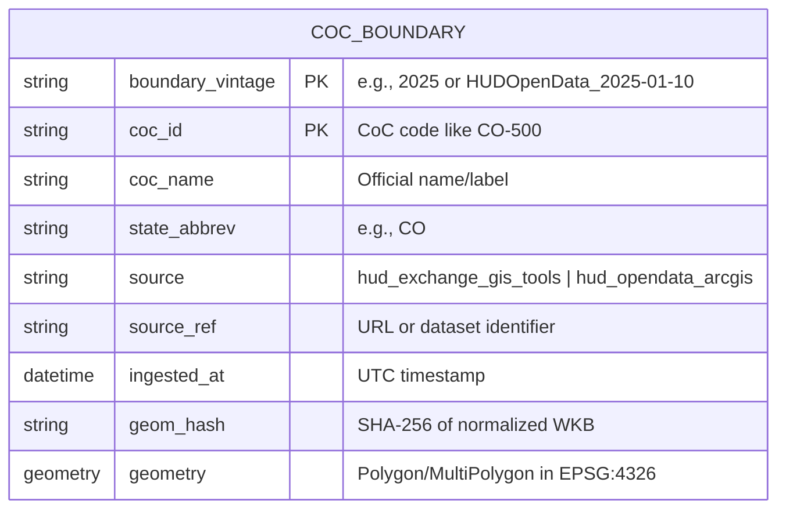
```mermaid
erDiagram
    COC_BOUNDARY {
        string boundary_vintage PK "e.g., 2025 or HUDOpenData_2025-01-10"
        string coc_id PK "CoC code like CO-500"
        string coc_name "Official name/label"
        string state_abbrev "e.g., CO"
        string source "hud_exchange_gis_tools | hud_opendata_arcgis"
        string source_ref "URL or dataset identifier"
        datetime ingested_at "UTC timestamp"
        string geom_hash "SHA-256 of normalized WKB"
        geometry geometry "Polygon/MultiPolygon in EPSG:4326"
    }
```

| Column | Type | Description |
|--------|------|-------------|
| `boundary_vintage` | string | Version identifier (e.g., `2025`) |
| `coc_id` | string | CoC identifier (e.g., `CO-500`) |
| `coc_name` | string | Official CoC name |
| `state_abbrev` | string | US state abbreviation |
| `source` | string | Data source identifier |
| `source_ref` | string | URL or reference to original data |
| `ingested_at` | datetime | UTC timestamp of ingestion |
| `geom_hash` | string | SHA-256 hash for change detection |
| `geometry` | Polygon/MultiPolygon | Boundary in EPSG:4326 |

### Registry Schema

The registry tracks all available boundary vintages:

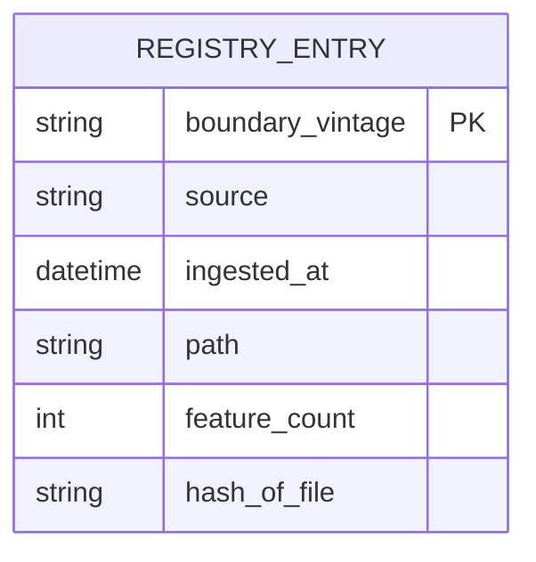
```mermaid
erDiagram
    REGISTRY_ENTRY {
        string boundary_vintage PK
        string source
        datetime ingested_at
        string path
        int feature_count
        string hash_of_file
    }
```

### Crosswalk Schema

Crosswalks link CoC boundaries to census geographies:

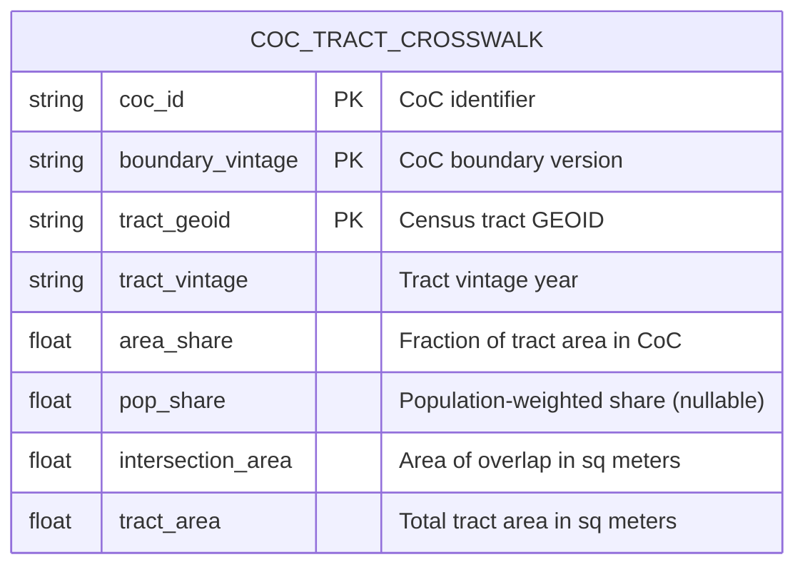
```mermaid
erDiagram
    COC_TRACT_CROSSWALK {
        string coc_id PK "CoC identifier"
        string boundary_vintage PK "CoC boundary version"
        string tract_geoid PK "Census tract GEOID"
        string tract_vintage "Tract vintage year"
        float area_share "Fraction of tract area in CoC"
        float pop_share "Population-weighted share (nullable)"
        float intersection_area "Area of overlap in sq meters"
        float tract_area "Total tract area in sq meters"
    }
```

| Column | Type | Description |
|--------|------|-------------|
| `coc_id` | string | CoC identifier (e.g., `CO-500`) |
| `boundary_vintage` | string | CoC boundary version |
| `tract_geoid` | string | 11-digit census tract GEOID |
| `tract_vintage` | string | Census tract vintage year |
| `area_share` | float | `intersection_area / tract_area` |
| `pop_share` | float | Population-weighted share (nullable) |
| `intersection_area` | float | Overlap area in square meters |
| `tract_area` | float | Total tract area in square meters |

### CoC Measures Schema

Aggregated demographic measures at CoC level:

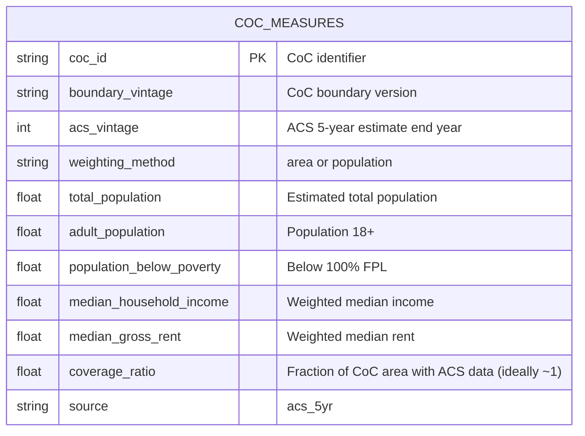
```mermaid
erDiagram
    COC_MEASURES {
        string coc_id PK "CoC identifier"
        string boundary_vintage "CoC boundary version"
        int acs_vintage "ACS 5-year estimate end year"
        string weighting_method "area or population"
        float total_population "Estimated total population"
        float adult_population "Population 18+"
        float population_below_poverty "Below 100% FPL"
        float median_household_income "Weighted median income"
        float median_gross_rent "Weighted median rent"
        float coverage_ratio "Fraction of CoC area with ACS data (ideally ~1)"
        string source "acs_5yr"
    }
```

| Column | Type | Description |
|--------|------|-------------|
| `coc_id` | string | CoC identifier |
| `boundary_vintage` | string | CoC boundary version used |
| `acs_vintage` | int | ACS 5-year estimate end year |
| `weighting_method` | string | `area` or `population` |
| `total_population` | float | Weighted population estimate |
| `adult_population` | float | Population 18 and older |
| `population_below_poverty` | float | Below 100% federal poverty line |
| `median_household_income` | float | Population-weighted median |
| `median_gross_rent` | float | Population-weighted median |
| `coverage_ratio` | float | Fraction of CoC area covered by tracts with data |
| `source` | string | Always `acs_5yr` |

### PIT Counts Schema (Phase 3)

Canonical PIT (Point-in-Time) count data:

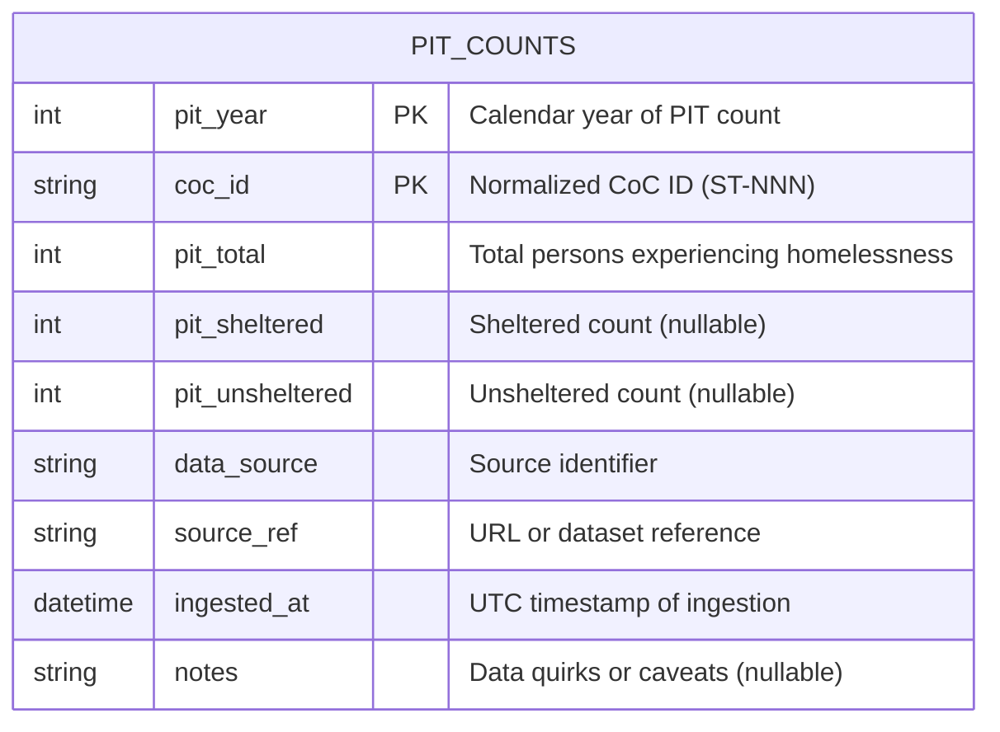
```mermaid
erDiagram
    PIT_COUNTS {
        int pit_year PK "Calendar year of PIT count"
        string coc_id PK "Normalized CoC ID (ST-NNN)"
        int pit_total "Total persons experiencing homelessness"
        int pit_sheltered "Sheltered count (nullable)"
        int pit_unsheltered "Unsheltered count (nullable)"
        string data_source "Source identifier"
        string source_ref "URL or dataset reference"
        datetime ingested_at "UTC timestamp of ingestion"
        string notes "Data quirks or caveats (nullable)"
    }
```

| Column | Type | Description |
|--------|------|-------------|
| `pit_year` | int | Calendar year of PIT count |
| `coc_id` | string | Normalized CoC ID (e.g., `CO-500`) |
| `pit_total` | int | Total persons experiencing homelessness |
| `pit_sheltered` | int | Sheltered count (nullable) |
| `pit_unsheltered` | int | Unsheltered count (nullable) |
| `data_source` | string | Source identifier (e.g., `hud_exchange`) |
| `source_ref` | string | URL or dataset reference |
| `ingested_at` | datetime | UTC timestamp of ingestion |
| `notes` | string | Data quirks or caveats (nullable) |

### Panel Schema (Phase 3)

Analysis-ready CoC × year panels combining PIT counts with ACS measures:

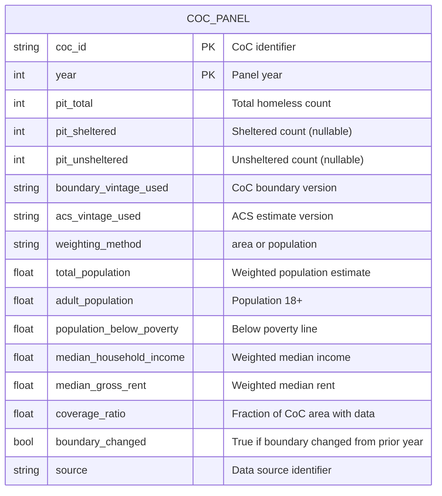
```mermaid
erDiagram
    COC_PANEL {
        string coc_id PK "CoC identifier"
        int year PK "Panel year"
        int pit_total "Total homeless count"
        int pit_sheltered "Sheltered count (nullable)"
        int pit_unsheltered "Unsheltered count (nullable)"
        string boundary_vintage_used "CoC boundary version"
        string acs_vintage_used "ACS estimate version"
        string weighting_method "area or population"
        float total_population "Weighted population estimate"
        float adult_population "Population 18+"
        float population_below_poverty "Below poverty line"
        float median_household_income "Weighted median income"
        float median_gross_rent "Weighted median rent"
        float coverage_ratio "Fraction of CoC area with data"
        bool boundary_changed "True if boundary changed from prior year"
        string source "Data source identifier"
    }
```

| Column | Type | Description |
|--------|------|-------------|
| `coc_id` | string | CoC identifier (e.g., `CO-500`) |
| `year` | int | Panel year |
| `pit_total` | int | Total homeless count from PIT |
| `pit_sheltered` | int | Sheltered count (nullable) |
| `pit_unsheltered` | int | Unsheltered count (nullable) |
| `boundary_vintage_used` | string | CoC boundary version applied |
| `acs_vintage_used` | string | ACS estimate version applied |
| `weighting_method` | string | `area` or `population` |
| `total_population` | float | Weighted population estimate |
| `adult_population` | float | Population 18 and older |
| `population_below_poverty` | float | Below 100% federal poverty line |
| `median_household_income` | float | Population-weighted median |
| `median_gross_rent` | float | Population-weighted median |
| `coverage_ratio` | float | Fraction of CoC area covered by tracts with data |
| `boundary_changed` | bool | True if CoC boundary changed from prior year |
| `source` | string | Data source identifier |

### Normalized ZORI Schema

ZORI data from Zillow is normalized to this long-format schema:

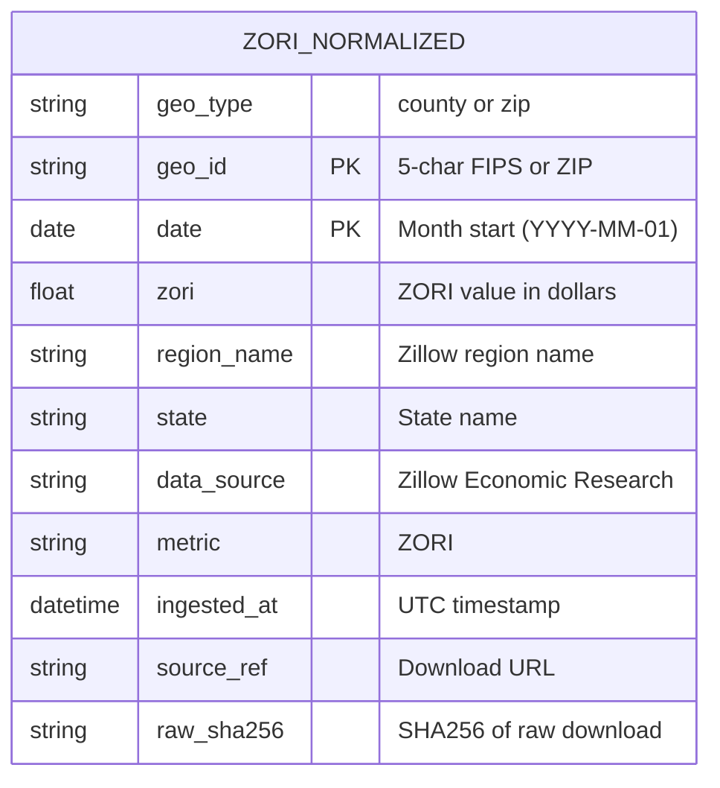
```mermaid
erDiagram
    ZORI_NORMALIZED {
        string geo_type "county or zip"
        string geo_id PK "5-char FIPS or ZIP"
        date date PK "Month start (YYYY-MM-01)"
        float zori "ZORI value in dollars"
        string region_name "Zillow region name"
        string state "State name"
        string data_source "Zillow Economic Research"
        string metric "ZORI"
        datetime ingested_at "UTC timestamp"
        string source_ref "Download URL"
        string raw_sha256 "SHA256 of raw download"
    }
```

| Column | Type | Description |
|--------|------|-------------|
| `geo_type` | string | Geography type: `county` or `zip` |
| `geo_id` | string | 5-character FIPS code (county) or ZIP code |
| `date` | date | Month start date (e.g., `2024-01-01`) |
| `zori` | float | ZORI value (level) in dollars |
| `region_name` | string | Zillow's region name |
| `state` | string | State name |
| `data_source` | string | Always `Zillow Economic Research` |
| `metric` | string | Always `ZORI` |
| `ingested_at` | datetime | UTC timestamp of ingestion |
| `source_ref` | string | Download URL |
| `raw_sha256` | string | SHA256 hash of raw download for provenance |

### CoC ZORI Schema

Aggregated ZORI data at CoC level:

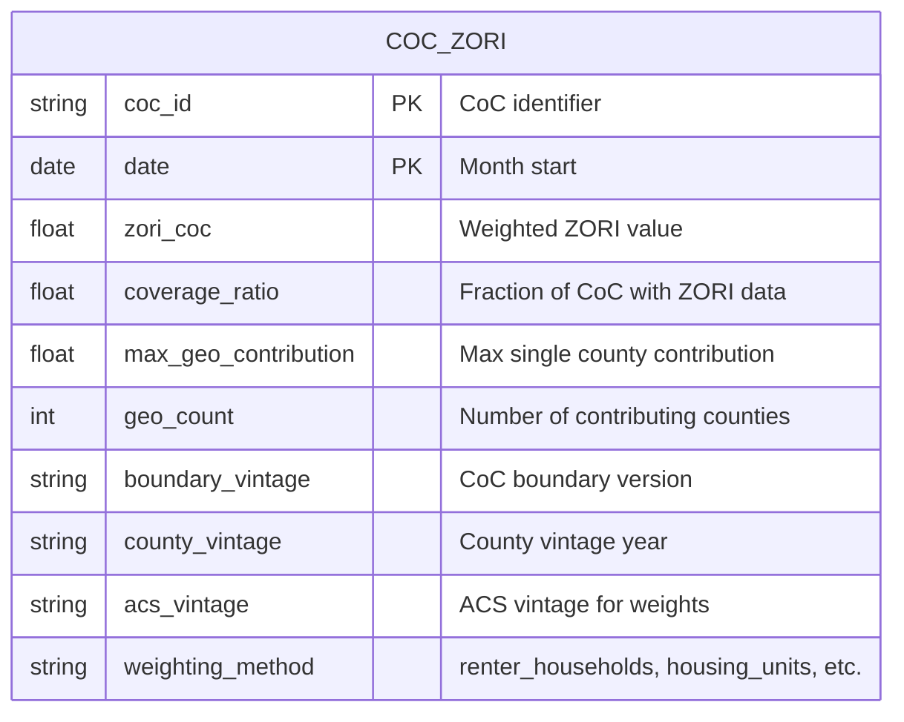
```mermaid
erDiagram
    COC_ZORI {
        string coc_id PK "CoC identifier"
        date date PK "Month start"
        float zori_coc "Weighted ZORI value"
        float coverage_ratio "Fraction of CoC with ZORI data"
        float max_geo_contribution "Max single county contribution"
        int geo_count "Number of contributing counties"
        string boundary_vintage "CoC boundary version"
        string county_vintage "County vintage year"
        string acs_vintage "ACS vintage for weights"
        string weighting_method "renter_households, housing_units, etc."
    }
```

| Column | Type | Description |
|--------|------|-------------|
| `coc_id` | string | CoC identifier (e.g., `CO-500`) |
| `date` | date | Month start date |
| `zori_coc` | float | Weighted average ZORI for CoC |
| `coverage_ratio` | float | Sum of weights for counties with ZORI data |
| `max_geo_contribution` | float | Largest single county weight |
| `geo_count` | int | Number of counties contributing to estimate |
| `boundary_vintage` | string | CoC boundary version used |
| `county_vintage` | string | TIGER county vintage |
| `acs_vintage` | string | ACS vintage for demographic weights |
| `weighting_method` | string | Weighting method used |

### County Weights Schema

ACS-based county weights for ZORI aggregation:

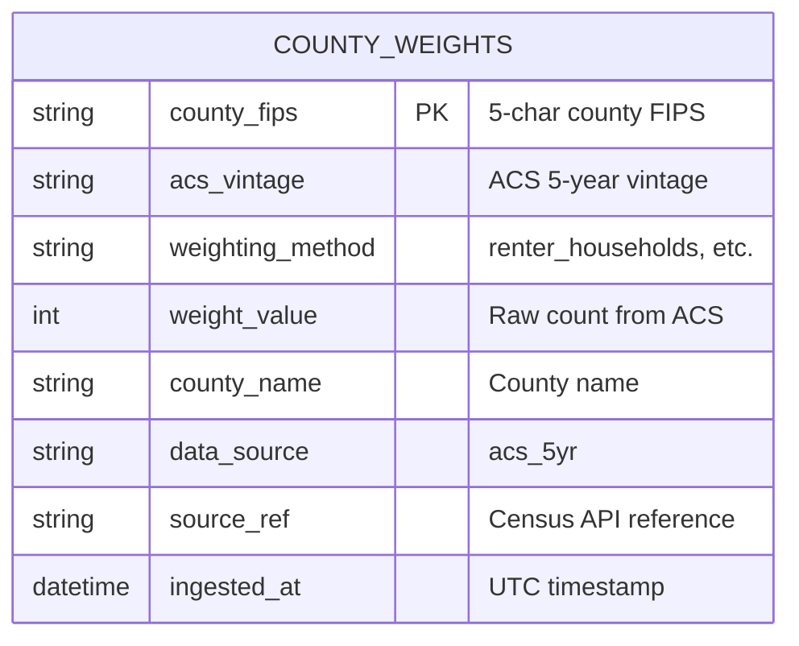
```mermaid
erDiagram
    COUNTY_WEIGHTS {
        string county_fips PK "5-char county FIPS"
        string acs_vintage "ACS 5-year vintage"
        string weighting_method "renter_households, etc."
        int weight_value "Raw count from ACS"
        string county_name "County name"
        string data_source "acs_5yr"
        string source_ref "Census API reference"
        datetime ingested_at "UTC timestamp"
    }
```

| Column | Type | Description |
|--------|------|-------------|
| `county_fips` | string | 5-character county FIPS code |
| `acs_vintage` | string | ACS 5-year estimate vintage |
| `weighting_method` | string | `renter_households`, `housing_units`, or `population` |
| `weight_value` | int | Raw count from ACS table |
| `county_name` | string | County name from Census |
| `data_source` | string | Always `acs_5yr` |
| `source_ref` | string | Census API endpoint reference |
| `ingested_at` | datetime | UTC timestamp of retrieval |

### Storage Locations

| File | Path Pattern | Description |
|------|--------------|-------------|
| Boundary data | `data/curated/coc_boundaries__{vintage}.parquet` | GeoParquet with boundaries |
| Registry | `data/curated/boundary_registry.parquet` | Vintage tracking |
| Maps | `data/curated/maps/{coc_id}__{vintage}.html` | Generated HTML maps |
| Raw downloads | `data/raw/hud_exchange/{vintage}/` | Original source files |
| Census tracts | `data/curated/census/tracts__{year}.parquet` | TIGER tract geometries |
| Census counties | `data/curated/census/counties__{year}.parquet` | TIGER county geometries |
| Tract crosswalks | `data/curated/xwalks/coc_tract_xwalk__{boundary}__{tracts}.parquet` | CoC-tract mapping |
| County crosswalks | `data/curated/xwalks/coc_county_xwalk__{boundary}.parquet` | CoC-county mapping |
| CoC measures | `data/curated/measures/coc_measures__{boundary}__{acs}.parquet` | Aggregated ACS data |
| PIT counts | `data/curated/pit/pit_counts__{year}.parquet` | Canonical PIT data |
| PIT registry | `data/curated/pit/pit_registry.parquet` | PIT year tracking |
| CoC panels | `data/curated/panels/coc_panel__{start}_{end}.parquet` | Analysis-ready panels |
| Tract population | `data/curated/acs/tract_population__{acs}__{tracts}.parquet` | ACS tract population |
| CoC population rollup | `data/curated/acs/coc_population_rollup__{boundary}__{acs}__{tracts}__{weighting}.parquet` | Aggregated CoC population |
| Population crosscheck | `data/curated/acs/acs_population_crosscheck__{boundary}__{acs}__{tracts}__{weighting}.parquet` | Validation report |
| Raw ZORI | `data/raw/rents/zori__{geography}__{date}.csv` | Downloaded Zillow CSV |
| Normalized ZORI | `data/curated/rents/zori__{geography}.parquet` | Normalized ZORI data |
| County weights | `data/curated/acs/county_weights__{acs}__{method}.parquet` | ACS county weights |
| CoC ZORI | `data/curated/rents/coc_zori__{geo}__b{boundary}__c{counties}__acs{acs}__w{weight}.parquet` | Aggregated CoC ZORI |
| CoC ZORI yearly | `data/curated/rents/coc_zori_yearly__...parquet` | Yearly collapsed ZORI |

### Dataset Provenance

All CoC Lab Parquet files embed **provenance metadata** in the file schema, enabling full reproducibility without sidecar files.

#### Provenance Block Schema

```json
{
  "boundary_vintage": "2025",
  "tract_vintage": "2023",
  "acs_vintage": "2022",
  "weighting": "population",
  "created_at": "2025-01-05T12:30:00+00:00",
  "coclab_version": "0.1.0",
  "extra": {
    "dataset_type": "coc_measures",
    "crosswalk_path": "data/curated/xwalks/coc_tract_xwalk__2025__2023.parquet"
  }
}
```

| Field | Type | Description |
|-------|------|-------------|
| `boundary_vintage` | string | CoC boundary version used |
| `tract_vintage` | string | Census tract geometry version |
| `acs_vintage` | string | ACS 5-year estimate end year |
| `weighting` | string | Weighting method (`area`, `population`, `area+population`) |
| `created_at` | ISO 8601 | Timestamp of dataset creation |
| `coclab_version` | string | CoC Lab version that produced the file |
| `extra` | object | Extensible metadata (dataset type, source paths, etc.) |

#### Reading Provenance

```python
from coclab.provenance import read_provenance

provenance = read_provenance("data/curated/measures/coc_measures__2025__2022.parquet")
print(provenance.boundary_vintage)  # "2025"
print(provenance.weighting)         # "population"
print(provenance.to_json())         # Full JSON representation
```

#### Design Rationale

- **Embedded in Parquet metadata**: Provenance travels with the data file
- **Extensible**: The `extra` field allows adding fields without schema changes
- **No sidecar files**: Eliminates file proliferation and sync issues
- **Read without loading data**: Provenance can be inspected via schema metadata

#### PIT Provenance Metadata

PIT count Parquet files include additional provenance fields tracking data lineage and any CoC ID transformations:

```json
{
  "created_at": "2025-01-05T22:02:41.946985+00:00",
  "coclab_version": "0.1.0",
  "extra": {
    "pit_year": 2024,
    "row_count": 385,
    "data_source": "hud_exchange",
    "source_ref": "https://www.huduser.gov/.../2007-2024-PIT-Counts-by-CoC.xlsb",
    "ingested_at": "2025-01-05T22:02:41.929693+00:00",
    "rows_read": 390,
    "rows_skipped": 5,
    "cross_state_mappings": {
      "MO-604a": "MO-604"
    }
  }
}
```

| Field | Type | Description |
|-------|------|-------------|
| `pit_year` | int | PIT count year |
| `row_count` | int | Number of CoC records in output |
| `data_source` | string | Source identifier (e.g., `hud_exchange`) |
| `source_ref` | string | Download URL or file reference |
| `ingested_at` | ISO 8601 | Timestamp when data was parsed |
| `rows_read` | int | Total rows read from source file |
| `rows_skipped` | int | Rows skipped (invalid CoC IDs, missing data) |
| `cross_state_mappings` | object | CoC IDs with letter suffixes mapped to base IDs |

**Reading PIT Provenance:**

```python
from coclab.provenance import read_provenance

provenance = read_provenance("data/curated/pit/pit_counts__2024.parquet")
print(provenance.extra["pit_year"])           # 2024
print(provenance.extra["source_ref"])         # HUD download URL
print(provenance.extra["cross_state_mappings"])  # {"MO-604a": "MO-604"}
```

---

## Workflows

### Ingestion Workflow

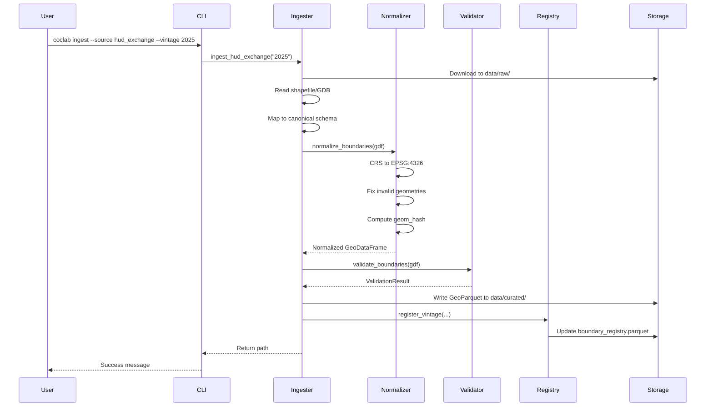
```mermaid
sequenceDiagram
    participant User
    participant CLI
    participant Ingester
    participant Normalizer
    participant Validator
    participant Registry
    participant Storage

    User->>CLI: coclab ingest --source hud_exchange --vintage 2025
    CLI->>Ingester: ingest_hud_exchange("2025")
    Ingester->>Storage: Download to data/raw/
    Ingester->>Ingester: Read shapefile/GDB
    Ingester->>Ingester: Map to canonical schema
    Ingester->>Normalizer: normalize_boundaries(gdf)
    Normalizer->>Normalizer: CRS to EPSG:4326
    Normalizer->>Normalizer: Fix invalid geometries
    Normalizer->>Normalizer: Compute geom_hash
    Normalizer-->>Ingester: Normalized GeoDataFrame
    Ingester->>Validator: validate_boundaries(gdf)
    Validator-->>Ingester: ValidationResult
    Ingester->>Storage: Write GeoParquet to data/curated/
    Ingester->>Registry: register_vintage(...)
    Registry->>Storage: Update boundary_registry.parquet
    Ingester-->>CLI: Return path
    CLI-->>User: Success message
```

### Visualization Workflow

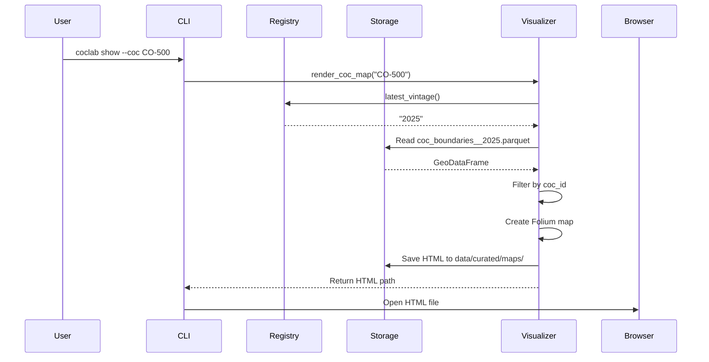
```mermaid
sequenceDiagram
    participant User
    participant CLI
    participant Registry
    participant Storage
    participant Visualizer
    participant Browser

    User->>CLI: coclab show --coc CO-500
    CLI->>Visualizer: render_coc_map("CO-500")
    Visualizer->>Registry: latest_vintage()
    Registry-->>Visualizer: "2025"
    Visualizer->>Storage: Read coc_boundaries__2025.parquet
    Storage-->>Visualizer: GeoDataFrame
    Visualizer->>Visualizer: Filter by coc_id
    Visualizer->>Visualizer: Create Folium map
    Visualizer->>Storage: Save HTML to data/curated/maps/
    Visualizer-->>CLI: Return HTML path
    CLI->>Browser: Open HTML file
```

### Version Selection Logic

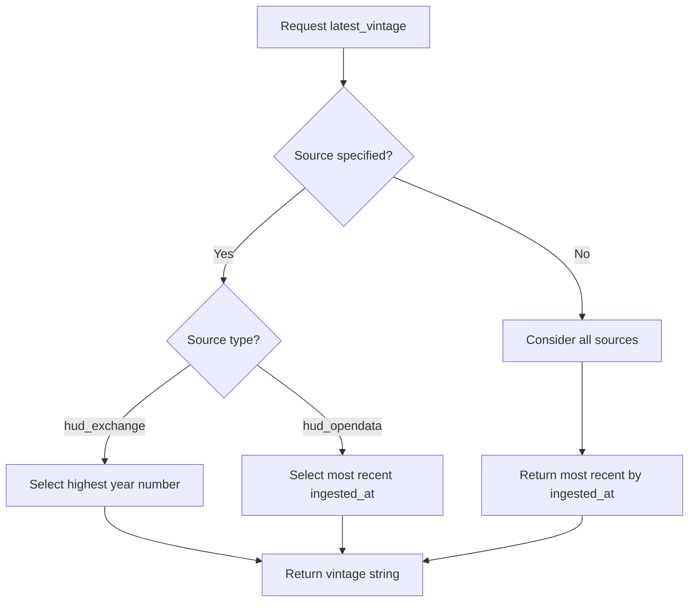
```mermaid
flowchart TD
    A[Request latest_vintage] --> B{Source specified?}
    B -->|Yes| C{Source type?}
    B -->|No| D[Consider all sources]

    C -->|hud_exchange| E[Select highest year number]
    C -->|hud_opendata| F[Select most recent ingested_at]

    D --> G[Return most recent by ingested_at]
    E --> H[Return vintage string]
    F --> H
    G --> H
```

### Crosswalk & Measures Workflow

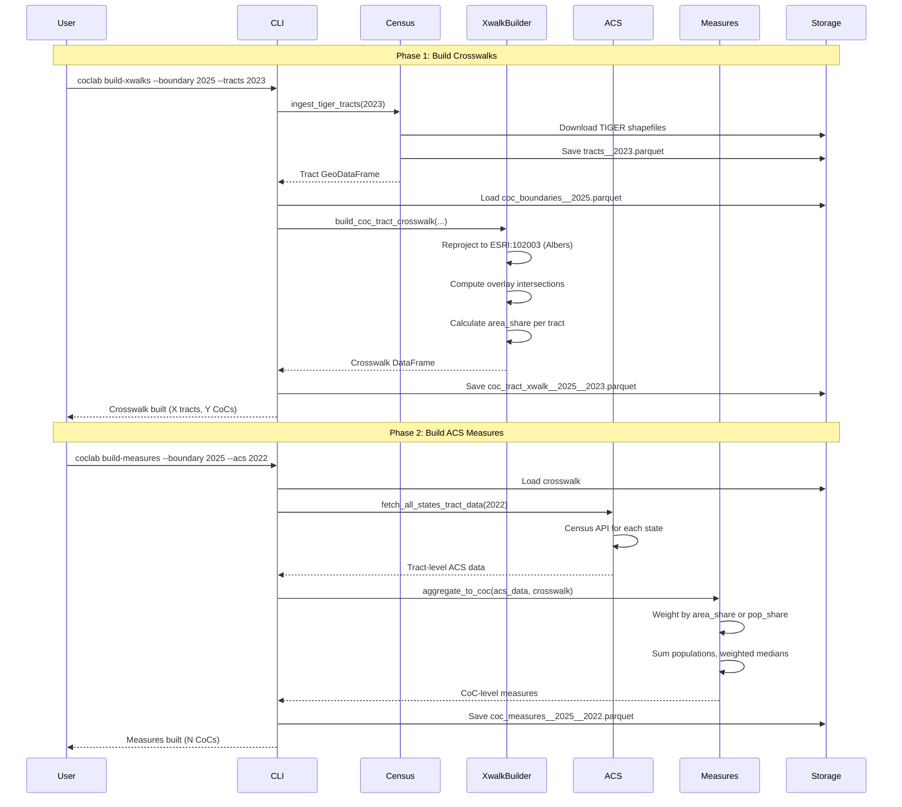
```mermaid
sequenceDiagram
    participant User
    participant CLI
    participant Census
    participant XwalkBuilder
    participant ACS
    participant Measures
    participant Storage

    Note over User,Storage: Phase 1: Build Crosswalks
    User->>CLI: coclab build-xwalks --boundary 2025 --tracts 2023
    CLI->>Census: ingest_tiger_tracts(2023)
    Census->>Storage: Download TIGER shapefiles
    Census->>Storage: Save tracts__2023.parquet
    Census-->>CLI: Tract GeoDataFrame
    CLI->>Storage: Load coc_boundaries__2025.parquet
    CLI->>XwalkBuilder: build_coc_tract_crosswalk(...)
    XwalkBuilder->>XwalkBuilder: Reproject to ESRI:102003 (Albers)
    XwalkBuilder->>XwalkBuilder: Compute overlay intersections
    XwalkBuilder->>XwalkBuilder: Calculate area_share per tract
    XwalkBuilder-->>CLI: Crosswalk DataFrame
    CLI->>Storage: Save coc_tract_xwalk__2025__2023.parquet
    CLI-->>User: Crosswalk built (X tracts, Y CoCs)

    Note over User,Storage: Phase 2: Build ACS Measures
    User->>CLI: coclab build-measures --boundary 2025 --acs 2022
    CLI->>Storage: Load crosswalk
    CLI->>ACS: fetch_all_states_tract_data(2022)
    ACS->>ACS: Census API for each state
    ACS-->>CLI: Tract-level ACS data
    CLI->>Measures: aggregate_to_coc(acs_data, crosswalk)
    Measures->>Measures: Weight by area_share or pop_share
    Measures->>Measures: Sum populations, weighted medians
    Measures-->>CLI: CoC-level measures
    CLI->>Storage: Save coc_measures__2025__2022.parquet
    CLI-->>User: Measures built (N CoCs)
```

---

## Methodology: ACS Aggregation to CoC Level

This section documents how ACS demographic measures are aggregated from census tracts to CoC boundaries.

### Aggregation Algorithm

CoC Lab uses **weighted tract-level aggregation** to produce CoC-level estimates. The algorithm differs by measure type:

#### Count Variables (population, poverty counts)

```
CoC_estimate = Σ(tract_value × weight)
```

Where `weight` is either:
- `area_share`: fraction of tract area falling within the CoC
- `pop_share`: population-proportional weight (`tract_pop × area_share / total`)

#### Median Variables (income, rent)

```
CoC_estimate = Σ(tract_median × pop_weight) / Σ(pop_weight)
```

These are **population-weighted averages** of tract medians—NOT true medians computed from underlying household distributions.

### Why This Approach Is Acceptable

| Justification | Explanation |
|---------------|-------------|
| **Standard practice** | Aligns with HUD's own CoC-level reporting and academic research (e.g., Byrne et al., 2012). The Census Bureau does not publish CoC-level tabulations. |
| **ACS design constraints** | PUMS microdata uses PUMAs (~100k people) that don't nest within CoC boundaries, making true microdata pooling infeasible for most CoCs. |
| **Large-aggregate convergence** | CoCs typically span dozens to hundreds of tracts. At this scale, weighted aggregation converges toward true values (Central Limit Theorem). |
| **Explicit diagnostics** | The `coverage_ratio` field quantifies crosswalk completeness, enabling identification of problematic estimates. |

### Known Limitations vs True Pooled Microdata

#### 1. Median Estimates Are Approximate

Averaging tract medians ≠ true population median. Example:

| Tract | Median Income | Population |
|-------|---------------|------------|
| A     | $100,000      | 5,000      |
| B     | $30,000       | 5,000      |

**Weighted average**: $65,000 — but true CoC median depends on the actual income distributions, not just tract medians.

#### 2. MOE Propagation Not Implemented

ACS estimates include margins of error (MOE). Proper aggregated MOEs require variance formulas accounting for covariance. **CoC estimates should be treated as point estimates only.**

#### 3. Ecological Inference Risk

Tract-level rates (e.g., poverty rate) may not reflect within-CoC variation. Using aggregated rates for individual-level inference is subject to **ecological fallacy**.

#### 4. Boundary Mismatch Artifacts

When CoC boundaries cut through tracts, area weighting assumes uniform population distribution—false for mixed urban/rural tracts. Population weighting mitigates but doesn't eliminate this.

#### 5. Temporal Mismatch

ACS 5-year estimates pool data across 5 years (e.g., 2018-2022 for vintage 2022). CoC boundaries may change during that period. This module assumes boundaries are static.

#### 6. Small-CoC Instability

CoCs with few tracts or low populations have estimates more sensitive to individual tract values and crosswalk precision.

#### 7. Housing-Market Representativeness

Population-weighted tract coverage does not guarantee housing-market representativeness. Tracts with high population density may have systematically different rental markets, vacancy rates, or housing stock than lower-density tracts within the same CoC. This limitation will be addressed explicitly in **Phase 3 sensitivity analyses**, which will examine how weighting choices affect homelessness prediction models.

### References

- Byrne, T., et al. (2012). "Predicting Homelessness Using ACS Data."
- HUD Exchange CoC Analysis Tools methodology documentation
- Census Bureau ACS Handbook, Chapter 12: "Working with ACS Data"

---

## Methodology: ZORI Aggregation to CoC Level

This section documents how ZORI (Zillow Observed Rent Index) data is aggregated from county geography to CoC boundaries.

### What is ZORI?

ZORI (Zillow Observed Rent Index) measures typical observed rent across a given region. Key characteristics:

- **Monthly time series** - Published monthly at county and ZIP code levels
- **Smoothed measure** - Uses repeat-rent methodology to control for composition changes
- **Covers ~40% of US counties** - Urban/suburban counties with sufficient listings
- **Published by Zillow Economic Research** - Free for public use with attribution

### Aggregation Pipeline

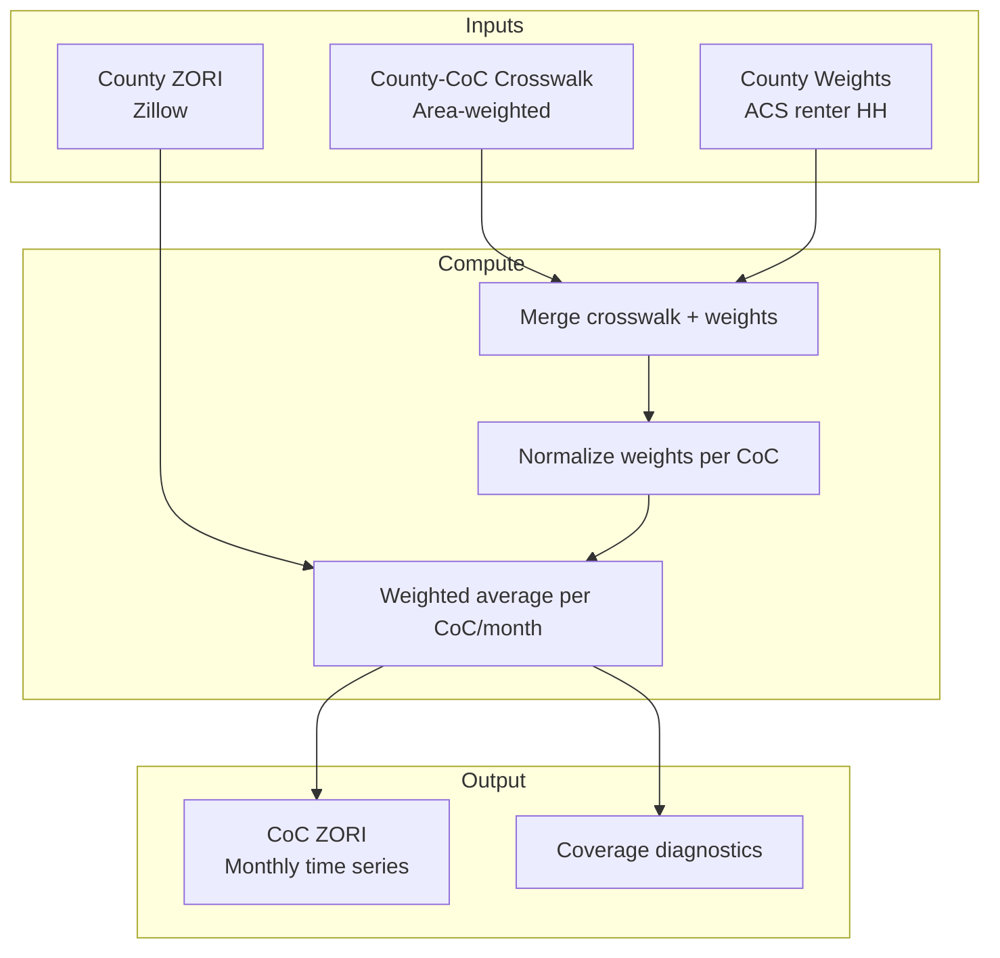
```mermaid
flowchart TB
    subgraph Inputs
        ZORI[County ZORI\nZillow]
        XWALK[County-CoC Crosswalk\nArea-weighted]
        WEIGHTS[County Weights\nACS renter HH]
    end

    subgraph Compute
        MERGE[Merge crosswalk + weights]
        NORM[Normalize weights per CoC]
        AGG[Weighted average per CoC/month]
    end

    subgraph Output
        COC_ZORI[CoC ZORI\nMonthly time series]
        DIAG[Coverage diagnostics]
    end

    ZORI --> AGG
    XWALK --> MERGE
    WEIGHTS --> MERGE
    MERGE --> NORM
    NORM --> AGG
    AGG --> COC_ZORI
    AGG --> DIAG
```

### Weighting Methods

ZORI aggregation supports multiple weighting schemes:

| Method | ACS Variable | Description |
|--------|--------------|-------------|
| `renter_households` | B25003_003E | Renter-occupied housing units (recommended) |
| `housing_units` | B25001_001E | Total housing units |
| `population` | B01003_001E | Total population |
| `equal` | N/A | Equal weight per county |

**Recommended:** `renter_households` because ZORI measures rental prices, so weighting by renter population produces more representative estimates.

### Aggregation Algorithm

For each CoC and month:

1. **Load county-CoC crosswalk** with area shares
2. **Load county weights** (e.g., renter households from ACS)
3. **Compute combined weights:**
   ```
   w[county,coc] = area_share[county,coc] × weight_value[county]
   ```
4. **Normalize weights per CoC:**
   ```
   w_norm[county,coc] = w[county,coc] / Σ w[county,coc]
   ```
5. **Filter to counties with ZORI data** for the given month
6. **Compute weighted average:**
   ```
   zori_coc = Σ (w_norm[county,coc] × zori[county])
   ```
7. **Compute coverage ratio:**
   ```
   coverage_ratio = Σ w_norm[county,coc] for counties with ZORI data
   ```

### Coverage Ratio Interpretation

The `coverage_ratio` field indicates what fraction of the CoC (by weight) has ZORI data:

| Value | Interpretation | Recommendation |
|-------|----------------|----------------|
| `0.90 - 1.00` | Excellent coverage | Use estimate directly |
| `0.70 - 0.89` | Good coverage | Use with caution |
| `0.50 - 0.69` | Moderate coverage | Consider limitations |
| `< 0.50` | Poor coverage | May not be representative |

Low coverage typically indicates:
- Rural CoCs with few urban counties
- Newer ZORI data where historical coverage is sparse
- CoCs dominated by counties without sufficient Zillow listings

### Known Limitations

#### 1. County-Level Granularity

ZORI is published at county level, not tract level. This means:
- Within-county rent variation is not captured
- Urban/rural mix within CoC affects representativeness
- Small CoCs spanning few counties have less smoothing

#### 2. ZORI Coverage Gaps

Not all counties have ZORI data:
- ~1,500 of ~3,100 US counties have ZORI (40-50%)
- Rural counties often lack sufficient Zillow listings
- Coverage varies over time (expanding)

#### 3. Temporal Alignment

ZORI months represent market conditions at a point in time. When aligning with PIT counts (January), use:
- `pit_january` method: Use January ZORI value
- `calendar_mean`: Average over calendar year
- `calendar_median`: Median over calendar year

#### 4. Weighting Assumptions

County weights assume uniform distribution of characteristics within the county-CoC intersection. This may not hold for:
- Counties split between urban and rural CoCs
- Counties with diverse housing markets

### Yearly Collapse Methods

The `collapse_to_yearly()` function supports:

| Method | Description | Use Case |
|--------|-------------|----------|
| `pit_january` | January value only | Align with PIT count timing |
| `calendar_mean` | Mean of 12 months | Annual average |
| `calendar_median` | Median of 12 months | Robust to outliers |

### Data Attribution

ZORI data requires attribution to Zillow:

> "The Zillow Economic Research team publishes a variety of real estate metrics including median home values and rents... All data accessed and downloaded from this page is free for public use by consumers, media, analysts, academics and policymakers, consistent with our published Terms of Use. Proper and clear attribution of all data to Zillow is required."

---

## Methodology: Panel Assembly (Phase 3)

This section documents how CoC × year analysis panels are constructed by joining PIT counts with ACS demographic measures.

### Panel Assembly Algorithm

Panel assembly follows these steps for each year in the requested range:

1. **Load PIT counts** from canonical Parquet files
2. **Apply alignment policy** to determine boundary and ACS vintages
3. **Load ACS measures** for the aligned vintage
4. **Join** PIT and ACS data by CoC ID
5. **Detect boundary changes** from prior year
6. **Compute coverage ratio** from crosswalk weights

### Alignment Policies

Alignment policies are **pure functions** that map PIT years to data vintages:

| Policy | Rule | Rationale |
|--------|------|-----------|
| Boundary vintage | `f(pit_year) = pit_year` | Use boundaries in effect during PIT count |
| ACS vintage | `f(pit_year) = pit_year - 1` | ACS released ~1 year after reference period |

**Example:** PIT year 2024 uses:
- Boundary vintage 2024
- ACS vintage 2023 (covering 2019-2023)

Policies are recorded in panel provenance metadata for reproducibility.

### Boundary Change Detection

The `boundary_changed` flag indicates whether a CoC's boundary differs from the prior year:

```
boundary_changed[coc, year] =
    (boundary_vintage[year] ≠ boundary_vintage[year-1]) OR
    (geom_hash[coc, year] ≠ geom_hash[coc, year-1])
```

First year in panel always has `boundary_changed = False`.

### Coverage Ratio Interpretation

The `coverage_ratio` field reflects crosswalk completeness:

| Value | Interpretation |
|-------|----------------|
| `1.0` | Perfect coverage—all CoC area mapped to tracts |
| `0.95-0.99` | Minor boundary/tract misalignment |
| `< 0.90` | Significant gaps—investigate crosswalk |
| `> 1.0` | Overlapping tract assignments (rare) |

### Panel Diagnostics

The `panel-diagnostics` command provides:

1. **Coverage summary** - Min/max/mean coverage by year
2. **Boundary change summary** - CoCs with changes and affected years
3. **Missingness report** - Missing values per column per year
4. **Weighting sensitivity** - Compare area vs population weighting effects

### Known Limitations

#### 1. Vintage Alignment Lag

ACS vintage Y-1 means demographic data is 1-2 years old relative to PIT counts. Rapidly changing areas may show measurement lag.

#### 2. Boundary Change Granularity

Boundary changes are detected at annual resolution. Mid-year changes are assigned to the later vintage.

#### 3. Missing Data Handling

CoCs missing from PIT or ACS for a given year are excluded from the panel for that year. Use `missingness_report()` to identify gaps.

---

## Module Reference

### cli/main.py

The CLI module uses [Typer](https://typer.tiangolo.com/) for command-line parsing.

**Entry Point:** `coclab`

**Commands:**
- `ingest` - Trigger data ingestion
- `list-vintages` - Display registry contents
- `show` - Generate interactive maps

### ingest/hud_exchange_gis.py

Handles ingestion from HUD Exchange GIS Tools.

**Key Functions:**
- `download_hud_exchange_gdb()` - Download and extract source files
- `read_coc_boundaries()` - Parse geodatabase or shapefile
- `map_to_canonical_schema()` - Normalize field names
- `ingest_hud_exchange()` - Complete pipeline

**Field Mapping:**
| Source Fields | Canonical Field |
|---------------|-----------------|
| `COCNUM`, `COC_NUM`, `CocNum` | `coc_id` |
| `COCNAME`, `COC_NAME`, `CocName` | `coc_name` |
| `STUSAB`, `STATE`, `ST` | `state_abbrev` |

### ingest/hud_opendata_arcgis.py

Handles ingestion from HUD Open Data ArcGIS Hub.

**API Endpoint:** Continuum of Care Grantee Areas feature service

**Key Functions:**
- `_fetch_page()` - Fetch paginated data (page size: 1000)
- `_fetch_all_features()` - Handle pagination
- `_features_to_geodataframe()` - Convert GeoJSON to GeoDataFrame
- `ingest_hud_opendata()` - Complete pipeline

### geo/normalize.py

Geometry processing and normalization.

**Functions:**
| Function | Purpose |
|----------|---------|
| `normalize_crs()` | Reproject to EPSG:4326 |
| `fix_geometry()` | Apply `shapely.make_valid()` |
| `ensure_polygon_type()` | Filter to Polygon/MultiPolygon |
| `compute_geom_hash()` | SHA-256 of WKB (6 decimal precision) |
| `normalize_boundaries()` | Full pipeline |

### geo/validate.py

Data quality validation.

**Classes:**
- `ValidationResult` - Container for errors/warnings
- `ValidationIssue` - Individual issue with severity

**Validation Checks:**
- Required columns exist with correct types
- `coc_id` uniqueness within vintage
- Geometry validity (non-empty, valid type)
- Anomaly detection (tiny polygons, invalid coordinates)

### geo/io.py

GeoParquet I/O utilities.

**Functions:**
- `read_geoparquet()` - Load GeoParquet to GeoDataFrame
- `write_geoparquet()` - Save with snappy compression
- `curated_boundary_path()` - Generate canonical file paths
- `registry_path()` - Get registry file location

### registry/registry.py

Vintage tracking and version selection.

**Functions:**
- `register_vintage()` - Idempotent registration with hash checking
- `list_vintages()` - Get all entries sorted by date
- `latest_vintage()` - Resolve current version by source policy
- `compute_file_hash()` - SHA-256 of file contents

### registry/schema.py

Data structures for registry.

**Classes:**
- `RegistryEntry` - Dataclass with serialization methods

### viz/map_folium.py

Interactive map generation with Folium.

**Features:**
- Auto-centering on CoC centroid
- Blue polygon overlay (30% opacity)
- Interactive tooltip (ID, Name, Vintage, Source)
- Auto-fitted bounds

### census/ingest/tracts.py

TIGER/Line census tract geometry ingestion.

**Functions:**
| Function | Purpose |
|----------|---------|
| `download_tiger_tracts()` | Download and parse national tract shapefiles |
| `ingest_tiger_tracts()` | Full pipeline: download, normalize, save to GeoParquet |

**Output Schema:**
- `GEOID` - 11-digit tract identifier (state + county + tract)
- `NAME` - Tract name
- `ALAND` - Land area in square meters
- `AWATER` - Water area in square meters
- `geometry` - Polygon/MultiPolygon in EPSG:4326

### census/ingest/counties.py

TIGER/Line county geometry ingestion.

**Functions:**
| Function | Purpose |
|----------|---------|
| `download_tiger_counties()` | Download and parse national county shapefiles |
| `ingest_tiger_counties()` | Full pipeline: download, normalize, save to GeoParquet |

**Output Schema:**
- `GEOID` - 5-digit county FIPS code
- `NAME` - County name
- `STATEFP` - State FIPS code
- `geometry` - Polygon/MultiPolygon in EPSG:4326

### xwalks/tract.py

CoC-to-census-tract crosswalk builder.

**Functions:**
| Function | Purpose |
|----------|---------|
| `build_coc_tract_crosswalk()` | Compute area-weighted tract-to-CoC mappings |
| `add_population_weights()` | Add population-weighted shares to crosswalk |
| `validate_population_shares()` | Validate that pop_share sums to ~1 per CoC |
| `save_crosswalk()` | Save crosswalk to GeoParquet |

**Algorithm:**
1. Reproject both layers to ESRI:102003 (Albers Equal Area)
2. Compute geometric overlay (intersection)
3. Calculate `area_share = intersection_area / tract_area`
4. Filter to shares > 1e-9 (remove slivers)

### xwalks/county.py

CoC-to-county crosswalk builder.

**Functions:**
| Function | Purpose |
|----------|---------|
| `build_coc_county_crosswalk()` | Compute area-weighted county-to-CoC mappings |
| `save_county_crosswalk()` | Save crosswalk to GeoParquet |

### measures/acs.py

ACS 5-year estimate aggregation to CoC level.

**Constants:**
- `ACS_VARS` - Dictionary of ACS variable codes (population, income, rent, poverty)
- `ADULT_VARS` - Age-specific population variables for adults 18+

**Functions:**
| Function | Purpose |
|----------|---------|
| `fetch_acs_tract_data()` | Fetch ACS data for a single state via Census API |
| `fetch_all_states_tract_data()` | Fetch ACS data for all states (parallelized) |
| `aggregate_to_coc()` | Aggregate tract data to CoC using crosswalk weights |
| `build_coc_measures()` | Full pipeline: fetch, aggregate, save |

**Weighting Methods:**
- `area` - Weight by `area_share` (fraction of tract area in CoC)
- `population` - Weight by `pop_share` (population-proportional)

### measures/diagnostics.py

Attribution diagnostics and coverage reporting.

**Functions:**
| Function | Purpose |
|----------|---------|
| `compute_crosswalk_diagnostics()` | Per-CoC metrics: tract count, coverage ratio |
| `compute_measure_diagnostics()` | Compare area vs population weighted results |
| `summarize_diagnostics()` | Generate CLI-readable text summary |
| `identify_problem_cocs()` | Flag CoCs with low coverage or high concentration |

**Diagnostic Metrics:**
- `num_tracts` - Number of tracts intersecting CoC
- `max_tract_contribution` - Largest single-tract area share
- `coverage_ratio_area` - Sum of area_share (ideally ~1.0)
- `coverage_ratio_pop` - Sum of pop_share (when available)

### acs/ingest/tract_population.py

ACS tract-level population data ingestion from Census API.

**Functions:**
| Function | Purpose |
|----------|---------|
| `parse_acs_vintage()` | Parse ACS vintage string to API year |
| `normalize_geoid()` | Normalize tract GEOID to 11-character format |
| `fetch_state_tract_population()` | Fetch population for one state |
| `fetch_tract_population()` | Fetch population for all US states/territories |
| `ingest_tract_population()` | Full pipeline: fetch, cache, save with provenance |

**Output Schema:**
- `tract_geoid` - 11-digit Census tract GEOID
- `acs_vintage` - ACS 5-year vintage (e.g., "2019-2023")
- `tract_vintage` - Census tract vintage year
- `total_population` - Population count (B01003_001E)
- `moe_total_population` - Margin of error (B01003_001M)
- `data_source` - Always "acs_5yr"
- `source_ref` - API parameters used
- `ingested_at` - UTC timestamp

### acs/rollup.py

Tract-to-CoC population aggregation.

**Functions:**
| Function | Purpose |
|----------|---------|
| `rollup_tract_population()` | Aggregate tract population to CoC using crosswalk |
| `build_coc_population_rollup()` | Full pipeline: load, rollup, save |
| `get_tract_population_path()` | Get path to tract population parquet |
| `get_crosswalk_path()` | Get path to crosswalk parquet |
| `get_output_path()` | Generate rollup output path |

**Output Schema:**
- `coc_id` - CoC identifier
- `boundary_vintage`, `acs_vintage`, `tract_vintage` - Version identifiers
- `weighting_method` - "area" or "population_mass"
- `coc_population` - Aggregated population estimate
- `coverage_ratio` - Fraction of CoC area covered by tracts with data
- `max_tract_contribution` - Maximum single tract contribution
- `tract_count` - Number of contributing tracts

### acs/crosscheck.py

Population rollup validation against existing CoC measures.

**Classes:**
| Class | Purpose |
|-------|---------|
| `CrosscheckResult` | Validation results with error/warning counts and report DataFrame |

**Functions:**
| Function | Purpose |
|----------|---------|
| `crosscheck_population()` | Compare rollup vs measures, flag outliers |
| `run_crosscheck()` | Full pipeline: load files, validate, save report |
| `print_crosscheck_report()` | Format console output, return exit code |
| `get_rollup_path()` | Get rollup input path |
| `get_measures_path()` | Get measures input path |
| `get_crosscheck_output_path()` | Generate report output path |

**CrosscheckResult Fields:**
- `error_count` - Number of CoCs with errors
- `warning_count` - Number of CoCs with warnings
- `report_df` - DataFrame with per-CoC comparison
- `missing_in_rollup` - CoC IDs in measures but not rollup
- `missing_in_measures` - CoC IDs in rollup but not measures
- `summary` - Dict with min/median/max deltas
- `passed` - Property: True if error_count == 0

**Default Thresholds:**
- Error: `abs(pct_delta) > 0.05` or `coverage_ratio > 1.01`
- Warning: `abs(pct_delta) > 0.01` or `coverage_ratio < 0.95`

### provenance.py

Dataset provenance tracking via Parquet metadata.

**Classes:**
| Class | Purpose |
|-------|---------|
| `ProvenanceBlock` | Dataclass holding provenance fields with JSON serialization |

**Functions:**
| Function | Purpose |
|----------|---------|
| `write_parquet_with_provenance()` | Write DataFrame with embedded provenance metadata |
| `read_provenance()` | Extract provenance from Parquet file without loading data |
| `has_provenance()` | Check if a Parquet file contains provenance |

**ProvenanceBlock Fields:**
- `boundary_vintage` - CoC boundary version
- `tract_vintage` - Census tract version
- `acs_vintage` - ACS estimate end year
- `weighting` - Weighting method used
- `created_at` - ISO 8601 creation timestamp
- `coclab_version` - CoC Lab version
- `extra` - Extensible metadata dictionary

### rents/ingest.py

ZORI data download and normalization from Zillow Economic Research.

**Functions:**
| Function | Purpose |
|----------|---------|
| `download_zori()` | Download raw ZORI CSV from Zillow |
| `parse_zori_county()` | Parse county ZORI to long format |
| `parse_zori_zip()` | Parse ZIP ZORI to long format |
| `ingest_zori()` | Full pipeline: download, normalize, save with provenance |
| `get_output_path()` | Get canonical output path |

**Zillow Download URLs:**
- County: `https://files.zillowstatic.com/research/public_csvs/zori/County_zori_uc_sfrcondomfr_sm_month.csv`
- ZIP: `https://files.zillowstatic.com/research/public_csvs/zori/Zip_zori_uc_sfrcondomfr_sm_month.csv`

### rents/weights.py

County-level ACS weight computation for ZORI aggregation.

**Functions:**
| Function | Purpose |
|----------|---------|
| `parse_acs_vintage()` | Parse ACS vintage string to API year |
| `fetch_state_county_acs()` | Fetch county ACS data for one state |
| `fetch_county_acs_totals()` | Fetch county ACS data for all states |
| `build_county_weights()` | Build and cache county weights |
| `load_county_weights()` | Load cached county weights |
| `get_county_weights_path()` | Get canonical weights path |

**ACS Variables:**
| Method | Table | Variable | Description |
|--------|-------|----------|-------------|
| `renter_households` | B25003 | B25003_003E | Renter-occupied housing units |
| `housing_units` | B25001 | B25001_001E | Total housing units |
| `population` | B01003 | B01003_001E | Total population |

### rents/aggregate.py

ZORI aggregation from county to CoC geography.

**Functions:**
| Function | Purpose |
|----------|---------|
| `load_zori()` | Load normalized ZORI parquet |
| `load_crosswalk()` | Load county-CoC crosswalk |
| `load_weights()` | Load county weights |
| `compute_coc_county_weights()` | Compute combined area × demographic weights |
| `aggregate_monthly()` | Aggregate county ZORI to CoC per month |
| `collapse_to_yearly()` | Collapse monthly to yearly values |
| `aggregate_zori_to_coc()` | Full pipeline: load, aggregate, save |
| `get_coc_zori_path()` | Get canonical output path |
| `get_coc_zori_yearly_path()` | Get yearly output path |

**Yearly Collapse Methods:**
- `pit_january`: Use January value only
- `calendar_mean`: Average of 12 monthly values
- `calendar_median`: Median of 12 monthly values

### rents/diagnostics.py

ZORI coverage and quality diagnostics.

**Functions:**
| Function | Purpose |
|----------|---------|
| `compute_coc_diagnostics()` | Per-CoC metrics: coverage, dominance, month counts |
| `identify_problem_cocs()` | Flag CoCs with low coverage or high dominance |
| `generate_text_summary()` | CLI-readable text summary |
| `summarize_coc_zori()` | Combined summary and diagnostics |
| `run_zori_diagnostics()` | Full diagnostics pipeline |

**Diagnostic Metrics:**
- `months_total` - Number of months in date range
- `months_covered` - Months with ZORI data
- `coverage_ratio_mean` - Mean coverage across months
- `coverage_ratio_p10/p50/p90` - Coverage percentiles
- `max_geo_contribution_max` - Maximum single county contribution
- `flag_low_coverage` - True if coverage < threshold
- `flag_high_dominance` - True if max contribution > threshold

### pit/ingest/hud_exchange.py (Phase 3)

PIT data download from HUD Exchange.

**Functions:**
| Function | Purpose |
|----------|---------|
| `get_pit_source_url()` | Get download URL for a PIT year |
| `download_pit_data()` | Download PIT Excel file from HUD Exchange |
| `list_available_years()` | List years with known PIT data URLs |

**DownloadResult Fields:**
- `path` - Path to downloaded file
- `source_url` - Original download URL
- `downloaded_at` - Timestamp of download
- `file_size` - Size in bytes

### pit/ingest/parser.py (Phase 3)

PIT data parsing and canonicalization.

**Classes:**
| Class | Purpose |
|-------|---------|
| `PITParseResult` | Result container with DataFrame and parsing metadata |

**Functions:**
| Function | Purpose |
|----------|---------|
| `normalize_coc_id()` | Normalize CoC ID to ST-NNN format |
| `parse_pit_file()` | Parse CSV/Excel to canonical schema, returns `PITParseResult` |
| `write_pit_parquet()` | Write with embedded provenance |
| `get_canonical_output_path()` | Generate standard output path |

**PITParseResult Fields:**
- `df` - Parsed DataFrame in canonical schema
- `cross_state_mappings` - Dict of cross-state CoC ID mappings (e.g., `{"MO-604a": "MO-604"}`)
- `rows_read` - Total rows read from source file
- `rows_skipped` - Rows skipped due to invalid CoC IDs or missing data

**CoC ID Normalization:**
- Handles various formats: `CO-500`, `co-500`, `CO500`, `CO 500`
- Zero-pads short numbers: `CO-5` → `CO-005`
- Strips cross-state letter suffixes: `MO-604a` → `MO-604`
- Rejects strings longer than 7 characters (skips footnotes/non-CoC text)
- Validates US state/territory codes

**Cross-State CoC Handling:**

Some CoCs span multiple states. HUD identifies these with a letter suffix in PIT files (e.g., `MO-604a` for Kansas City metro spanning MO and KS). The parser:
1. Detects the letter suffix
2. Normalizes to the base CoC ID (`MO-604`)
3. Records the mapping in `PITParseResult.cross_state_mappings`
4. Logs an info message: `Mapping CoC ID 'MO-604a' -> 'MO-604'`
5. Embeds the mapping in Parquet provenance metadata

### pit/registry.py (Phase 3)

PIT year tracking and version management.

**Functions:**
| Function | Purpose |
|----------|---------|
| `register_pit_year()` | Register a PIT year in the registry |
| `list_pit_years()` | List all registered PIT years |
| `get_pit_path()` | Get path for a specific PIT year |
| `latest_pit_year()` | Get most recent registered year |

### pit/qa.py (Phase 3)

PIT data quality validation.

**Classes:**
| Class | Purpose |
|-------|---------|
| `Severity` | Enum: ERROR, WARNING |
| `QAIssue` | Individual validation issue |
| `QAReport` | Collection of issues with pass/fail status |

**Functions:**
| Function | Purpose |
|----------|---------|
| `check_duplicates()` | Find duplicate CoC IDs per year |
| `check_missing_cocs()` | Compare against boundary vintages |
| `check_invalid_counts()` | Detect negative/non-integer values |
| `check_yoy_changes()` | Flag large year-over-year changes |
| `validate_pit_data()` | Run all validation checks |

### panel/policies.py (Phase 3)

Panel assembly alignment policies.

**Classes:**
| Class | Purpose |
|-------|---------|
| `AlignmentPolicy` | Dataclass defining vintage alignment rules |

**Functions:**
| Function | Purpose |
|----------|---------|
| `default_boundary_vintage()` | PIT year Y → boundary vintage Y |
| `default_acs_vintage()` | PIT year Y → ACS vintage Y-1 |

**DEFAULT_POLICY:**
- `boundary_vintage_fn`: Same year as PIT
- `acs_vintage_fn`: PIT year minus 1 (ACS lag)
- `weighting_method`: `population`

### panel/assemble.py (Phase 3)

CoC × year panel construction.

**Functions:**
| Function | Purpose |
|----------|---------|
| `build_panel()` | Construct panel for year range |
| `save_panel()` | Write panel with embedded provenance |

**Panel Assembly Steps:**
1. Load PIT counts for each year
2. Apply alignment policy for boundary/ACS vintages
3. Join ACS measures using crosswalks
4. Detect boundary changes between years
5. Compute coverage ratios

### panel/diagnostics.py (Phase 3)

Panel quality and sensitivity analysis.

**Classes:**
| Class | Purpose |
|-------|---------|
| `DiagnosticsReport` | Container for all diagnostic results |

**Functions:**
| Function | Purpose |
|----------|---------|
| `coverage_summary()` | Coverage ratio stats by year |
| `boundary_change_summary()` | CoCs with boundary changes |
| `weighting_sensitivity()` | Compare area vs population weighting |
| `missingness_report()` | Missing data patterns per column |
| `generate_diagnostics_report()` | Run all diagnostics |

**DiagnosticsReport Methods:**
- `to_dict()` - JSON-compatible serialization
- `to_csv(output_dir)` - Export individual CSVs
- `summary()` - CLI-readable text output

---

## Development

### Running Tests

```bash
# Run all tests
pytest

# Run smoke tests only
pytest tests/test_smoke.py -v

# Run with coverage
pytest --cov=coclab
```

### Code Quality

```bash
# Lint and check
ruff check .

# Format code
ruff format .
```

### Project Dependencies

**Core:**
- `geopandas` - Geospatial data handling
- `shapely` - Geometry operations
- `pyproj` - Coordinate transformations
- `pyarrow` - Parquet I/O
- `pandas` - Data manipulation
- `folium` - Interactive maps
- `typer` - CLI framework

**Development:**
- `pytest` - Testing
- `ruff` - Linting and formatting

### Adding a New Data Source

1. Create new ingester in `coclab/ingest/`
2. Implement the canonical schema mapping
3. Call `normalize_boundaries()` and `validate_boundaries()`
4. Register vintage using `register_vintage()`
5. Add CLI option in `cli/main.py`
6. Add tests

### Extending Validation

Add new checks in `coclab/geo/validate.py`:

```python
def _validate_custom(gdf: gpd.GeoDataFrame, result: ValidationResult) -> None:
    # Your validation logic
    if issue_found:
        result.add_warning("Description of issue", {"metadata": value})
```

---

## Appendix

### CoC ID Format

CoC identifiers follow the pattern: `{STATE}-{NUMBER}`

- `STATE` - Two-letter state abbreviation
- `NUMBER` - Three-digit number (zero-padded)

Examples: `CO-500`, `NY-600`, `CA-500`

**Cross-State CoCs:**

Some CoCs span multiple states. In HUD PIT data files, these may appear with a letter suffix (e.g., `MO-604a`) indicating combined territory data. CoC Lab normalizes these to the canonical format:

| Raw ID | Normalized | Notes |
|--------|------------|-------|
| `MO-604a` | `MO-604` | Kansas City metro (MO + KS) |

The original ID and mapping are preserved in Parquet provenance metadata for traceability.

### Coordinate Reference System

All geometries are stored in **EPSG:4326** (WGS84):
- Latitude: -90 to 90
- Longitude: -180 to 180

### Geometry Hash Algorithm

1. Extract WKB from geometry
2. Round coordinates to 6 decimal places (~11cm precision)
3. Compute SHA-256 hash
4. Store as hex string

This enables efficient change detection between vintages.

### ACS Vintage Alignment Rule

> **ACS vintage YYYY represents pooled 5-year estimates covering YYYY-4 through YYYY, and is aligned to CoC boundary vintage YYYY+1 unless otherwise specified.**

Example: ACS vintage 2022 (covering 2018–2022) aligns with CoC boundary vintage 2023.

This convention reflects that ACS estimates are released ~1 year after the reference period ends, and CoC boundaries for a given fiscal year are typically finalized during that release window.

---

*Generated for CoC Lab v0*
