# CoC Lab Manual

> A comprehensive guide to the Continuum of Care (CoC) boundary data infrastructure

---

## Table of Contents

- [[#Overview]]
- [[#Installation]]
- [[#Architecture]]
- [[#CLI Reference]]
- [[#Python API]]
- [[#Data Model]]
- [[#Workflows]]
- [[#Methodology: ACS Aggregation to CoC Level]]
- [[#Module Reference]]
- [[#Development]]

---

## Overview

CoC Lab is a Python-based data and geospatial infrastructure for working with **Continuum of Care (CoC) boundary data**. It provides tools to:

- **Ingest** CoC boundaries from HUD data sources
- **Validate** geometry and data quality
- **Version** boundary snapshots over time
- **Visualize** boundaries as interactive maps
- **Build crosswalks** linking CoCs to census tracts and counties
- **Compute measures** aggregating ACS demographic data to CoC level

### What is a Continuum of Care?

A Continuum of Care (CoC) is a regional or local planning body that coordinates housing and services funding for homeless families and individuals. HUD assigns each CoC a unique identifier (e.g., `CO-500` for Colorado Balance of State CoC).

### Data Sources

| Source | Description | Update Frequency |
|--------|-------------|------------------|
| **HUD Exchange GIS Tools** | Annual CoC boundary shapefiles | Yearly vintages |
| **HUD Open Data (ArcGIS)** | Current CoC Grantee Areas | Live snapshots |

### Choosing a Data Source

The two data sources serve different purposes. Choose based on your use case:

#### HUD Exchange (`hud_exchange`)

**Best for:** Historical analysis, reproducible research, compliance documentation

| Aspect | Details |
|--------|---------|
| **Update cadence** | Annual releases tied to HUD fiscal year |
| **Data stability** | Immutable once published—boundaries for a given vintage never change |
| **Historical access** | Multiple years available (e.g., 2020, 2021, 2022, 2023, 2024, 2025) |
| **Format** | Geodatabase or Shapefile downloads |

**Advantages:**
- **Reproducibility** — Running the same vintage always yields identical results
- **Historical comparison** — Compare how CoC boundaries evolved year-over-year
- **Audit trails** — Document which vintage was used for a specific analysis
- **Offline availability** — Downloaded files can be archived and reused

**Disadvantages:**
- **Lag time** — New vintages are published months after fiscal year ends
- **May miss recent changes** — Boundary updates between releases aren't reflected
- **Larger downloads** — Full national dataset for each vintage

#### HUD Open Data (`hud_opendata`)

**Best for:** Current boundary lookups, real-time applications, quick exploration

| Aspect | Details |
|--------|---------|
| **Update cadence** | Live—reflects HUD's current authoritative boundaries |
| **Data stability** | May change at any time as HUD updates boundaries |
| **Historical access** | Current snapshot only (no historical data) |
| **Format** | ArcGIS Feature Service (paginated API) |

**Advantages:**
- **Always current** — Reflects the latest boundary definitions from HUD
- **No manual downloads** — Data fetched directly via API
- **Lightweight** — Only retrieves the data you need

**Disadvantages:**
- **Not reproducible** — Same query on different days may yield different results
- **No history** — Cannot access how boundaries looked in the past
- **API dependency** — Requires network access and relies on HUD service availability

#### Decision Guide

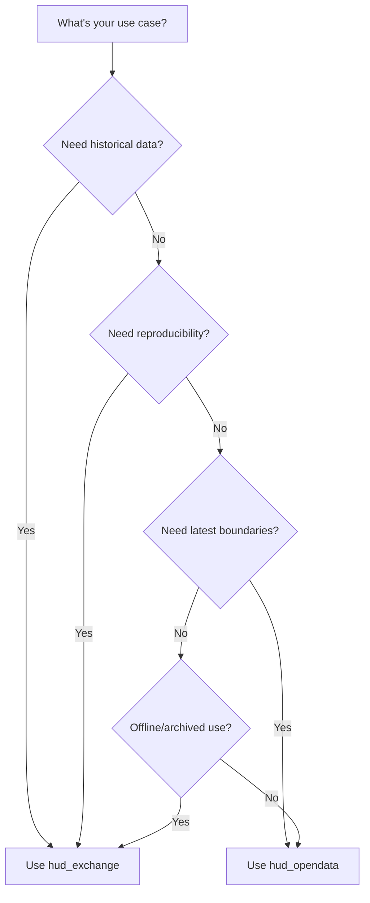

| Use Case | Recommended Source |
|----------|-------------------|
| Year-over-year boundary change analysis | `hud_exchange` |
| Point-in-time count reporting (e.g., FY2024 PIT) | `hud_exchange` (matching vintage) |
| "What CoC is this address in today?" | `hud_opendata` |
| Building a dashboard with current boundaries | `hud_opendata` |
| Research paper requiring reproducible methods | `hud_exchange` |
| Archiving boundaries for compliance records | `hud_exchange` |

---

## Installation

### Prerequisites

- Python 3.12+
- `uv` package manager (recommended) or `pip`

### Quick Install

```bash
# Clone the repository
git clone https://github.com/your-org/coc-pit.git
cd coc-pit

# Install with uv (recommended)
uv sync

# Or install with pip
pip install -e .

# For development (includes pytest, ruff)
uv sync --extra dev
```

### Verify Installation

```bash
# Check CLI is available
coclab --help

# Run tests
pytest tests/test_smoke.py -v
```

---

## Architecture

### System Overview

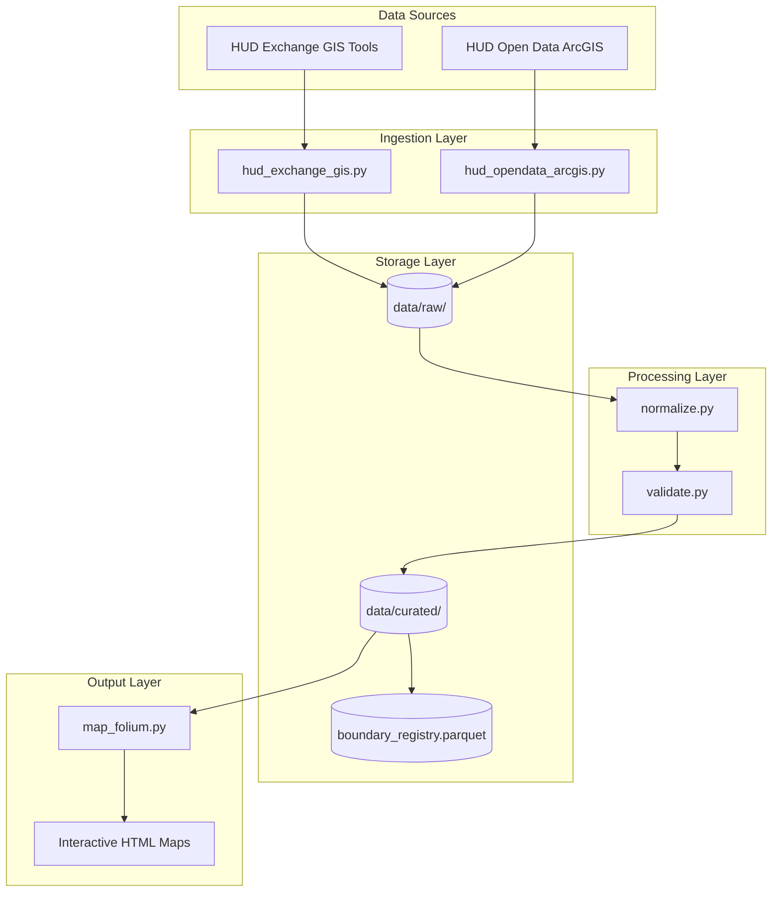

### Module Structure

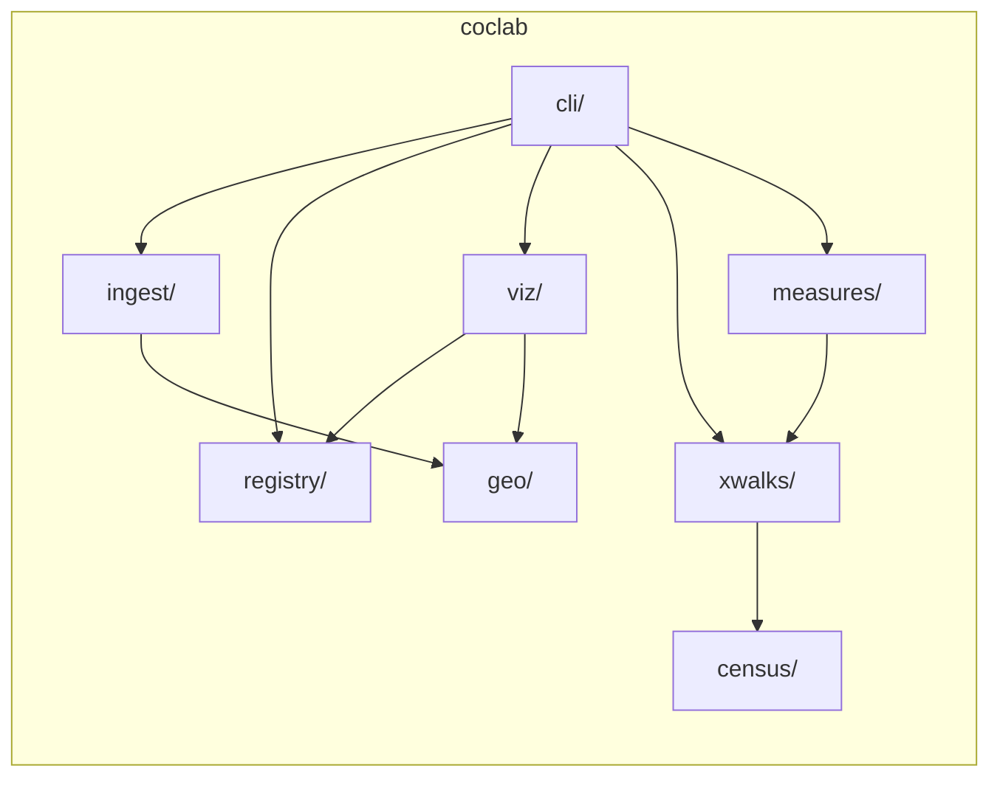

### Directory Layout

```
coclab/
  cli/          # CLI commands (Typer)
  geo/          # Geometry normalization and validation
  ingest/       # Data source ingesters
  registry/     # Vintage tracking and version selection
  viz/          # Map rendering (Folium)
  census/       # Census geometry ingestion (TIGER/Line)
    ingest/     # Tract and county downloaders
  xwalks/       # CoC-to-census crosswalk builders
  measures/     # ACS measure aggregation and diagnostics
data/
  raw/          # Downloaded source files
  curated/      # Processed GeoParquet files
    census/     # TIGER tract/county geometries
    xwalks/     # CoC-tract and CoC-county crosswalks
    measures/   # CoC-level demographic measures
tests/          # Test suite including smoke tests
```

---

## CLI Reference

The `coclab` command provides access to all core functionality.

### Commands Overview

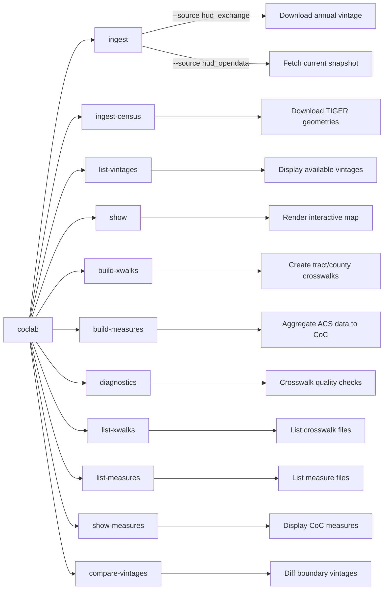

### `coclab ingest`

Ingest CoC boundary data from HUD sources.

**From HUD Exchange (annual vintages):**
```bash
coclab ingest --source hud_exchange --vintage 2025
```

**From HUD Open Data (current snapshot):**
```bash
coclab ingest --source hud_opendata --snapshot latest
```

| Option       | Description                                    | Default                     |
| ------------ | ---------------------------------------------- | --------------------------- |
| `--source`   | Data source (`hud_exchange` or `hud_opendata`) | Required                    |
| `--vintage`  | Year for HUD Exchange data                     | Required for `hud_exchange` |
| `--snapshot` | Snapshot tag for Open Data                     | `latest`                    |

### `coclab list-vintages`

List all available boundary vintages in the registry.

```bash
coclab list-vintages
```

**Example Output:**
```
Available boundary vintages:

Vintage                        Source                    Features   Ingested At
-------------------------------------------------------------------------------------
2025                           hud_exchange_gis_tools    400        2025-01-15 14:30
HUDOpenData_2025-01-10         hud_opendata_arcgis       402        2025-01-10 09:15
```

### `coclab show`

Render an interactive map for a specific CoC boundary.

```bash
# Show using latest vintage
coclab show --coc CO-500

# Specify a vintage
coclab show --coc CO-500 --vintage 2025

# Custom output path
coclab show --coc NY-600 --output my_map.html
```

| Option | Description | Default |
|--------|-------------|---------|
| `--coc` | CoC identifier (e.g., `CO-500`) | Required |
| `--vintage` | Boundary vintage to use | Latest |
| `--output` | Output HTML file path | Auto-generated |

### `coclab build-xwalks`

Build area-weighted crosswalks linking CoC boundaries to census tracts and counties.

```bash
# Build crosswalks for a specific boundary and tract vintage
coclab build-xwalks --boundary 2025 --tracts 2023

# Also build county crosswalk
coclab build-xwalks --boundary 2025 --tracts 2023 --counties 2023
```

| Option | Description | Default |
|--------|-------------|---------|
| `--boundary`, `-b` | CoC boundary vintage | Latest |
| `--tracts`, `-t` | Census tract vintage year | 2023 |
| `--counties`, `-c` | Census county vintage year | Same as tracts |
| `--output-dir`, `-o` | Output directory | `data/curated/xwalks` |

**Output:**
- `coc_tract_xwalk__{boundary}__{tracts}.parquet`
- `coc_county_xwalk__{boundary}.parquet`
- Diagnostic summary printed to console

### `coclab build-measures`

Aggregate ACS 5-year estimates to CoC level using tract crosswalks.

```bash
# Build measures with area weighting
coclab build-measures --boundary 2025 --acs 2022

# Use population weighting instead
coclab build-measures --boundary 2025 --acs 2022 --weighting population
```

| Option | Description | Default |
|--------|-------------|---------|
| `--boundary`, `-b` | CoC boundary vintage | Latest |
| `--acs`, `-a` | ACS 5-year estimate end year | 2022 |
| `--tracts`, `-t` | Tract vintage for crosswalk | Same as ACS |
| `--weighting`, `-w` | `area` or `population` | `area` |
| `--output-dir`, `-o` | Output directory | `data/curated/measures` |

**Output:**
- `coc_measures__{boundary}__{acs}.parquet`
- Summary statistics printed to console

### `coclab ingest-census`

Download TIGER census geometries (tracts and/or counties).

```bash
# Download both tracts and counties for 2023
coclab ingest-census --year 2023

# Download only tracts
coclab ingest-census --year 2023 --type tracts

# Force re-download even if files exist
coclab ingest-census --year 2023 --force
```

| Option | Description | Default |
|--------|-------------|---------|
| `--year`, `-y` | TIGER vintage year | 2023 |
| `--type`, `-t` | `tracts`, `counties`, or `all` | `all` |
| `--force` | Re-download even if file exists | False |

### `coclab diagnostics`

Run crosswalk quality diagnostics.

```bash
# Basic diagnostics
coclab diagnostics --crosswalk data/curated/xwalks/coc_tract_xwalk__2025__2023.parquet

# Show problem CoCs
coclab diagnostics -x crosswalk.parquet --show-problems

# Custom thresholds and CSV export
coclab diagnostics -x crosswalk.parquet --coverage-threshold 0.90 -o diagnostics.csv
```

| Option | Description | Default |
|--------|-------------|---------|
| `--crosswalk`, `-x` | Path to crosswalk parquet file | Required |
| `--coverage-threshold` | Coverage threshold for flagging | 0.95 |
| `--max-contribution` | Max tract contribution threshold | 0.8 |
| `--show-problems` | Show problem CoCs | False |
| `--output`, `-o` | Save diagnostics to CSV | None |

### `coclab list-xwalks`

List available crosswalk files.

```bash
# List all crosswalks
coclab list-xwalks

# List only tract crosswalks
coclab list-xwalks --type tract
```

| Option | Description | Default |
|--------|-------------|---------|
| `--type`, `-t` | `tract`, `county`, or `all` | `all` |
| `--dir`, `-d` | Directory to scan | `data/curated/xwalks` |

### `coclab list-measures`

List available CoC measure files.

```bash
coclab list-measures
```

| Option | Description | Default |
|--------|-------------|---------|
| `--dir`, `-d` | Directory to scan | `data/curated/measures` |

### `coclab show-measures`

Display computed measures for a specific CoC.

```bash
# Show measures (auto-detect latest files)
coclab show-measures --coc CO-500

# Specify vintages
coclab show-measures --coc CO-500 --boundary 2025 --acs 2022

# Output as JSON
coclab show-measures --coc NY-600 --format json
```

| Option | Description | Default |
|--------|-------------|---------|
| `--coc`, `-c` | CoC identifier | Required |
| `--boundary`, `-b` | Boundary vintage | Auto-detect |
| `--acs`, `-a` | ACS vintage year | Auto-detect |
| `--format`, `-f` | `table`, `json`, or `csv` | `table` |

### `coclab compare-vintages`

Compare CoC boundaries between two vintages.

```bash
# Basic comparison
coclab compare-vintages --vintage1 2024 --vintage2 2025

# Show unchanged CoCs too
coclab compare-vintages -v1 2024 -v2 2025 --show-unchanged

# Save diff to CSV
coclab compare-vintages -v1 2024 -v2 2025 -o diff_report.csv
```

| Option | Description | Default |
|--------|-------------|---------|
| `--vintage1`, `-v1` | First (older) vintage | Required |
| `--vintage2`, `-v2` | Second (newer) vintage | Required |
| `--show-unchanged` | Also list unchanged CoCs | False |
| `--output`, `-o` | Save diff to CSV | None |

**Output:**
- Summary counts of added, removed, changed, unchanged CoCs
- Lists of affected CoC IDs by category

---

## Python API

### Quick Start

```python
from coclab.ingest import ingest_hud_exchange, ingest_hud_opendata
from coclab.registry import latest_vintage, list_vintages
from coclab.viz import render_coc_map

# Ingest a vintage
output_path = ingest_hud_exchange("2025")

# Get the latest vintage
vintage = latest_vintage()

# List all vintages
for entry in list_vintages():
    print(f"{entry.boundary_vintage}: {entry.feature_count} features")

# Render a map
map_path = render_coc_map("CO-500", vintage="2025")
print(f"Map saved to: {map_path}")
```

### API Reference

#### Ingestion Functions

```python
# HUD Exchange GIS Tools (annual vintages)
from coclab.ingest import ingest_hud_exchange

path = ingest_hud_exchange(
    boundary_vintage: str,  # e.g., "2025"
    url: str | None = None,  # Custom download URL
    download_dir: Path | None = None  # Custom download directory
) -> Path  # Returns path to curated GeoParquet

# HUD Open Data ArcGIS (live snapshots)
from coclab.ingest import ingest_hud_opendata

path = ingest_hud_opendata(
    snapshot_tag: str = "latest"  # Snapshot identifier
) -> Path  # Returns path to curated GeoParquet
```

#### Registry Functions

```python
from coclab.registry import (
    register_vintage,
    list_vintages,
    latest_vintage,
    RegistryEntry
)

# Register a new vintage
register_vintage(
    vintage: str,
    path: Path,
    source: str,
    feature_count: int,
    hash_of_file: str | None = None,
    ingested_at: datetime | None = None
) -> None

# List all vintages (sorted by ingested_at descending)
entries: list[RegistryEntry] = list_vintages()

# Get latest vintage string
vintage: str = latest_vintage(source: str | None = None)
```

#### Visualization Functions

```python
from coclab.viz import render_coc_map

html_path = render_coc_map(
    coc_id: str,           # e.g., "CO-500"
    vintage: str | None = None,  # Uses latest if None
    out_html: Path | None = None  # Custom output path
) -> Path  # Returns path to generated HTML
```

#### Geo Processing Functions

```python
from coclab.geo import normalize_boundaries, validate_boundaries
import geopandas as gpd

# Normalize a GeoDataFrame
gdf_normalized = normalize_boundaries(gdf: gpd.GeoDataFrame) -> gpd.GeoDataFrame

# Validate boundaries (returns ValidationResult)
result = validate_boundaries(gdf: gpd.GeoDataFrame) -> ValidationResult
print(result.errors)    # List of error messages
print(result.warnings)  # List of warning messages
print(result.is_valid)  # True if no errors
```

#### Census Geometry Functions

```python
from coclab.census.ingest import (
    download_tiger_tracts,
    download_tiger_counties,
    ingest_tiger_tracts,
    ingest_tiger_counties,
)

# Download and normalize tract geometries
tracts_gdf = download_tiger_tracts(year: int = 2023) -> gpd.GeoDataFrame

# Download, normalize, and save to parquet
output_path = ingest_tiger_tracts(year: int = 2023) -> Path

# Same for counties
counties_gdf = download_tiger_counties(year: int = 2023) -> gpd.GeoDataFrame
output_path = ingest_tiger_counties(year: int = 2023) -> Path
```

#### Crosswalk Functions

```python
from coclab.xwalks import (
    build_coc_tract_crosswalk,
    build_coc_county_crosswalk,
    add_population_weights,
    validate_population_shares,
    save_crosswalk,
)

# Build area-weighted tract crosswalk
crosswalk = build_coc_tract_crosswalk(
    coc_gdf: gpd.GeoDataFrame,      # CoC boundaries with 'coc_number' column
    tract_gdf: gpd.GeoDataFrame,    # Tract geometries with 'GEOID' column
    boundary_vintage: str,           # e.g., "2025"
    tract_vintage: str,              # e.g., "2023"
) -> pd.DataFrame

# Add population weights to crosswalk
crosswalk_with_pop = add_population_weights(
    crosswalk: pd.DataFrame,
    population_data: pd.DataFrame,   # Must have 'GEOID' and 'total_population'
) -> pd.DataFrame

# Validate population shares sum to ~1 per CoC
validation = validate_population_shares(crosswalk: pd.DataFrame) -> pd.DataFrame

# Save crosswalk to parquet
output_path = save_crosswalk(
    crosswalk: pd.DataFrame,
    boundary_vintage: str,
    tract_vintage: str,
    output_dir: Path = Path("data/curated/xwalks"),
) -> Path
```

#### ACS Measure Functions

```python
from coclab.measures import (
    fetch_acs_tract_data,
    fetch_all_states_tract_data,
    aggregate_to_coc,
    build_coc_measures,
)

# Fetch ACS data for a single state
tract_data = fetch_acs_tract_data(
    year: int,           # ACS 5-year estimate end year
    state_fips: str,     # e.g., "06" for California
) -> pd.DataFrame

# Fetch for all states
all_tract_data = fetch_all_states_tract_data(year: int) -> pd.DataFrame

# Aggregate tract data to CoC level
coc_measures = aggregate_to_coc(
    acs_data: pd.DataFrame,
    crosswalk: pd.DataFrame,
    weighting: Literal["area", "population"] = "area",
) -> pd.DataFrame

# Full pipeline: fetch, aggregate, save
coc_measures = build_coc_measures(
    boundary_vintage: str,
    acs_vintage: int,
    crosswalk_path: Path,
    weighting: Literal["area", "population"] = "area",
    output_dir: Path | None = None,
) -> pd.DataFrame
```

#### Diagnostics Functions

```python
from coclab.measures import (
    compute_crosswalk_diagnostics,
    compute_measure_diagnostics,
    summarize_diagnostics,
    identify_problem_cocs,
)

# Compute per-CoC crosswalk quality metrics
diagnostics = compute_crosswalk_diagnostics(crosswalk: pd.DataFrame) -> pd.DataFrame
# Returns: coc_id, num_tracts, max_tract_contribution, coverage_ratio_area, coverage_ratio_pop

# Compare area vs population weighted measures
comparison = compute_measure_diagnostics(
    area_measures: pd.DataFrame,
    pop_measures: pd.DataFrame,
) -> pd.DataFrame

# Generate CLI-readable summary
summary_text = summarize_diagnostics(diagnostics: pd.DataFrame) -> str

# Flag CoCs with potential issues
problems = identify_problem_cocs(
    diagnostics: pd.DataFrame,
    coverage_threshold: float = 0.95,
    max_contribution_threshold: float = 0.8,
) -> pd.DataFrame
```

---

## Data Model

### Canonical Boundary Schema

All boundary data is normalized to this schema before storage:

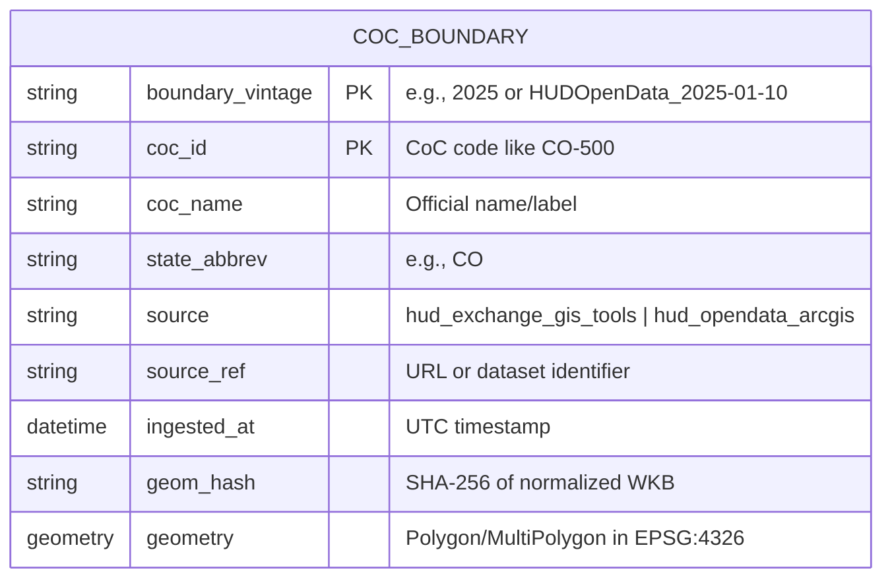

| Column | Type | Description |
|--------|------|-------------|
| `boundary_vintage` | string | Version identifier (e.g., `2025`) |
| `coc_id` | string | CoC identifier (e.g., `CO-500`) |
| `coc_name` | string | Official CoC name |
| `state_abbrev` | string | US state abbreviation |
| `source` | string | Data source identifier |
| `source_ref` | string | URL or reference to original data |
| `ingested_at` | datetime | UTC timestamp of ingestion |
| `geom_hash` | string | SHA-256 hash for change detection |
| `geometry` | Polygon/MultiPolygon | Boundary in EPSG:4326 |

### Registry Schema

The registry tracks all available boundary vintages:

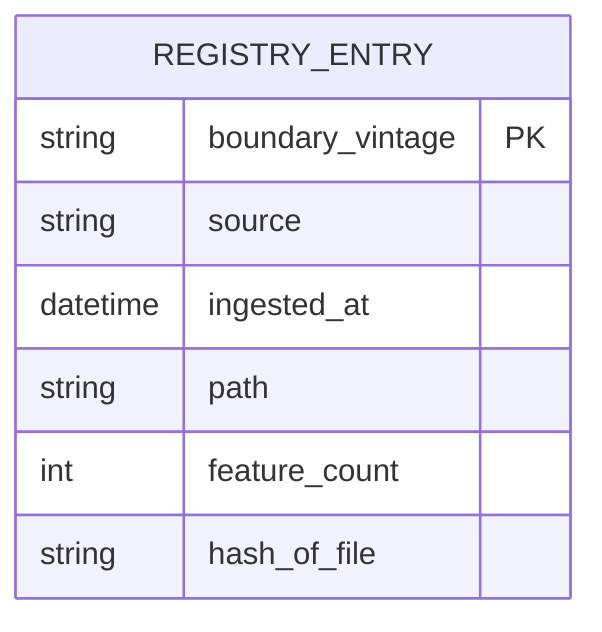

### Crosswalk Schema

Crosswalks link CoC boundaries to census geographies:

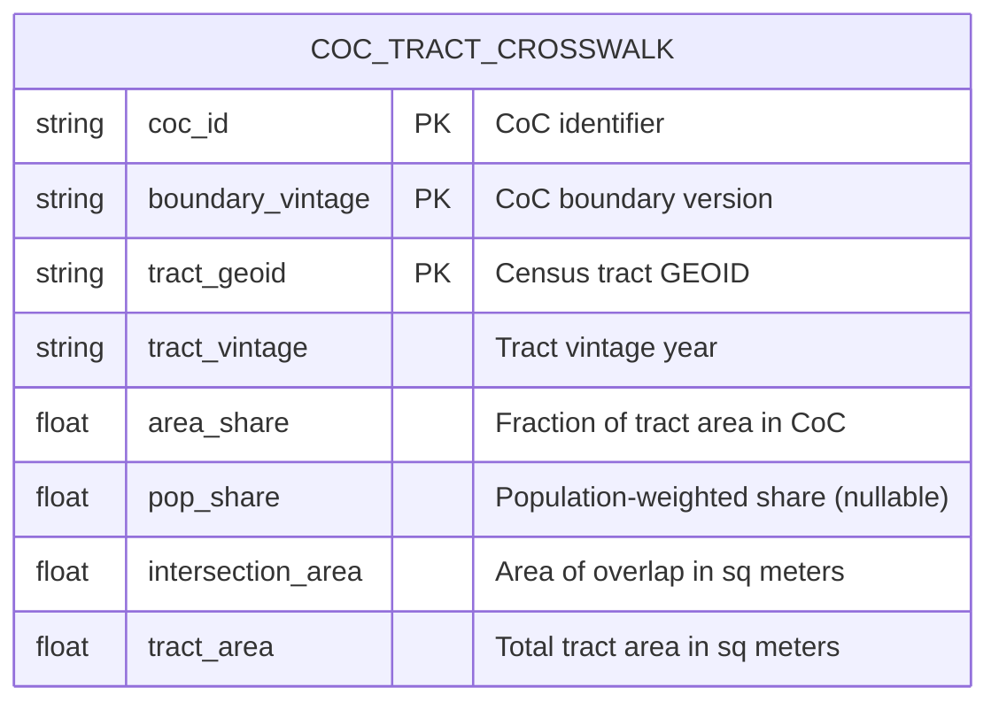

| Column | Type | Description |
|--------|------|-------------|
| `coc_id` | string | CoC identifier (e.g., `CO-500`) |
| `boundary_vintage` | string | CoC boundary version |
| `tract_geoid` | string | 11-digit census tract GEOID |
| `tract_vintage` | string | Census tract vintage year |
| `area_share` | float | `intersection_area / tract_area` |
| `pop_share` | float | Population-weighted share (nullable) |
| `intersection_area` | float | Overlap area in square meters |
| `tract_area` | float | Total tract area in square meters |

### CoC Measures Schema

Aggregated demographic measures at CoC level:

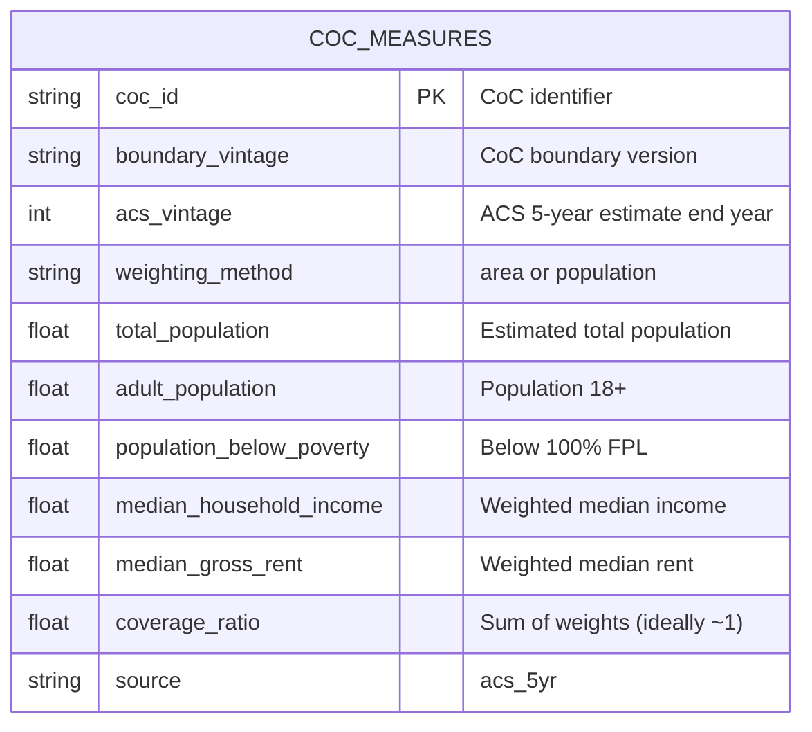

| Column | Type | Description |
|--------|------|-------------|
| `coc_id` | string | CoC identifier |
| `boundary_vintage` | string | CoC boundary version used |
| `acs_vintage` | int | ACS 5-year estimate end year |
| `weighting_method` | string | `area` or `population` |
| `total_population` | float | Weighted population estimate |
| `adult_population` | float | Population 18 and older |
| `population_below_poverty` | float | Below 100% federal poverty line |
| `median_household_income` | float | Population-weighted median |
| `median_gross_rent` | float | Population-weighted median |
| `coverage_ratio` | float | Sum of weights (quality indicator) |
| `source` | string | Always `acs_5yr` |

### Storage Locations

| File | Path Pattern | Description |
|------|--------------|-------------|
| Boundary data | `data/curated/coc_boundaries__{vintage}.parquet` | GeoParquet with boundaries |
| Registry | `data/curated/boundary_registry.parquet` | Vintage tracking |
| Maps | `data/curated/maps/{coc_id}__{vintage}.html` | Generated HTML maps |
| Raw downloads | `data/raw/hud_exchange/{vintage}/` | Original source files |
| Census tracts | `data/curated/census/tracts__{year}.parquet` | TIGER tract geometries |
| Census counties | `data/curated/census/counties__{year}.parquet` | TIGER county geometries |
| Tract crosswalks | `data/curated/xwalks/coc_tract_xwalk__{boundary}__{tracts}.parquet` | CoC-tract mapping |
| County crosswalks | `data/curated/xwalks/coc_county_xwalk__{boundary}.parquet` | CoC-county mapping |
| CoC measures | `data/curated/measures/coc_measures__{boundary}__{acs}.parquet` | Aggregated ACS data |

### Dataset Provenance

All CoC Lab Parquet files embed **provenance metadata** in the file schema, enabling full reproducibility without sidecar files.

#### Provenance Block Schema

```json
{
  "boundary_vintage": "2025",
  "tract_vintage": "2023",
  "acs_vintage": "2022",
  "weighting": "population",
  "created_at": "2025-01-05T12:30:00+00:00",
  "coclab_version": "0.1.0",
  "extra": {
    "dataset_type": "coc_measures",
    "crosswalk_path": "data/curated/xwalks/coc_tract_xwalk__2025__2023.parquet"
  }
}
```

| Field | Type | Description |
|-------|------|-------------|
| `boundary_vintage` | string | CoC boundary version used |
| `tract_vintage` | string | Census tract geometry version |
| `acs_vintage` | string | ACS 5-year estimate end year |
| `weighting` | string | Weighting method (`area`, `population`, `area+population`) |
| `created_at` | ISO 8601 | Timestamp of dataset creation |
| `coclab_version` | string | CoC Lab version that produced the file |
| `extra` | object | Extensible metadata (dataset type, source paths, etc.) |

#### Reading Provenance

```python
from coclab.provenance import read_provenance

provenance = read_provenance("data/curated/measures/coc_measures__2025__2022.parquet")
print(provenance.boundary_vintage)  # "2025"
print(provenance.weighting)         # "population"
print(provenance.to_json())         # Full JSON representation
```

#### Design Rationale

- **Embedded in Parquet metadata**: Provenance travels with the data file
- **Extensible**: The `extra` field allows adding fields without schema changes
- **No sidecar files**: Eliminates file proliferation and sync issues
- **Read without loading data**: Provenance can be inspected via schema metadata

---

## Workflows

### Ingestion Workflow

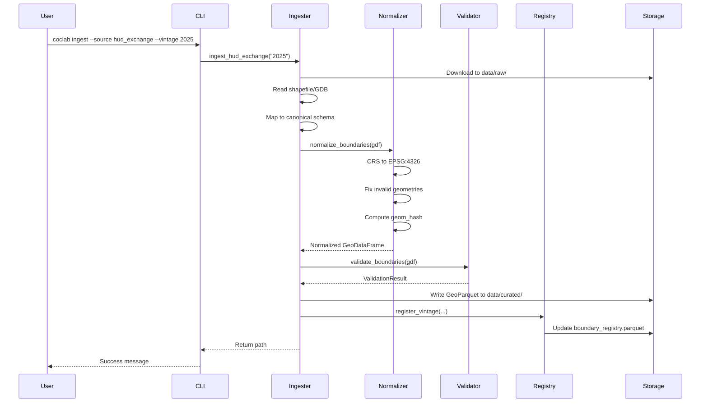

### Visualization Workflow

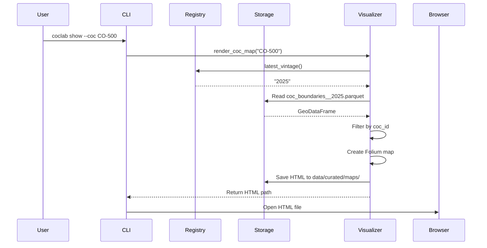

### Version Selection Logic

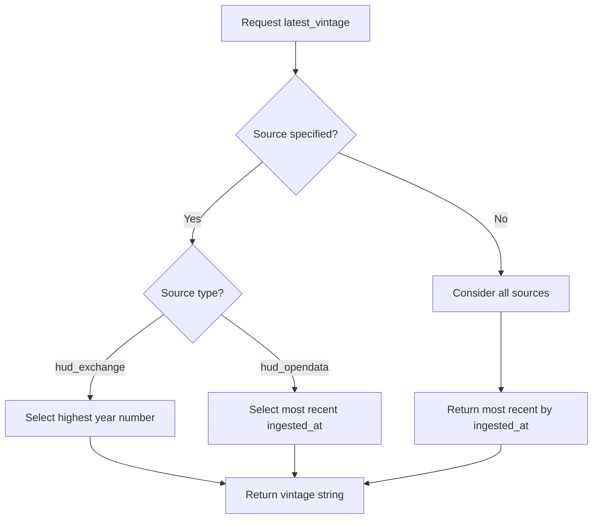

### Crosswalk & Measures Workflow

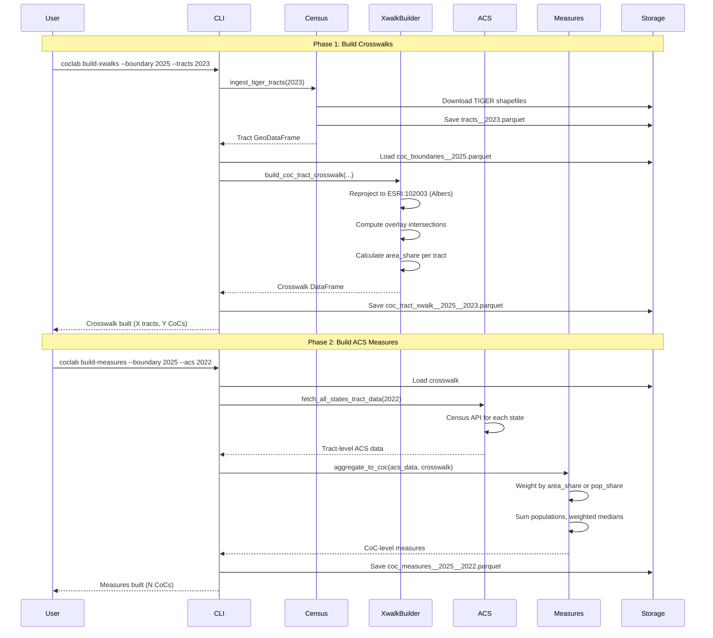

---

## Methodology: ACS Aggregation to CoC Level

This section documents how ACS demographic measures are aggregated from census tracts to CoC boundaries.

### Aggregation Algorithm

CoC Lab uses **weighted tract-level aggregation** to produce CoC-level estimates. The algorithm differs by measure type:

#### Count Variables (population, poverty counts)

```
CoC_estimate = Σ(tract_value × weight)
```

Where `weight` is either:
- `area_share`: fraction of tract area falling within the CoC
- `pop_share`: population-proportional weight (`tract_pop × area_share / total`)

#### Median Variables (income, rent)

```
CoC_estimate = Σ(tract_median × pop_weight) / Σ(pop_weight)
```

These are **population-weighted averages** of tract medians—NOT true medians computed from underlying household distributions.

### Why This Approach Is Acceptable

| Justification | Explanation |
|---------------|-------------|
| **Standard practice** | Aligns with HUD's own CoC-level reporting and academic research (e.g., Byrne et al., 2012). The Census Bureau does not publish CoC-level tabulations. |
| **ACS design constraints** | PUMS microdata uses PUMAs (~100k people) that don't nest within CoC boundaries, making true microdata pooling infeasible for most CoCs. |
| **Large-aggregate convergence** | CoCs typically span dozens to hundreds of tracts. At this scale, weighted aggregation converges toward true values (Central Limit Theorem). |
| **Explicit diagnostics** | The `coverage_ratio` field quantifies crosswalk completeness, enabling identification of problematic estimates. |

### Known Limitations vs True Pooled Microdata

#### 1. Median Estimates Are Approximate

Averaging tract medians ≠ true population median. Example:

| Tract | Median Income | Population |
|-------|---------------|------------|
| A     | $100,000      | 5,000      |
| B     | $30,000       | 5,000      |

**Weighted average**: $65,000 — but true CoC median depends on the actual income distributions, not just tract medians.

#### 2. MOE Propagation Not Implemented

ACS estimates include margins of error (MOE). Proper aggregated MOEs require variance formulas accounting for covariance. **CoC estimates should be treated as point estimates only.**

#### 3. Ecological Inference Risk

Tract-level rates (e.g., poverty rate) may not reflect within-CoC variation. Using aggregated rates for individual-level inference is subject to **ecological fallacy**.

#### 4. Boundary Mismatch Artifacts

When CoC boundaries cut through tracts, area weighting assumes uniform population distribution—false for mixed urban/rural tracts. Population weighting mitigates but doesn't eliminate this.

#### 5. Temporal Mismatch

ACS 5-year estimates pool data across 5 years (e.g., 2018-2022 for vintage 2022). CoC boundaries may change during that period. This module assumes boundaries are static.

#### 6. Small-CoC Instability

CoCs with few tracts or low populations have estimates more sensitive to individual tract values and crosswalk precision.

#### 7. Housing-Market Representativeness

Population-weighted tract coverage does not guarantee housing-market representativeness. Tracts with high population density may have systematically different rental markets, vacancy rates, or housing stock than lower-density tracts within the same CoC. This limitation will be addressed explicitly in **Phase 3 sensitivity analyses**, which will examine how weighting choices affect homelessness prediction models.

### References

- Byrne, T., et al. (2012). "Predicting Homelessness Using ACS Data."
- HUD Exchange CoC Analysis Tools methodology documentation
- Census Bureau ACS Handbook, Chapter 12: "Working with ACS Data"

---

## Module Reference

### cli/main.py

The CLI module uses [Typer](https://typer.tiangolo.com/) for command-line parsing.

**Entry Point:** `coclab`

**Commands:**
- `ingest` - Trigger data ingestion
- `list-vintages` - Display registry contents
- `show` - Generate interactive maps

### ingest/hud_exchange_gis.py

Handles ingestion from HUD Exchange GIS Tools.

**Key Functions:**
- `download_hud_exchange_gdb()` - Download and extract source files
- `read_coc_boundaries()` - Parse geodatabase or shapefile
- `map_to_canonical_schema()` - Normalize field names
- `ingest_hud_exchange()` - Complete pipeline

**Field Mapping:**
| Source Fields | Canonical Field |
|---------------|-----------------|
| `COCNUM`, `COC_NUM`, `CocNum` | `coc_id` |
| `COCNAME`, `COC_NAME`, `CocName` | `coc_name` |
| `STUSAB`, `STATE`, `ST` | `state_abbrev` |

### ingest/hud_opendata_arcgis.py

Handles ingestion from HUD Open Data ArcGIS Hub.

**API Endpoint:** Continuum of Care Grantee Areas feature service

**Key Functions:**
- `_fetch_page()` - Fetch paginated data (page size: 1000)
- `_fetch_all_features()` - Handle pagination
- `_features_to_geodataframe()` - Convert GeoJSON to GeoDataFrame
- `ingest_hud_opendata()` - Complete pipeline

### geo/normalize.py

Geometry processing and normalization.

**Functions:**
| Function | Purpose |
|----------|---------|
| `normalize_crs()` | Reproject to EPSG:4326 |
| `fix_geometry()` | Apply `shapely.make_valid()` |
| `ensure_polygon_type()` | Filter to Polygon/MultiPolygon |
| `compute_geom_hash()` | SHA-256 of WKB (6 decimal precision) |
| `normalize_boundaries()` | Full pipeline |

### geo/validate.py

Data quality validation.

**Classes:**
- `ValidationResult` - Container for errors/warnings
- `ValidationIssue` - Individual issue with severity

**Validation Checks:**
- Required columns exist with correct types
- `coc_id` uniqueness within vintage
- Geometry validity (non-empty, valid type)
- Anomaly detection (tiny polygons, invalid coordinates)

### geo/io.py

GeoParquet I/O utilities.

**Functions:**
- `read_geoparquet()` - Load GeoParquet to GeoDataFrame
- `write_geoparquet()` - Save with snappy compression
- `curated_boundary_path()` - Generate canonical file paths
- `registry_path()` - Get registry file location

### registry/registry.py

Vintage tracking and version selection.

**Functions:**
- `register_vintage()` - Idempotent registration with hash checking
- `list_vintages()` - Get all entries sorted by date
- `latest_vintage()` - Resolve current version by source policy
- `compute_file_hash()` - SHA-256 of file contents

### registry/schema.py

Data structures for registry.

**Classes:**
- `RegistryEntry` - Dataclass with serialization methods

### viz/map_folium.py

Interactive map generation with Folium.

**Features:**
- Auto-centering on CoC centroid
- Blue polygon overlay (30% opacity)
- Interactive tooltip (ID, Name, Vintage, Source)
- Auto-fitted bounds

### census/ingest/tracts.py

TIGER/Line census tract geometry ingestion.

**Functions:**
| Function | Purpose |
|----------|---------|
| `download_tiger_tracts()` | Download and parse national tract shapefiles |
| `ingest_tiger_tracts()` | Full pipeline: download, normalize, save to GeoParquet |

**Output Schema:**
- `GEOID` - 11-digit tract identifier (state + county + tract)
- `NAME` - Tract name
- `ALAND` - Land area in square meters
- `AWATER` - Water area in square meters
- `geometry` - Polygon/MultiPolygon in EPSG:4326

### census/ingest/counties.py

TIGER/Line county geometry ingestion.

**Functions:**
| Function | Purpose |
|----------|---------|
| `download_tiger_counties()` | Download and parse national county shapefiles |
| `ingest_tiger_counties()` | Full pipeline: download, normalize, save to GeoParquet |

**Output Schema:**
- `GEOID` - 5-digit county FIPS code
- `NAME` - County name
- `STATEFP` - State FIPS code
- `geometry` - Polygon/MultiPolygon in EPSG:4326

### xwalks/tract.py

CoC-to-census-tract crosswalk builder.

**Functions:**
| Function | Purpose |
|----------|---------|
| `build_coc_tract_crosswalk()` | Compute area-weighted tract-to-CoC mappings |
| `add_population_weights()` | Add population-weighted shares to crosswalk |
| `validate_population_shares()` | Validate that pop_share sums to ~1 per CoC |
| `save_crosswalk()` | Save crosswalk to GeoParquet |

**Algorithm:**
1. Reproject both layers to ESRI:102003 (Albers Equal Area)
2. Compute geometric overlay (intersection)
3. Calculate `area_share = intersection_area / tract_area`
4. Filter to shares > 1e-9 (remove slivers)

### xwalks/county.py

CoC-to-county crosswalk builder.

**Functions:**
| Function | Purpose |
|----------|---------|
| `build_coc_county_crosswalk()` | Compute area-weighted county-to-CoC mappings |
| `save_county_crosswalk()` | Save crosswalk to GeoParquet |

### measures/acs.py

ACS 5-year estimate aggregation to CoC level.

**Constants:**
- `ACS_VARS` - Dictionary of ACS variable codes (population, income, rent, poverty)
- `ADULT_VARS` - Age-specific population variables for adults 18+

**Functions:**
| Function | Purpose |
|----------|---------|
| `fetch_acs_tract_data()` | Fetch ACS data for a single state via Census API |
| `fetch_all_states_tract_data()` | Fetch ACS data for all states (parallelized) |
| `aggregate_to_coc()` | Aggregate tract data to CoC using crosswalk weights |
| `build_coc_measures()` | Full pipeline: fetch, aggregate, save |

**Weighting Methods:**
- `area` - Weight by `area_share` (fraction of tract area in CoC)
- `population` - Weight by `pop_share` (population-proportional)

### measures/diagnostics.py

Attribution diagnostics and coverage reporting.

**Functions:**
| Function | Purpose |
|----------|---------|
| `compute_crosswalk_diagnostics()` | Per-CoC metrics: tract count, coverage ratio |
| `compute_measure_diagnostics()` | Compare area vs population weighted results |
| `summarize_diagnostics()` | Generate CLI-readable text summary |
| `identify_problem_cocs()` | Flag CoCs with low coverage or high concentration |

**Diagnostic Metrics:**
- `num_tracts` - Number of tracts intersecting CoC
- `max_tract_contribution` - Largest single-tract area share
- `coverage_ratio_area` - Sum of area_share (ideally ~1.0)
- `coverage_ratio_pop` - Sum of pop_share (when available)

### provenance.py

Dataset provenance tracking via Parquet metadata.

**Classes:**
| Class | Purpose |
|-------|---------|
| `ProvenanceBlock` | Dataclass holding provenance fields with JSON serialization |

**Functions:**
| Function | Purpose |
|----------|---------|
| `write_parquet_with_provenance()` | Write DataFrame with embedded provenance metadata |
| `read_provenance()` | Extract provenance from Parquet file without loading data |
| `has_provenance()` | Check if a Parquet file contains provenance |

**ProvenanceBlock Fields:**
- `boundary_vintage` - CoC boundary version
- `tract_vintage` - Census tract version
- `acs_vintage` - ACS estimate end year
- `weighting` - Weighting method used
- `created_at` - ISO 8601 creation timestamp
- `coclab_version` - CoC Lab version
- `extra` - Extensible metadata dictionary

---

## Development

### Running Tests

```bash
# Run all tests
pytest

# Run smoke tests only
pytest tests/test_smoke.py -v

# Run with coverage
pytest --cov=coclab
```

### Code Quality

```bash
# Lint and check
ruff check .

# Format code
ruff format .
```

### Project Dependencies

**Core:**
- `geopandas` - Geospatial data handling
- `shapely` - Geometry operations
- `pyproj` - Coordinate transformations
- `pyarrow` - Parquet I/O
- `pandas` - Data manipulation
- `folium` - Interactive maps
- `typer` - CLI framework

**Development:**
- `pytest` - Testing
- `ruff` - Linting and formatting

### Adding a New Data Source

1. Create new ingester in `coclab/ingest/`
2. Implement the canonical schema mapping
3. Call `normalize_boundaries()` and `validate_boundaries()`
4. Register vintage using `register_vintage()`
5. Add CLI option in `cli/main.py`
6. Add tests

### Extending Validation

Add new checks in `coclab/geo/validate.py`:

```python
def _validate_custom(gdf: gpd.GeoDataFrame, result: ValidationResult) -> None:
    # Your validation logic
    if issue_found:
        result.add_warning("Description of issue", {"metadata": value})
```

---

## Appendix

### CoC ID Format

CoC identifiers follow the pattern: `{STATE}-{NUMBER}`

- `STATE` - Two-letter state abbreviation
- `NUMBER` - Three-digit number

Examples: `CO-500`, `NY-600`, `CA-500`

### Coordinate Reference System

All geometries are stored in **EPSG:4326** (WGS84):
- Latitude: -90 to 90
- Longitude: -180 to 180

### Geometry Hash Algorithm

1. Extract WKB from geometry
2. Round coordinates to 6 decimal places (~11cm precision)
3. Compute SHA-256 hash
4. Store as hex string

This enables efficient change detection between vintages.

### ACS Vintage Alignment Rule

> **ACS vintage YYYY represents pooled 5-year estimates covering YYYY-4 through YYYY, and is aligned to CoC boundary vintage YYYY+1 unless otherwise specified.**

Example: ACS vintage 2022 (covering 2018–2022) aligns with CoC boundary vintage 2023.

This convention reflects that ACS estimates are released ~1 year after the reference period ends, and CoC boundaries for a given fiscal year are typically finalized during that release window.

---

*Generated for CoC Lab v0*
